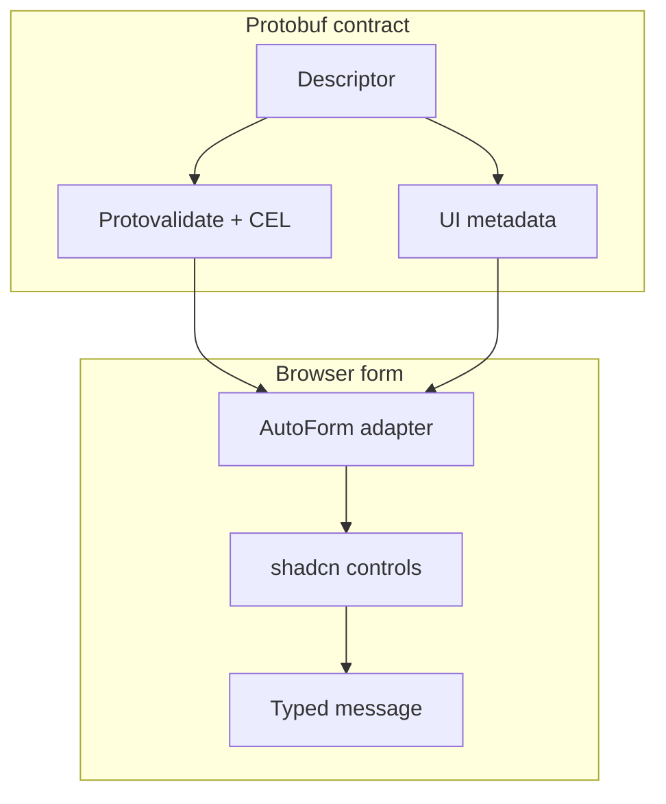

AutoForm reads protobuf descriptors and optional UI annotations to generate fields.
Use this for admin surfaces, setup flows, connector configuration, and forms that should evolve with proto schema.

The default `auto-form` registry item uses React Hook Form. Install `auto-form-tanstack` and import
from `@/components/auto-form-tanstack` to keep TanStack Form as the state owner. Both entries use the
same renderer, fields, validation lifecycle, stepper, and protobuf submission contract.

```tsx
import { AutoForm } from "@/components/auto-form";
import { CreateConnectorRequestSchema } from "@/gen/example/v1/connector_pb";

export function ConnectorForm() {
  return (
    <AutoForm
      schema={CreateConnectorRequestSchema}
      onSubmit={(message) => console.log(message)}
      modes={["simple", "advanced", "json"]}
    />
  );
}
```

For protobuf schemas, `onSubmit` receives an automatic dirty-field update mask and `AbortSignal` as
its third argument. Use the mask when constructing an AIP update request; an empty `paths` array means
nothing changed. Pass the signal to abortable transports so unmounts and newer attempts stop stale work:

```tsx
<AutoForm
  defaultValues={connector}
  schema={ConnectorSchema}
  withSubmit
  onSubmit={(nextConnector, _form, { signal, updateMask }) =>
    updateConnector(create(UpdateConnectorRequestSchema, {
      connector: nextConnector,
      updateMask,
    }), { signal })
  }
/>
```

Custom `SchemaProvider.validateSchema(values, context)` receives the same signal. AutoForm aborts a
superseded step validation, aborts active validation and submission on unmount, and ignores results
that settle after cancellation.

## UI metadata examples

Protoform supports annotations for:

- labels and descriptions
- help text and docs links
- field order and compact rows
- stable step ownership for linear multi-step forms
- simple / advanced visibility
- CEL-driven visibility and disabled states
- select options and option groups
- custom validation messages
- regex examples
- disabled or conditional visibility rules

```proto
message ConnectorConfig {
  string bootstrap_servers = 1 [
    (protoform.ui.field).label = "Bootstrap servers",
    (protoform.ui.field).help = "Comma-separated host:port list",
    (protoform.ui.field).step = "connection"
  ];
}
```

Pass the ordered step definitions through `stepper={{ steps }}`. AutoForm validates only the current
step on Continue, validates the complete request on Submit, and returns structured field errors to
their owning step. See [Steppers](/docs/steppers).

## Oneof support

Oneofs are flattened for form use while still creating valid protobuf messages:

```tsx
form.setOneofValue("auth", "sasl", { username: "", password: "" });
```


## shadcn-native control coverage

AutoForm resolves protobuf annotations and field config into source-owned UI components. The
default registry item copies its runtime and these render targets into your app:

| Annotation / config | shadcn-style control |
| --- | --- |
| `CONTROL_TYPE_TEXT`, `email`, `url`, `password` | `Input` |
| `CONTROL_TYPE_TEXTAREA` | `Textarea` |
| `CONTROL_TYPE_CHECKBOX`, `SWITCH`, `TOGGLE` | `Checkbox`, `Switch`, `Toggle` |
| `CONTROL_TYPE_RADIO_GROUP`, `SELECT`, `COMBOBOX`, `MULTI_SELECT` | `RadioGroup`, `Select`, `Command`, `Popover`, `Badge` |
| `CONTROL_TYPE_DATE`, `TIMESTAMP` | `Calendar`, `Popover`, `InputGroup` |
| `CONTROL_TYPE_JSON`, `KEY_VALUE`, `SLIDER` | purpose-built shadcn-style field components |



The coverage manifest now tracks every bundled shadcn Base UI component. Data-entry primitives render directly from proto annotations; display and shell primitives are available for AutoForm composition, summaries, slots, help, loading, and mode UI without Radix dependencies.

### Full bundled component coverage

| Component role | Components |
| --- | --- |
| Direct field controls | `Input`, `Textarea`, `Checkbox`, `Switch`, `Toggle`, `RadioGroup`, `Select`, `Combobox`, `MultiSelect`, `Calendar`, `Slider`, `JsonField`, `KeyValueField`, `Tags`, `ToggleGroup`, `Choicebox` |
| Field composition | `Button`, `Badge`, `InputGroup`, `Popover`, `Command`, `Collapsible`, `Dialog` |
| Form shell and state | `Field`, `Group`, `Label`, `Tooltip`, `Tabs`, `Spinner`, `Typography`, `Alert` |
| Display/demo-only primitives | `Card`, `Separator`, `CopyButton` |

The manifest lives in `shadcn-controls.ts` and is tested, so adding a new bundled shadcn component requires deciding whether it is a proto-renderable field, field composition, form shell, or display-only primitive.
