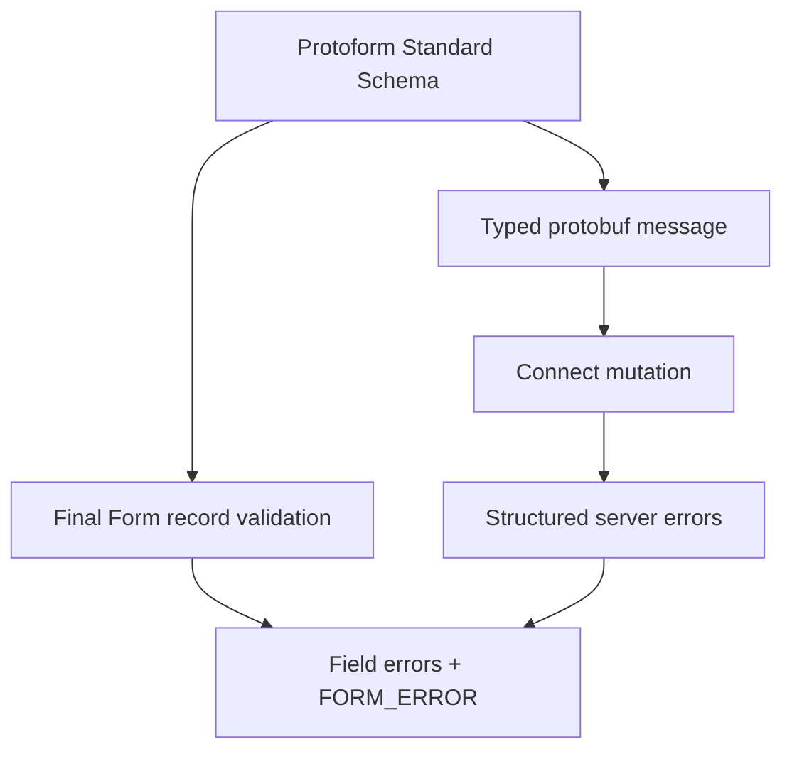

Protoform exposes protobuf validation as Standard Schema and adapts its issues to Final Form's
whole-record validation contract. The form stays hand-built while validation and typed submission
continue to come from the generated protobuf descriptor.

```bash
bun add final-form react-final-form
bunx shadcn@latest add @protoform/protoform-core @protoform/protobuf-provider
```

## Live example

This form uses the generated request descriptor, local TypeScript API, client validation, typed
protobuf submission, and structured server errors. Submit it empty to see descriptor validation. Use
`ada@blocked.example` to see a server violation return to the email field.

<div className="my-8 rounded-2xl border p-6">
  <FinalFormExample />
</div>

## Create the shared schema

```tsx
import { createProtoFormSchema } from "@/lib/protobuf-provider"

interface ProfileValues {
  displayName: string
  email: string
}

const schema = createProtoFormSchema<
  ProfileValues,
  typeof SubmitProfileRequestSchema
>(SubmitProfileRequestSchema)
```

## Validate with Final Form

React Final Form accepts record validation that returns an error object or a promise. Pass its
`FORM_ERROR` key so root issues use the framework's form-level error channel.

```tsx
import { createFinalFormValidator } from "@/lib/core"
import { FORM_ERROR } from "final-form"
import { Form } from "react-final-form"

const validate = createFinalFormValidator(schema, {
  rootErrorKey: FORM_ERROR,
})

<Form
  initialValues={{ displayName: "", email: "" }}
  validate={validate}
  onSubmit={async (values) => {
    const result = await schema["~standard"].validate(values)
    if (result.issues) return { [FORM_ERROR]: "Review the form." }

    try {
      await client.submitProfile(result.value)
    } catch (error) {
      return mapStructuredServerErrors(error, FORM_ERROR)
    }
  }}
>
  {({ handleSubmit }) => <form onSubmit={handleSubmit}>{/* fields */}</form>}
</Form>
```

Validate in the submit handler to obtain the generated, typed protobuf message. The validation
adapter itself returns the nested errors Final Form expects.

## Submission errors

Final Form expects anticipated submission failures to resolve with an error object. Reserve promise
rejection for transport or programming failures. Return mapped structured server errors from
`onSubmit`, render `submitError`, and focus the first field owning a server violation.

Render all root and field messages, preserve entered values, and set `aria-invalid` on invalid
inputs. Protobuf paths should be converted with `extractFieldViolations` and
`protoPathToFormPath`; unmapped failures remain visible at form level.



See the [React Final Form `Form` contract](https://final-form.org/docs/react-final-form/types/FormProps)
for record validation and submission semantics. Generated AutoForm adapters currently target React
Hook Form and TanStack Form. Use this adapter for an existing hand-built Final Form.
