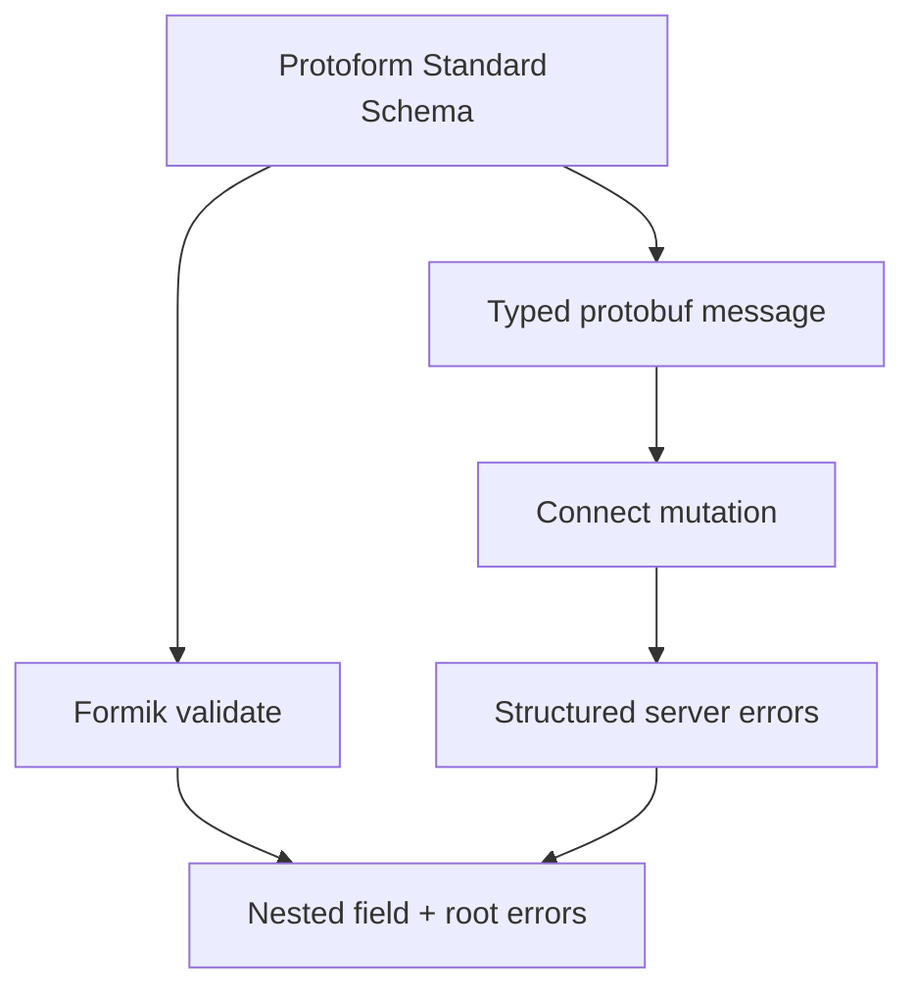

Protoform connects Formik to the same Standard Schema used by every other integration. The adapter
maps every validation issue into Formik's nested error object while protobuf remains the validation
and submission contract.

```bash
bun add formik
bunx shadcn@latest add @protoform/protoform-core @protoform/protobuf-provider
```

## Live example

This form uses the generated request descriptor, local TypeScript API, client validation, typed
protobuf submission, and structured server errors. Submit it empty to see descriptor validation. Use
`ada@blocked.example` to see a server violation return to the email field.

<div className="my-8 rounded-2xl border p-6">
  <FormikExample />
</div>

## Create the shared schema

```tsx
import { createProtoFormSchema } from "@/lib/protobuf-provider"

interface ProfileValues {
  displayName: string
  email: string
}

const schema = createProtoFormSchema<
  ProfileValues,
  typeof SubmitProfileRequestSchema
>(SubmitProfileRequestSchema)
```

## Validate with Formik

Formik accepts synchronous or asynchronous form-level `validate` functions. Pass
`createFormikValidator(schema)` to `validate`, not `validationSchema`; the latter expects a
library-specific schema interface.

```tsx
import { createFormikValidator } from "@/lib/core"
import { Formik } from "formik"

const validate = createFormikValidator(schema)

<Formik
  initialValues={{ displayName: "", email: "" }}
  validate={validate}
  onSubmit={async (values, helpers) => {
    const result = await schema["~standard"].validate(values)
    if (result.issues) return

    try {
      await client.submitProfile(result.value)
    } catch (error) {
      helpers.setErrors(mapStructuredServerErrors(error))
    }
  }}
>
  {({ handleSubmit }) => <form onSubmit={handleSubmit}>{/* fields */}</form>}
</Formik>
```

The validation adapter returns form-shaped errors only. Validate in the submit handler to obtain the
schema's transformed output, including the generated, typed protobuf message.

## Root and server errors

Root validation issues use `_form` by default. Render every root message in a visible alert. Map
structured server errors from protobuf paths with `extractFieldViolations` and
`protoPathToFormPath`, call `setErrors`, and focus the first mapped field. Keep unmapped transport and
server failures in the form-level alert rather than silently swallowing them.

Multiple issues for one field are newline-delimited. Split them when rendering so every failure is
visible, and set `aria-invalid` on the owning input.



See the [Formik validation guide](https://formik.org/docs/guides/validation) for Formik's validation
lifecycle. Generated AutoForm adapters currently target React Hook Form and TanStack Form. Use this
adapter for an existing hand-built Formik form.
