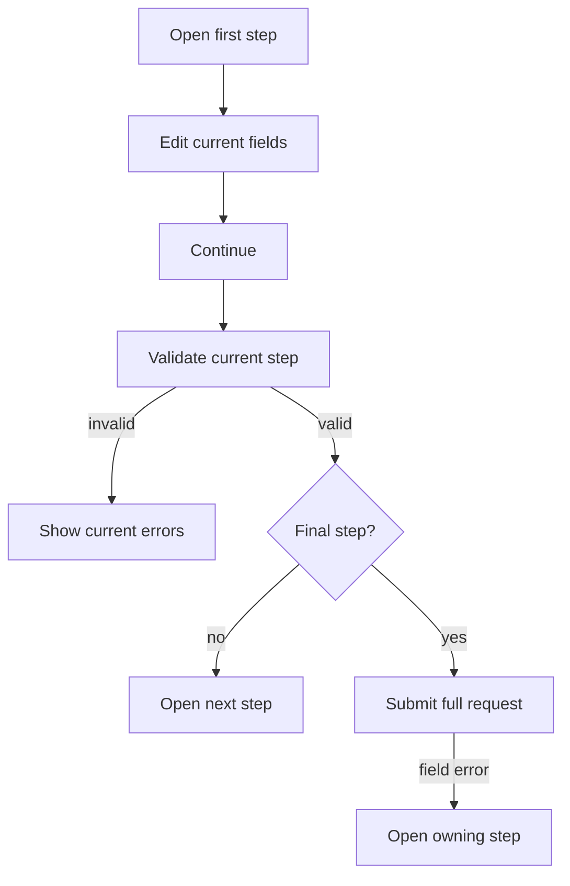

Protoform's stepper is an opt-in AutoForm presentation mode. It uses source-owned shadcn `Button`
and typography primitives around a semantic navigation landmark and ordered list. shadcn does not
publish a native Stepper component in its [component catalog](https://ui.shadcn.com/docs/components),
so the implementation follows established multi-page form and step-indicator guidance rather than
repurposing Tabs.

Tabs switch peer panels in any order. A form stepper is a linear task with current-step validation,
Back and Continue actions, and a final Submit. The distinction matches the
[W3C multi-page form pattern](https://www.w3.org/WAI/tutorials/forms/multi-page/) and the
[USWDS step indicator guidance](https://designsystem.digital.gov/components/step-indicator/).

## Recommendation: own the composition

Keep the existing registry implementation. Do not add a stepper state library or a generic Stepper
dependency. The form already owns values, validation, submission, and server errors; adding another
state machine would create synchronization work without improving the UI.

Compose the pattern from shadcn primitives:

- `Button` for Back, Continue, and Submit.
- Typography tokens for the step name and description.
- A native `<nav>` and `<ol>` for progress semantics.
- Responsive horizontal labels that move below the numbers and then hide before the ordered list
  would need to wrap.
- An optional vertical rail for longer step names.
- `Separator`, `Field`, and `Alert` where the form already uses them; none owns navigation state.

The minimum source-owned indicator is ordinary React and HTML:

```tsx
<nav aria-label="Form progress">
  <ol>
    {steps.map((step, index) => (
      <li
        aria-current={index === currentStepIndex ? "step" : undefined}
        key={step.id}
      >
        <span>{index + 1}</span>
        <span>{step.title}</span>
      </li>
    ))}
  </ol>
</nav>
```

Do not substitute Tabs, Breadcrumb, Carousel, or a clickable row of buttons. Tabs are peer views,
Breadcrumb describes location, Carousel browses content, and direct step buttons let users bypass
the form's validation contract. If a product later permits non-linear navigation, make that an
explicit AutoForm policy with tests rather than changing the indicator's semantics.

## Configure steps

```tsx
const steps = [
  { id: "basics", title: "Basics", description: "Name the resource." },
  { id: "runtime", title: "Runtime", description: "Choose capacity." },
  { id: "review", title: "Review", description: "Confirm and submit." },
];

<AutoForm
  schema={CreateEnvironmentRequestSchema}
  stepper={{ steps, defaultStep: "basics" }}
  withSubmit
/>
```

Horizontal is the default. It stays on one row and adapts to the available width: narrow
containers show numbers only, medium containers place labels below the numbers, and wide
containers place labels inline.

Use a vertical rail when the step names need more room:

```tsx
<AutoForm
  schema={CreateEnvironmentRequestSchema}
  stepper={{ steps, orientation: "vertical" }}
  withSubmit
/>
```

The vertical rail sits beside the active panel on wider screens and moves above it on narrow
screens. Both orientations keep the same ordered-list semantics and linear validation behavior.

`stepper` requires at least 2 steps with non-empty, unique IDs. The ID is the contract between the
ordered React configuration and protobuf UI metadata:

```proto
message CreateEnvironmentRequest {
  string display_name = 1 [
    (protoform.v1.field_ui).step = "basics"
  ];

  oneof credentials {
    option (protoform.v1.oneof_ui).step = "runtime";
    ApiKeyCredentials api_key = 2;
    ServiceAccountCredentials service_account = 3;
  }
}
```

Unannotated fields and unknown step IDs fall back to the first step so schema evolution does not hide
new request data. Step ownership currently applies to top-level fields and oneofs.

When `showSummary` is enabled with a stepper, Protoform keeps the summary hidden until the final
step. This preserves a focused flow while still giving the user a complete review before Submit.

## Interaction contract



| Action | Behavior |
| --- | --- |
| Back | Cancel pending step validation, move back, and preserve values |
| Continue | Validate the current step; disable while asynchronous validation is running |
| Submit | Validate the complete request; disable while the mutation is running |
| Server field error | Open the owning step, show the error, and focus its field |
| Root or unmapped error | Stay on the current step and show the form-level alert |

Resolver-backed forms validate the complete request so root-level invariants can block Continue,
then retain only root and current-step issues. Provider-backed forms validate once and apply the same
current-step filter. The protobuf resolver remains compatible with Standard Schema v1 while retaining
protobuf-specific paths, oneof normalization, and typed message output.

## Accessibility

- The progress indicator is `<nav aria-label="Form progress"><ol>…</ol></nav>`.
- The current list item has `aria-current="step"`; completed states include text for screen readers.
- `Step X of Y` uses a polite live region.
- Each panel is a labelled section and follows DOM order.
- Actions use real buttons with visible focus styles and at least the registry's standard target size.
- Error fields use `aria-invalid` and `aria-describedby`; submission errors return focus to the first
  field that needs attention.
- Progress is not conveyed by color alone.

Keep step titles short, use 3 or more steps only when the task has stable high-level phases, and do
not change the ordered step list while the user is completing the form. Conditional fields belong
inside a stable step. For a short form, render the normal single-page AutoForm instead.

Start with the [two-step form](/docs/two-step-form), then use the
[complex end-to-end example](/docs/complex-example) for a combined workflow and the
[kitchen sink](/docs/kitchen-sink) for the widest five-step contract.
