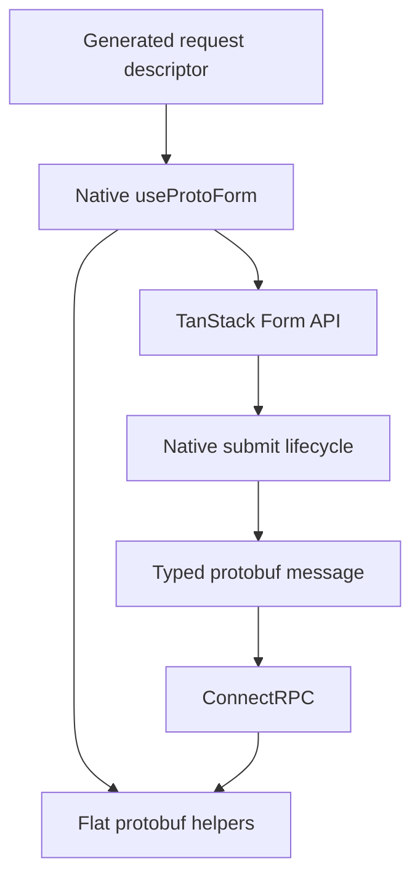

Protoform keeps TanStack Form as the form state owner. The native `Field`, `Subscribe`, store,
validators, listeners, and submission APIs remain available. Protoform adds protobuf conversion,
update masks, oneof updates, and Connect/gRPC field errors on the same form object.

## Install the native hook

```bash
bunx shadcn@latest add @protoform/use-proto-form-tanstack
```

Migration starts with an import change:

```diff
- import { useForm } from "@tanstack/react-form";
+ import { useProtoForm } from "@/hooks/use-proto-form-tanstack";
```

Pass the protobuf descriptor before the TanStack options you already use:

```tsx
import { Button } from "@/components/ui/button";
import { Field, FieldError, FieldLabel } from "@/components/ui/field";
import { Input } from "@/components/ui/input";
import { useProtoForm } from "@/hooks/use-proto-form-tanstack";
import { SignupRequestSchema } from "@/gen/example/v1/signup_pb";

export function SignupForm() {
  const form = useProtoForm(SignupRequestSchema, {
    defaultValues: { email: "", displayName: "" },
    validators: {
      onChange: ({ value }) =>
        value.email.endsWith("@example.com")
          ? undefined
          : { fields: { email: "Use your example.com address." } },
    },
    onSubmit: async ({ value }) => {
      await client.signup(form.createMessage(value));
    },
  });

  return (
    <form
      onSubmit={(event) => {
        event.preventDefault();
        event.stopPropagation();
        form.handleSubmit().catch(reportSubmissionError);
      }}
    >
      <form.Field name="email">
        {(field) => (
          <Field data-invalid={!field.state.meta.isValid}>
            <FieldLabel htmlFor={field.name}>Email</FieldLabel>
            <Input
              aria-invalid={!field.state.meta.isValid}
              id={field.name}
              name={field.name}
              onBlur={field.handleBlur}
              onChange={(event) => field.handleChange(event.target.value)}
              type="email"
              value={field.state.value}
            />
            {!field.state.meta.isValid ? (
              <FieldError>{field.state.meta.errors.join("\n")}</FieldError>
            ) : null}
          </Field>
        )}
      </form.Field>
      <Button type="submit">Create account</Button>
    </form>
  );
}
```

The hook composes protobuf validation with existing synchronous and asynchronous submit validators
instead of replacing them.

<div className="my-8 border-y border-border/60 py-8">
  <TanStackFormExample />
</div>

Submit an empty form to see protobuf issues in native TanStack field meta. Use
`ada@blocked.example` to see `setServerErrors` map a structured server violation back to the email
field.



## Flat Protoform helpers

The returned value is the full TanStack form API with these additions:

- `createMessage(values?)` converts form values into a protobuf message.
- `createUpdateMask()` returns dirty, writable protobuf paths.
- `setOneofValue(path, case, value)` changes a oneof without retaining the previous branch.
- `setServerErrors(error)` maps structured Connect/gRPC field violations into TanStack field meta.
- `getNestedErrors(path)` reads field errors below a nested object.
- `serverErrorContext` and `clearServerErrorContext()` expose unmapped server error details.

## Generate the form

Install the TanStack AutoForm when the descriptor should render the fields:

```bash
bunx shadcn@latest add @protoform/auto-form-tanstack
```

```tsx
import { AutoForm } from "@/components/auto-form-tanstack";
import { SignupRequestSchema } from "@/gen/example/v1/signup_pb";

export function SignupForm() {
  return (
    <AutoForm
      schema={SignupRequestSchema}
      validationMode="blur"
      revalidationMode="change"
      formOptions={{
        listeners: {
          onChange: ({ fieldApi }) => console.log(fieldApi.name),
        },
      }}
      onFormInit={(form) => {
        // Native TanStack API, including Field, Subscribe, and store.
        console.log(form.state.values);
      }}
      onSubmit={async (message, form, { updateMask, signal }) => {
        await client.signup(message, { signal });
        console.log(form.state.isSubmitted, updateMask?.paths);
      }}
      withSubmit
    />
  );
}
```

`formOptions` is passed to TanStack Form. `onFormInit`, `onFieldChange`, and `onSubmit` receive the
native TanStack form instance, so an uncommon native use case does not need a Protoform replacement
API.

## Shared AutoForm lifecycle

Both AutoForm engines accept the same lifecycle props:

| Prop | Values | Default |
| --- | --- | --- |
| `validationMode` | `"submit"`, `"blur"`, `"change"` | `"submit"` |
| `revalidationMode` | `"blur"`, `"change"` | `"change"` |

The generated field, array, map, object, oneof, stepper, accessibility, and protobuf submission
contracts are shared with the default React Hook Form AutoForm. The form state and native escape
hatches remain TanStack Form-owned.

## Choose a path

| Starting point | Use |
| --- | --- |
| Existing TanStack fields and state | `use-proto-form-tanstack` |
| Descriptor-driven generated fields | `auto-form-tanstack` |
| Validation outside React | `createProtoFormSchema` |
| Existing React Hook Form code | Default [`useProtoForm` and `auto-form`](/docs/react-hook-form) |

Formik and Final Form keep their smaller validation adapters. Protoform does not wrap their state
APIs or claim generated AutoForm parity for them.
