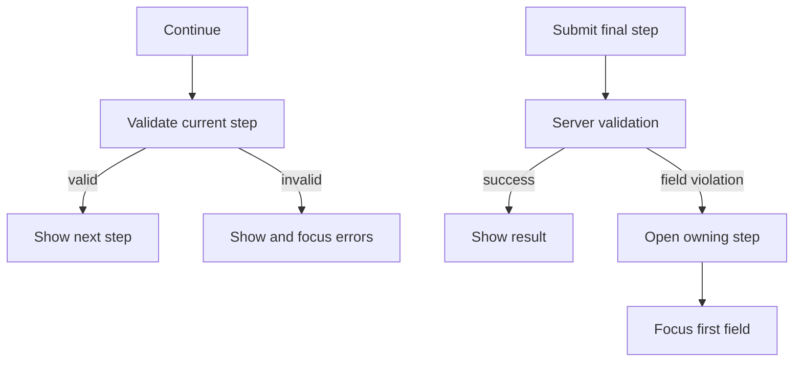

The complex example uses the same TypeScript server as the server-error form. The request adds 4 stable
steps, a credentials oneof, a redacted review summary, and a business rule that returns the user to
the field that needs attention.

```bash
bun run examples:generate
bun run examples:dev
```

<div className="my-8 border-y border-border/60 py-8">
  <ComplexFormExample />
</div>

## Stable step metadata

Top-level fields and oneofs opt into a step through presentation metadata:

```proto
message SubmitComplexFormRequest {
  string project_id = 1 [
    (buf.validate.field).required = true,
    (protoform.v1.field_ui).step = "project"
  ];

  oneof credentials {
    option (buf.validate.oneof).required = true;
    option (protoform.v1.oneof_ui).step = "access";

    ApiKeyCredentials api_key = 6;
    ServiceAccountCredentials service_account = 7;
  }
}
```

The component supplies the ordered labels and descriptions:

```tsx
const steps = [
  { id: "project", title: "Project" },
  { id: "runtime", title: "Runtime" },
  { id: "access", title: "Access" },
  { id: "review", title: "Review" },
];

<AutoForm
  schema={SubmitComplexFormRequestSchema}
  stepper={{ steps }}
  showSummary
  renderSummary={renderRedactedSummary}
  withSubmit
/>
```

## Validation and recovery



- **Back** never validates or discards values.
- **Continue** validates only fields owned by the current step.
- **Submit** validates the complete request and disables duplicate submissions.
- A structured field violation opens its owning step, keeps all values, renders `aria-invalid`, and
  focuses the first invalid field.
- Network and unstructured failures remain visible at the form root.

## Oneof state

Switching credentials uses the protobuf oneof shape, so only the active branch can reach the server.
The previous branch is cleared instead of becoming ghost data. The review summary deliberately
appears only on the final step and redacts the demo API key; production summaries must apply the same
rule to every sensitive field.

## API design boundary

`SubmitComplexForm` demonstrates a workflow request. It is not a resource-oriented standard method.
For a resource API, keep `parent`, `{resource}_id`, the resource message, update masks, etags,
pagination, filters, and long-running operation semantics in their standard protobuf request shapes.
The form can still use steps without changing that API contract.

See [Steppers](/docs/steppers), [Server errors](/docs/server-errors), and
[Google AIP and protobuf design](/docs/aip-protobuf) for the reusable rules.
