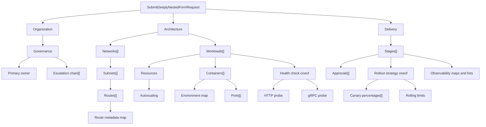

**Level 3 of 8**

**Prerequisite:** [Two-step form](/docs/two-step-form)

This example is intentionally difficult for a hand-built form renderer. The request contains six levels
of message nesting, repeated messages inside repeated messages, maps at several depths, two nested
oneofs, bounded numeric fields, email and URI controls, and a final dynamic `Struct` leaf.

The live UI still comes from one AutoForm:

```tsx
export function DeeplyNestedFormExample() {
  return (
    <AutoForm<SubmitDeeplyNestedFormRequest>
      defaultValues={defaultValues}
      schema={SubmitDeeplyNestedFormRequestSchema}
    />
  );
}
```

`defaultValues` is long because it contains a realistic blueprint. The form definition is not. There
is no component switch, recursive renderer configuration, collection controller, oneof state machine,
or manually assembled validation path in the example component.

<div className="my-8 border-y border-border/60 py-8">
  <DeeplyNestedFormExample />
</div>

## What this adds

- Six levels of nested messages.
- Repeated messages and maps at several depths.
- Nested oneofs with indexed validation paths.

Unlike the later kitchen sink, this rung is about descriptor depth rather than cross-field policy.

## The descriptor tree



The longest rendered collection path is
`architecture.networks[0].subnets[0].routes[0].metadata`. Protoform derives that path from the
descriptor and preserves it across add/remove operations, validation, form state, and protobuf
conversion.

## What Protoform owns

| Difficult concern | Descriptor-driven behavior |
| --- | --- |
| Nested sections | Message descriptors become semantic heading levels and sections |
| Collections of messages | Repeated fields get stable rows, Add/Remove actions, defaults, and indexed paths |
| Maps deep inside rows | Map entries become key/value controls and convert back to protobuf maps |
| Nested oneofs | A selector owns the active branch and clears the previous branch on switch |
| Constraints | Protovalidate requirements, patterns, ranges, map limits, and repeated limits become form errors |
| Typed output | Submission produces `SubmitDeeplyNestedFormRequest`, not an ad hoc JSON approximation |

The important boundary is the protobuf contract. Moving a field deeper, adding another repeated
message, or introducing a new oneof branch changes the descriptor and regenerated types; the React
callsite stays the same.

## Add submission without adding field code

The rendering example is local-only. A real application adds its mutation at the existing form
boundary without rewriting the nested UI:

```tsx
<AutoForm<SubmitDeeplyNestedFormRequest>
  defaultValues={defaultValues}
  onSubmit={saveBlueprint}
  schema={SubmitDeeplyNestedFormRequestSchema}
  withSubmit
/>
```

Use [Steppers](/docs/steppers) when the top-level groups represent a stable user workflow. Keep a
single page when expert users need to scan and compare the entire hierarchy. See the
[kitchen sink](/docs/kitchen-sink) for the same descriptor-first approach applied to maximal CEL.

**Next:** [CEL and RE2 form](/docs/cel-re2-form)
