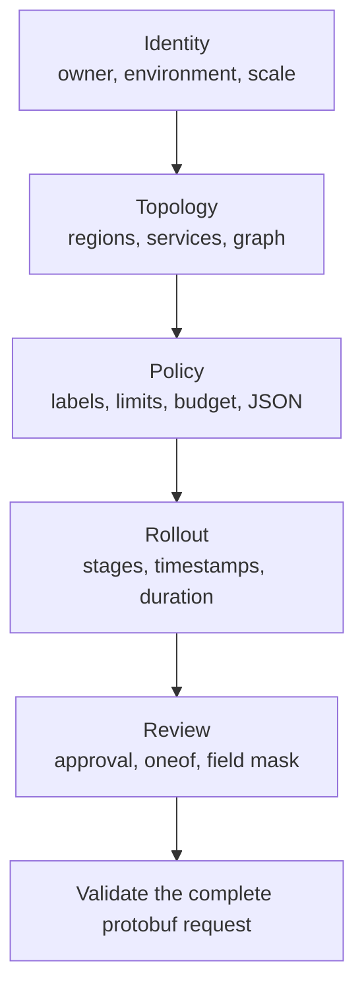

**Level 8 of 8**

**Prerequisite:** [AIP resource form](/docs/aip-resource-form)

This example deliberately combines features that usually live in separate forms. It is an executable
stress case, not a recommendation to put every business rule in one request. The same protobuf v2
descriptor drives the fields, browser validation, typed payload, conditional UI, review summary, and
five-step flow.

<div className="my-8 border-y border-border/60 py-8">
  <KitchenSinkExample />
</div>

## What this adds

Nothing should be learned here first. This capstone combines the earlier rungs to prove that their
contracts still compose under one large request.

## What the request exercises

| Area | Features |
| --- | --- |
| Protobuf v2 | scalars, `uint64`, enums, optional presence, repeated messages, maps, oneof, `Timestamp`, `Duration`, `Struct`, and `FieldMask` |
| Protovalidate | required values, ranges, uniqueness, map key/value rules, URI and email rules, and message CEL |
| CEL | nested comprehensions, membership, map indexing, presence, regular expressions, timestamp arithmetic, duration comparison, numeric conversion, conditionals, and dynamic error text |
| UI | radio group, switch, checkbox, URL, currency, JSON, conditional visibility, review summary, and source-owned steps |
| Form behavior | lossless 64-bit values, current-step validation, preserved values, full-request submit, and visible root errors |

The live form starts with a known-good production deployment. Change a service name, region,
dependency, budget, rollout stage, or notification route to make the contract fail at its public
validation boundary.



## Cross-collection graph integrity

`kitchen_sink.graph.integrity` treats repeated messages and maps as one deployment graph. It proves
that service names are unique, every region is used, dependencies exist, no service depends on
itself, no direct two-service cycle exists, rate-limit keys name real services, and every public
service has enough capacity.

```js CEL
this.services.size() >= 2 &&
this.services.all(service,
  this.regions.exists(region,
    region == service.primary_region
  ) &&
  this.services.filter(candidate,
    candidate.name == service.name
  ).size() == 1 &&
  (!service.public_endpoint || service.health_path.startsWith('/')) &&
  service.dependencies.all(dependency,
    dependency != service.name &&
    this.services.exists(candidate,
      candidate.name == dependency
    )
  )
) &&
!this.services.exists(service,
  service.dependencies.exists(dependency,
    this.services.exists(candidate,
      candidate.name == dependency &&
      candidate.dependencies.exists(back,
        back == service.name
      )
    )
  )
) &&
this.regions.all(region,
  this.services.exists(service,
    service.primary_region == region
  )
) &&
this.rate_limits.all(name,
  this.services.exists(service,
    service.name == name
  )
) &&
this.services.filter(service,
  service.public_endpoint
).all(service,
  service.name in this.rate_limits &&
  this.rate_limits[service.name] >= 100
)
```

CEL is not a graph database: this rule intentionally detects direct cycles only. If arbitrary-depth
cycle detection becomes a requirement, enforce it in a bounded backend algorithm and return a
structured field violation rather than trying to make CEL recursive.

## Production policy across fields, maps, and presence

`kitchen_sink.production.policy` applies only to the production enum value. It combines optional
presence through `has(`, repeated-message predicates, map membership and indexing, regular
expressions, and a restricted classification vocabulary.

```js CEL
this.environment != 3 || (
  this.regions.size() >= 2 &&
  this.acknowledge_risk &&
  has(this.approval_ticket) &&
  this.approval_ticket.matches('^CHG-[0-9]{6}$') &&
  this.services.all(service,
    service.replicas >= 3
  ) &&
  'owner' in this.labels &&
  this.labels['owner'].matches('^[a-z][a-z0-9-]+$') &&
  (
    !('data-classification' in this.labels) ||
    this.labels['data-classification'] in [
      'public',
      'internal',
      'restricted'
    ]
  )
)
```

## Numeric and temporal envelopes

The budget rule converts integer replicas with `double()` before comparing every service against an
equal share of the floating-point budget:

```js CEL
this.services.size() == 0 ||
this.services.all(service,
  double(service.replicas) * service.monthly_cost_per_replica <=
  this.monthly_budget / double(this.services.size())
)
```

The change-window rule requires paired timestamp presence, forward ordering, timestamp subtraction,
and comparison with `duration(`:

```js CEL
has(this.window_start) == has(this.window_end) &&
(
  !has(this.window_start) ||
  (
    this.window_end > this.window_start &&
    this.window_end - this.window_start <= duration('14400s')
  )
)
```

## Dynamic rollout errors

`kitchen_sink.rollout.sequence` is a string-returning rule. An empty string passes; the first
non-empty branch becomes the violation text. The nested conditional reports whether the rollout is
too short, starts incorrectly, ends incorrectly, or contains an unsupported or duplicate stage.

```js CEL
this.dry_run ? '' :
this.rollout_percentages.size() < 2 ?
  'Use at least two rollout stages.' :
this.rollout_percentages[0] != 5 ?
  'The rollout must begin at 5%.' :
this.rollout_percentages[
  this.rollout_percentages.size() - 1
] != 100 ?
  'The rollout must finish at 100%.' :
!this.rollout_percentages.all(percent,
  percent in [5, 25, 50, 100] &&
  this.rollout_percentages.filter(candidate,
    candidate == percent
  ).size() == 1
) ?
  'Use unique rollout stages from 5%, 25%, 50%, and 100%.' :
''
```

Boolean rules need a non-empty annotation message. A string-returning rule keeps the annotation
message empty because the expression produces its own text. Each rule has a stable, unique ID, and
the example is compiled by `buf lint` and executed by the same TypeScript validator used by the form.
See the official [Protovalidate CEL lint rules](https://buf.build/docs/lint/rules/) and the
[CEL language specification](https://github.com/google/cel-spec) for the underlying contracts.

## Stepper decision

The kitchen sink uses the Protoform stepper already in the registry: a source-owned shadcn
composition with no external stepper dependency. Progress is a navigation landmark containing an
ordered list, the current item has `aria-current="step"`, and `Button` owns Back, Continue, and Submit.
This keeps values and validation in the form integration instead of introducing a second state
machine. See [Steppers](/docs/steppers) for the pattern and [CEL expressions](/docs/cel-expressions)
for guidance on keeping powerful rules maintainable.
