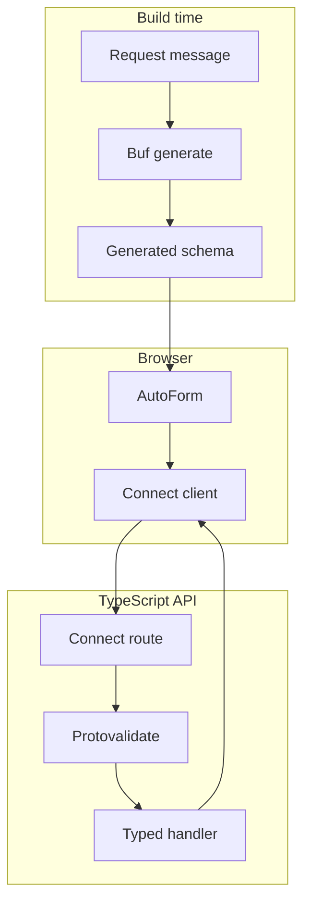

**Level 6 of 8**

**Prerequisite:** [Oneof form](/docs/oneof-form)

This is the first learning-path example that needs a server. The form stays small so the new concept
is obvious: a typed ConnectRPC error returns to the field that owns it.

## What this adds

- A generated Connect Query mutation.
- Server-side Protovalidate enforcement.
- `google.rpc.BadRequest.FieldViolation` mapped back to one input.
- Visible pending, success, and error states.

Start the example API and docs app together:

```bash
bun run examples:generate
bun run examples:dev
```

<div className="my-8 border-y border-border/60 py-8">
  <ServerErrorFormExample />
</div>

The live form submits to `http://127.0.0.1:55012`. Use an address ending in
`@blocked.example` to see a structured server error map back to the email field.

## Request path



The browser sends the resolver's typed `SubmitBasicFormRequest` directly. There is no handwritten
form DTO or conversion layer.

## Contract

The protobuf message owns data rules and optional presentation hints:

```proto
message SubmitBasicFormRequest {
  string display_name = 1 [
    (buf.validate.field).required = true,
    (buf.validate.field).string = { min_len: 2, max_len: 40 },
    (protoform.v1.field_ui).placeholder = "Ada Lovelace"
  ];

  string email = 2 [
    (buf.validate.field).required = true,
    (buf.validate.field).string.email = true,
    (protoform.v1.field_ui).control = CONTROL_TYPE_EMAIL
  ];
}
```

## Connect Query providers

```tsx
import { TransportProvider } from "@connectrpc/connect-query"
import { createConnectTransport } from "@connectrpc/connect-web"
import { QueryClient, QueryClientProvider } from "@tanstack/react-query"

const queryClient = new QueryClient()
const transport = createConnectTransport({
  baseUrl: "http://127.0.0.1:55012",
})

<TransportProvider transport={transport}>
  <QueryClientProvider client={queryClient}>
    <ServerErrorMutationForm />
  </QueryClientProvider>
</TransportProvider>
```

`TransportProvider` supplies the typed Connect transport. `QueryClientProvider` owns mutation state,
retries, and lifecycle callbacks.

## Canonical mutation

Use Connect Query's generated unary method descriptor. No handwritten request function or query key
is needed:

```tsx
import { useMutation } from "@connectrpc/connect-query"

function ServerErrorMutationForm() {
  const mutation = useMutation(
    FormExamplesService.method.submitBasicForm
  )

  async function onSubmit(values, form) {
    try {
      const response = await mutation.mutateAsync(values)
      showCreatedProfile(response.profileId)
    } catch (error) {
      if (!applyServerFieldErrors(error, SubmitBasicFormRequestSchema, form)) {
        throw error
      }
    }
  }

  return (
    <div aria-busy={mutation.isPending}>
      <AutoForm
        schema={SubmitBasicFormRequestSchema}
        onSubmit={onSubmit}
        withSubmit
      />
    </div>
  )
}
```

`mutateAsync` keeps the form submit promise pending, so AutoForm disables its submit button and shows
its loading label. `mutation.isPending` also exposes mutation state to surrounding UI. A successful
response renders the returned profile name. Structured Connect errors map back to fields; unknown
transport or programming errors are rethrown instead of disappearing.

## Server

```ts
export const formExamplesService = {
  submitBasicForm(request) {
    return {
      displayName: request.displayName,
      profileId: `profiles/${slugify(request.displayName)}`,
    }
  },
} satisfies ServiceImpl<typeof FormExamplesService>

const routes = (router: ConnectRouter) => {
  router.service(FormExamplesService, formExamplesService)
}

const handler = connectNodeAdapter({
  interceptors: [createValidateInterceptor()],
  routes,
})

createServer(handler).listen(55012, "127.0.0.1")
```

The interceptor enforces the same Protovalidate annotations on the server. Business rules return a
canonical `invalid_argument` error with `google.rpc.BadRequest.FieldViolation` details rather than a
message string the browser has to parse.

## Lower-level client alternative

Outside React, or when application code intentionally does not use TanStack Query, call the same
generated unary method with a Connect client:

```ts
const client = createClient(
  FormExamplesService,
  createConnectTransport({ baseUrl: "http://127.0.0.1:55012" })
)

const response = await client.submitBasicForm(values)
```

The request and response contract is identical. React applications should prefer the mutation hook
when they need pending, success, and error lifecycle state.

## Standard Schema seam

Protoform exposes the protobuf validation contract as Standard Schema v1. AutoForm uses the
protobuf-aware resolver for typed messages and form-path mapping, while another Standard Schema
consumer can use the same generated descriptor without depending on React Hook Form.

The source lives in [`examples/basic`](https://github.com/malinskibeniamin/protoform/tree/main/examples/basic)
and [`examples/server`](https://github.com/malinskibeniamin/protoform/tree/main/examples/server).
