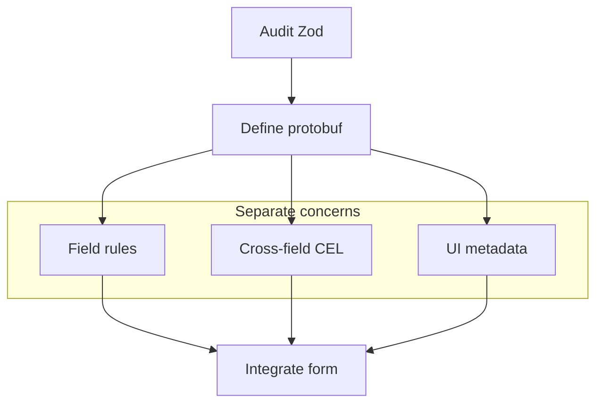

Protoform ships a migration prompt generator because schema migrations are often safer when an LLM does the repetitive mapping and a human reviews the contract.

For Yup, complete the transform, presence, conditional-rule, and asynchronous-test audit in
[Migrating from Yup](/docs/yup-migration) before asking an agent to translate the schema.

## Connect an agent

Use `/llms.txt` for the compact documentation map or `/llms-full.txt` for the complete corpus.
Focused demo pages also expose raw Markdown by adding `.md` to their URL, including the same
copyable source shown in their Preview and Code tabs.

Protoform keeps React Hook Form as the default while making interoperability examples explicit:

```ts twoslash
type FormEngine =
  | "react-hook-form"
  | "tanstack-form"
  | "formik"
  | "final-form";

const defaultEngine = "react-hook-form" satisfies FormEngine;
//    ^?
```

## Generate the prompt

```bash
bun run migrate:zod -- src/components/settings-form.tsx proto/settings.proto
```

The script asks your coding agent to:

1. Inventory each Zod field, message, regex, enum, union, default, and refinement.
2. Move scalar constraints to `buf.validate.field`.
3. Move cross-field refinements to message-level CEL expressions.
4. Convert discriminated unions to protobuf `oneof`.
5. Preserve shadcn accessibility with `Field`, `FieldLabel`, `FieldDescription`, and `FieldError`.
6. Replace `zodResolver` with `useProtoForm`.
7. Map Connect/gRPC backend validation errors with `setServerErrors`.
8. Propose AutoForm UI annotations for labels, help, placeholders, visibility rules, and data providers.

## Human review checklist

- Are proto field names stable enough to become API contract names?
- Did any Zod transform hide business logic that should become explicit conversion code?
- Are CEL ids stable and searchable?
- Do error messages work for screen readers without relying on color?
- Are optional fields represented with the right proto presence semantics?
- Are Google AIP field masks needed for update forms?

## Migration shape


