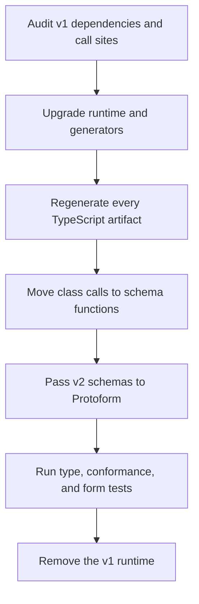

> **Scope:** This guide covers the `@bufbuild/protobuf` and `@bufbuild/protoc-gen-es`
> **v1-to-v2 package migration**. It is not a proto2-to-proto3 migration, and it is separate from
> changing `version: v1` to `version: v2` in Buf configuration files.

Protobuf-ES v2 is Protoform's canonical runtime and the only runtime that receives full feature
development. For staged upgrades, the `protobuf-v1-bridge` registry item provides an
isolated, temporary migration bridge. The bridge accepts Protobuf-ES v1 generated classes without
adding v1 code paths to the modern v2 provider.

The v2 API is schema-first: generated code exports a TypeScript message type and a runtime `Schema`
value instead of a generated message class.

The [official Protobuf-ES migration section](https://github.com/bufbuild/protobuf-es/blob/main/MANUAL.md#migrating-from-version-1)
is the source of truth for runtime and generator changes. This guide adds the Protoform-specific
steps and a safe rollout sequence.

## Optional v1 bridge

Use the bridge only when a form must move before its owning package can regenerate with
Protobuf-ES v2. It reflects v1 message classes generated from proto2 and proto3, renders scalar,
enum, nested, repeated, map, oneof, bytes, and 64-bit fields, preserves proto2 optional presence,
and returns a typed v1 message after safe conversion.

Keep the v1 runtime and bridge in the legacy package boundary:

```bash
bun add @bufbuild/protobuf@^1.10.1
bunx shadcn@latest add @protoform/protobuf-v1-bridge
```

```tsx
import { createProtobufV1Provider } from "@/lib/protobuf-v1-bridge";
import { LegacyProfileRequest } from "./gen/legacy_profile_pb.js";

const legacyProfileProvider = createProtobufV1Provider(LegacyProfileRequest);

export function LegacyProfileForm() {
  return (
    <AutoForm
      schema={legacyProfileProvider}
      withSubmit
      onSubmit={async (request) => {
        await submitLegacyProfile(request);
      }}
    />
  );
}
```

This bridge deliberately does not provide Protovalidate or CEL parity, v2 UI annotations, AIP
resource behavior, automatic update masks, or v2 Connect Query schemas. Proto2 `required` and
wire-shape conversion checks are bridge safeguards, not a replacement validation system. Keep
business validation on the existing server while migrating, and map its structured errors into
the form as usual.

Exit criteria are explicit: regenerate the message with the v2 plugin, replace the class with its
generated `Schema`, move the form to the modern provider, remove the bridge dependency, then prove
the legacy runtime is absent from that package's dependency tree. Do not build new features on the
bridge or make v1/v2 behavior conditional inside one provider.

## Migration flow



## 1. Audit before upgrading

Start from a passing build and commit or otherwise preserve the current generated output. Inventory
all packages that generate or consume protobuf messages:

```bash
bun pm ls | rg '@bufbuild|@connectrpc'

rg -n --glob '!**/*_pb.*' \
  'new [A-Z][A-Za-z0-9_]*\(|\b[A-Z][A-Za-z0-9_]*\.(fromBinary|fromJson|fromJsonString)\(|\.(toBinary|toJson|toJsonString|clone)\(' \
  src packages
```

Treat the search as an audit, not proof: it can find unrelated classes and miss calls hidden behind
application wrappers. Also inspect custom code generators, generated SDK dependencies, test
fixtures, worker entry points, and packages that publish protobuf values in their public API.

Capture a baseline before changing code:

```bash
bun run typecheck
bun run test:conformance
bun run test:unit
bun run test:integration
```

## 2. Upgrade one compatible package family

Upgrade the runtime and generator together. A generated file and the runtime that executes it must
use compatible major versions.

```bash
bun add @bufbuild/protobuf@^2
bun add -d @bufbuild/protoc-gen-es@^2
```

If the application uses the rest of the Protoform stack, keep its protobuf consumers on compatible
current majors too:

```bash
bun add @bufbuild/protovalidate@^1 @connectrpc/connect@^2
```

Upgrade `@connectrpc/connect-web` and other Connect packages to v2 when they are present. Upgrade
`@bufbuild/protoplugin` to v2 when the repository owns a custom JavaScript or TypeScript generator.
For generated SDK dependencies, select an SDK generated with the v2 ES plugin rather than keeping a
v1 SDK beside a v2 runtime.

Do not leave `@bufbuild/protobuf` v1 available through a direct dependency after the migration.
Use the package-manager dependency tree to find a remaining copy and upgrade the package that owns
it.

## 3. Update generation

A recommended local-plugin configuration is:

```yaml
version: v2
plugins:
  - local: protoc-gen-es
    out: src/gen
    opt:
      - target=ts
      - import_extension=js
    include_imports: true
inputs:
  - directory: proto
```

Use `import_extension=js` only when the TypeScript and ESM setup requires explicit JavaScript import
extensions. Protobuf-ES v2 defaults to no extension. The `ts_nocheck` option is also off by default;
keep strict generated-code checking when possible, or set `ts_nocheck=true` only as a temporary
compatibility measure.

`include_imports: true` makes the generator emit imported definitions such as Protovalidate option
descriptors. It is needed when those definitions are not supplied by a generated dependency. Avoid
generating the same imported definition into multiple packages that are loaded together.

If using the remote plugin instead, pin a v2 release:

```yaml
version: v2
plugins:
  - remote: buf.build/bufbuild/es:v2.13.0
    out: src/gen
    opt: target=ts
```

Then regenerate all outputs. In this repository the complete command is:

```bash
bun run proto:generate
```

Never patch generated `_pb.ts` files by hand. A successful TypeScript build of stale v1 output does
not establish that the runtime and generator match; inspect the generated preamble and generated
imports as well.

## 4. Replace classes with schemas

Protobuf-ES v2 generates two distinct exports for a message:

```ts
import type { User } from "./gen/user_pb.js";
import { UserSchema } from "./gen/user_pb.js";
```

`User` is a TypeScript type. `UserSchema` is the runtime descriptor passed to construction,
serialization, reflection, validation, Connect, and Protoform APIs.

### Construct messages

```ts
// v1
import { User } from "./gen/user_pb.js";

const user = new User({ firstName: "Ada" });
```

```ts
// v2
import { create } from "@bufbuild/protobuf";
import { UserSchema } from "./gen/user_pb.js";

const user = create(UserSchema, { firstName: "Ada" });
```

Nested message initializers can remain plain object literals inside `create()`. The returned message
is already a plain object with a `$typeName`; replace `PlainMessage<User>` with `User` and remove
`toPlainMessage` calls.

### Move serialization to standalone functions

| Typical v1 class call | Protobuf-ES v2 call |
| --- | --- |
| `User.fromBinary(bytes)` | `fromBinary(UserSchema, bytes)` |
| `user.toBinary()` | `toBinary(UserSchema, user)` |
| `User.fromJson(value)` | `fromJson(UserSchema, value)` |
| `user.toJson()` | `toJson(UserSchema, user)` |
| `User.fromJsonString(text)` | `fromJsonString(UserSchema, text)` |
| `user.toJsonString()` | `toJsonString(UserSchema, user)` |
| `user.clone()` | `clone(UserSchema, user)` |
| `User.equals(a, b)` | `equals(UserSchema, a, b)` |

For example:

```ts
import {
  clone,
  equals,
  fromBinary,
  fromJson,
  type JsonValue,
  toBinary,
  toJson,
} from "@bufbuild/protobuf";
import { type User, UserSchema } from "./gen/user_pb.js";

declare const bytes: Uint8Array;
declare const json: JsonValue;

const fromWire: User = fromBinary(UserSchema, bytes);
const fromApi: User = fromJson(UserSchema, json);
const encoded = toBinary(UserSchema, fromWire);
const protoJson = toJson(UserSchema, fromWire);
const copied = clone(UserSchema, fromWire);
const unchanged = equals(UserSchema, fromWire, copied);
```

Messages no longer implement `toJSON`. Convert with `toJson(UserSchema, message)` before passing a
message to `JSON.stringify`. Keep ProtoJSON conversion distinct from ordinary JavaScript object
serialization.

Well-known types and their helpers now come from `@bufbuild/protobuf/wkt`. For example, migrate
Timestamp and Any imports to that subpath, and use v2 helpers such as `timestampFromDate()` and
`anyPack()` with the message schema.

## 5. Move Protoform call sites

The modern Protoform provider accepts the generated v2 schema value, not a v1 constructor. The
temporary bridge above is the only migration exception:

```tsx
import { useProtoForm } from "@/hooks/use-proto-form";
import {
  type SignupRequest,
  SignupRequestSchema,
} from "./gen/signup_pb.js";

const form = useProtoForm(SignupRequestSchema, {
  defaultValues: {
    email: "",
    displayName: "",
  },
});

const submit = form.handleSubmit(async (values) => {
  const request: SignupRequest = form.createMessage(values);
  await client.signup(request);
});
```

Apply the same rule to `createProtoFormSchema(SignupRequestSchema)`, generated form bindings, and
AutoForm descriptors. Delete compatibility wrappers that accept a constructor or inspect v1 class
statics. Descriptor reflection should read `SignupRequestSchema`, not `SignupRequest` at runtime.

## Buf configuration v1 to v2 is a separate migration

Buf provides a migration command for `buf.yaml`, `buf.work.yaml`, `buf.gen.yaml`, and `buf.lock`:

```bash
buf config migrate --diff
buf config migrate
buf build
buf lint
```

The first command previews the rewrite. The second writes it. See the
[official Buf configuration migration guide](https://buf.build/docs/migration-guides/migrate-v2-config-files/)
and [`buf config migrate` CLI reference](https://buf.build/docs/reference/cli/buf/config/migrate/).

This tool migrates Buf configuration files only. It does not upgrade npm dependencies, regenerate
messages, or rewrite Protobuf-ES TypeScript call sites. A `version: v2` `buf.gen.yaml` can still run a
v1 plugin, so configuration version alone does not prove the application uses Protobuf-ES v2.

## Codemod guidance

Buf's published Protobuf-ES migration guidance provides no official call-site codemod. The official
automation is `buf config migrate`, which has the narrower configuration-only scope above.

A generic `new User()` to `create(UserSchema)` rewrite is unsafe without project and type
information. It must distinguish protobuf classes from ordinary classes, create collision-free
imports, separate type and value imports, find aliased generated symbols, and update serialization
wrappers. Prefer this compiler-driven sequence:

1. Upgrade the runtime and generator together.
2. Regenerate every owned schema and SDK.
3. Run the audit search from the first section.
4. Run TypeScript and migrate errors package by package.
5. Review every new `Schema` import rather than accepting a blind text rewrite.
6. Run binary and ProtoJSON round-trip fixtures before removing v1.

If a repository later adds a codemod, make it TypeScript-AST-based, require an explicit generated
module allowlist, support a dry run, and reject ambiguous call sites rather than guessing.

## Staged migration for a monorepo

The upstream runtime can run v1 and v2 in parallel during a staged migration. Keep each runtime
inside a clear package boundary, and make every package leave the bridge as soon as its generated
code moves to v2:

1. Migrate leaf packages that own generated code first.
2. Expose binary bytes or validated ProtoJSON across a temporary v1/v2 boundary, not a message
   instance whose runtime identity is ambiguous.
3. Migrate consumers and delete the boundary adapter immediately afterward.
4. Check the dependency tree until the v1 runtime is gone.

Do not pass a v1 message class into a v2 reflection, Connect, Protovalidate, or Protoform API. Do not
publish a library surface that sometimes returns v1 and sometimes returns v2 messages.

## Common failures

### Cannot resolve `@bufbuild/protobuf/codegenv1`

An import containing `codegenv1` normally means v2-generated code is using the compatibility
code-generation path and the bundler is not resolving package exports, or runtime and generated
artifacts are mismatched. Regenerate with the intended v2 plugin, confirm the runtime major, and
ensure the bundler supports package exports. Do not copy internal compatibility files into the
application.

### Generated import cannot be resolved

If generated code imports a local definition such as `buf/validate/validate_pb` that does not
exist, either consume the matching generated dependency or enable `include_imports: true` for the
owning generation target. Do not create an empty placeholder module.

### ESM import extension fails

Confirm whether the runtime expects extensionless imports, `.js`, or `.ts`, then set the generator
option consistently. For Node ESM projects compiled from TypeScript, `import_extension=js` is often
the right output even though the source file ends in `.ts`.

### JSON output changed

Do not compare `JSON.stringify(message)` between v1 and v2. Compare the result of
`toJson(MessageSchema, message)` or `toJsonString(MessageSchema, message)` and test the exact
ProtoJSON behavior required by the API.

## Verification checklist

- [ ] Runtime, generator, Connect, Protovalidate, and generated SDK versions are compatible.
- [ ] All generated preambles identify a v2 ES plugin.
- [ ] No hand-edited generated files remain.
- [ ] Construction uses `create(MessageSchema, init)`.
- [ ] Binary and JSON operations pass the matching schema.
- [ ] Well-known type helpers import from `@bufbuild/protobuf/wkt`.
- [ ] Protoform, Standard Schema, AutoForm, and generated bindings receive v2 schemas.
- [ ] Binary and ProtoJSON round-trip fixtures pass.
- [ ] Nested messages, oneofs, optional presence, maps, repeated fields, 64-bit integers, Any, and
  Timestamp fixtures pass where used.
- [ ] Structured server errors still map to every expected form path.
- [ ] `bun run proto:generate`, type checking, conformance, unit, integration, browser, and end-to-end
  tests pass.
- [ ] The package dependency tree contains no direct v1 runtime used by application code.

Protoform's [conformance suite](/docs/conformance) covers the shared form contract, while the
[production-readiness profile](/docs/production-readiness) tracks broader protobuf feature coverage.
