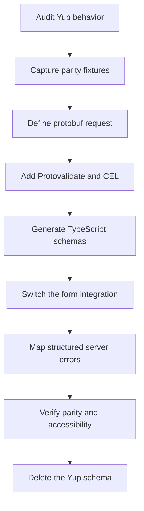

The goal is not to translate every Yup call one-for-one. Yup combines parsing, defaults,
transforms, validation, and TypeScript inference in one object. A protobuf-first form separates
those responsibilities:

- protobuf field types define the request shape
- Protovalidate annotations define portable validation
- CEL defines deterministic cross-field rules
- form `defaultValues` define initial UI state
- explicit application code owns normalization and other transforms
- the server owns asynchronous business checks and returns structured field violations

Start with behavior, not syntax. Capture what the Yup schema accepts, rejects, casts, removes, and
defaults before changing the form.

## Migration flow



## Before and after

A representative Yup schema might mix all of the concerns at once:

```tsx
import * as yup from "yup";

export const accountSchema = yup.object({
  displayName: yup.string().trim().min(2).max(40).required(),
  email: yup.string().email().required(),
  plan: yup.mixed<"starter" | "enterprise">()
    .oneOf(["starter", "enterprise"])
    .required(),
  seats: yup.number().integer().min(1).max(100).required(),
  website: yup.string().url().nullable().optional(),
  tags: yup.array()
    .of(yup.string().min(1).required())
    .min(1)
    .max(10)
    .required(),
}).noUnknown();
```

Move the request shape and portable rules into protobuf:

```proto
syntax = "proto3";

package account.v1;

import "buf/validate/validate.proto";

enum Plan {
  PLAN_UNSPECIFIED = 0;
  PLAN_STARTER = 1;
  PLAN_ENTERPRISE = 2;
}

message CreateAccountRequest {
  string display_name = 1 [
    (buf.validate.field).required = true,
    (buf.validate.field).string = { min_len: 2, max_len: 40 }
  ];

  string email = 2 [
    (buf.validate.field).required = true,
    (buf.validate.field).string.email = true
  ];

  Plan plan = 3 [(buf.validate.field).enum = {
    defined_only: true
    not_in: 0
  }];

  int32 seats = 4 [(buf.validate.field).int32 = {
    gte: 1
    lte: 100
  }];

  optional string website = 5 [(buf.validate.field).string.uri = true];

  repeated string tags = 6 [(buf.validate.field).repeated = {
    min_items: 1
    max_items: 10
    items: { string: { min_len: 1 } }
  }];
}
```

The `int32` type replaces Yup's `integer()` assertion. The enum replaces a closed `oneOf()` set.
The provider converts form-shaped values into the generated protobuf message after validation.

## Rule mapping

Use this table as an inventory aid, not an automatic rewrite rule:

| Yup | Protobuf and Protoform | Review before migrating |
| --- | --- | --- |
| `string().required()` | `required = true`, usually with `min_len` | Empty string and field presence are separate concerns |
| `string().min(n)` / `max(n)` | `string.min_len` / `string.max_len` | Protovalidate counts Unicode characters |
| `string().length(n)` | `string.len` | Do not combine `len` with min/max rules |
| `string().matches(regex)` | `string.pattern` | Protovalidate uses RE2, not JavaScript RegExp |
| `string().email()` | `string.email = true` | Re-run the existing accepted/rejected email fixtures |
| `string().url()` | `string.uri = true` | URI and URL acceptance may not be identical |
| `string().uuid()` | `string.uuid = true` | Preserve any version-specific policy separately |
| `number().integer()` | Choose an integer protobuf field type | Confirm range and signedness before choosing `int32`, `int64`, or unsigned types |
| `number().min(n)` / `max(n)` | Numeric `gte` / `lte` | Yup casts strings by default; protobuf fields do not inherit that behavior |
| `number().moreThan(n)` / `lessThan(n)` | Numeric `gt` / `lt` | Preserve inclusive versus exclusive bounds |
| `mixed().oneOf(values)` | Enum with `defined_only` and an unspecified-value rule | Use `oneof` when each option has a different object shape |
| `mixed().notOneOf(values)` | Scalar `not_in` or CEL | Keep the list stable and contract-owned |
| `array().min(n)` / `max(n)` | `repeated.min_items` / `max_items` | Add `items` rules for element validation |
| `array().of(schema)` | Repeated scalar rules or a nested message | Object arrays become repeated messages |
| `object().shape(...)` | Nested message | Decide whether absence is meaningful |
| `object().required()` | Message field with `required = true` | Message presence is explicit; scalar presence needs more care |
| `date()` | `google.protobuf.Timestamp` | Move string/Date conversion to the form boundary |
| `boolean().oneOf([true])` | `bool.const = true` | Useful for required acknowledgements |

## Presence, null, and empty values

Yup's `required()`, `defined()`, `nullable()`, `optional()`, and `notRequired()` describe different
states. Do not collapse them into one protobuf rule.

### Required strings

Yup `string().required()` rejects both missing values and empty strings. For a required protobuf
string, preserve both intent and a useful minimum:

```proto
message CreateAccountRequest {
  string display_name = 1 [
    (buf.validate.field).required = true,
    (buf.validate.field).string.min_len = 1
  ];
}
```

If whitespace-only strings were previously rejected by `trim().required()`, decide whether to
normalize or reject them. A transform and a validation rule are not the same behavior.

### Optional fields

Use `optional` when the request must distinguish absence from a scalar's zero value:

```proto
message CreateAccountRequest {
  optional string website = 2 [(buf.validate.field).string.uri = true];
}
```

An absent optional field skips its type-specific rule. An empty present string is still a value.
Test both cases.

### Nullable fields

`nullable()` allows JavaScript `null`. Protobuf has presence, but it does not give every scalar a
domain-level null value. Choose deliberately:

1. Normalize `null` to absence at the form boundary when they mean the same thing.
2. Use an optional scalar when absent versus present matters.
3. Use a wrapper, nested message, enum, or `oneof` when null is a real domain state.

Do not silently turn a meaningful `null` into an empty string or zero.

## Defaults and transforms

Yup may cast before it validates. `default()`, `transform()`, `trim()`, `lowercase()`, `ensure()`,
`strip()`, `camelCase()`, `json()`, and `noUnknown()` therefore need a behavior decision rather than
a validation annotation.

| Yup behavior | Migration destination |
| --- | --- |
| UI initial value from `default()` | The chosen form library's initial-values API |
| Business default applied when the request is handled | Explicit server defaulting |
| `trim()` or case normalization | Explicit preprocessing before message creation, or reject non-canonical input with CEL |
| `number()` string casting | Numeric input control plus explicit form-to-protobuf conversion |
| `date()` casting | Explicit conversion to `google.protobuf.Timestamp` |
| `strip()` / `stripUnknown()` | Construct only declared protobuf fields; audit any security assumptions separately |
| `noUnknown()` / `exact()` | Validate the JSON or HTTP trust boundary when unknown-key rejection is required |

Protobuf scalar defaults are wire-format behavior, not a replacement for Yup UI defaults. Keep
visible defaults in the form so the user can review what will be submitted.

If normalization changes stored or signed data, keep it out of a hidden client transform. Make it
explicit, test it independently, and apply the same rule on the server.

## Conditional and cross-field rules

Move deterministic `when()` conditions and sibling `ref()` comparisons to message-level CEL.
For example:

```tsx
const schema = yup.object({
  plan: yup.number().required(),
  seats: yup.number().when("plan", {
    is: 2,
    then: (current) => current.min(5),
    otherwise: (current) => current.min(1),
  }),
});
```

becomes:

```proto
message CreateAccountRequest {
  option (buf.validate.message).cel = {
    id: "create_account.enterprise_seats"
    message: "Enterprise accounts require at least 5 seats."
    expression: "this.plan != 2 || this.seats >= 5"
  };

  Plan plan = 1;
  int32 seats = 2 [(buf.validate.field).int32.gte = 1];
}
```

Give every CEL rule a stable, searchable id and a user-facing message. Keep presentation-only
conditions in UI metadata instead of turning them into API validation.

## Custom and asynchronous tests

Classify every Yup `test()` before moving it:

| Test behavior | Destination |
| --- | --- |
| Pure check of one value | Built-in Protovalidate rule or field CEL |
| Pure comparison across request fields | Message CEL |
| Lookup, uniqueness check, authorization, quota, or other I/O | Server handler or service layer |
| UI-only warning | Form UI state, not the protobuf contract |

Yup custom tests may be asynchronous, and their execution order is not guaranteed. Do not copy a
network-backed test into client validation. Submit the typed request, return a canonical Connect
error with `BadRequest.FieldViolation` details, and call `setServerErrors(error)` so every violation
is visible at its owning field. Hand-built form integrations should follow the structured mapping in
the [TanStack Form guide](/docs/tanstack-form) or
the [Formik](/docs/formik) or [Final Form](/docs/final-form) guide.

If you keep an availability check while the user types, treat it as a separate debounced query with
request cancellation. The submit path must still enforce the rule on the server.

## Objects, arrays, and unions

- A nested Yup object becomes a nested protobuf message.
- An array becomes a repeated field; put element rules in `items` or the nested message.
- A string-keyed record usually becomes a protobuf map; validate keys and values separately.
- A closed scalar choice becomes an enum with an `UNSPECIFIED` zero value.
- A discriminated object union becomes a protobuf `oneof` when exactly one branch is valid.
- A confirmation-only field, such as `passwordConfirmation`, does not necessarily belong in the API
  request. Keep it local if the server never needs it.

Switching a `oneof` branch must clear the previous branch value so ghost data cannot reach the
server. See [Oneof edge cases](/docs/oneof-edge-cases).

## Switch the form integration

For React Hook Form, replace `yupResolver(schema)` with the protobuf-aware hook:

```tsx
const form = useProtoForm(CreateAccountRequestSchema, {
  defaultValues: {
    displayName: "",
    email: "",
    plan: 0,
    seats: 1,
    website: undefined,
    tags: [],
  },
});

const submit = form.handleSubmit(async (values) => {
  try {
    await client.createAccount(form.createMessage(values));
  } catch (error) {
    if (!form.setServerErrors(error)) {
      throw error;
    }
  }
});
```

Keep the existing shadcn fields during the first migration. Changing the schema contract and the
visual form at the same time makes parity failures harder to diagnose. AutoForm can be adopted in a
later change after the contract is stable.

TanStack Form can consume `createProtoFormSchema` through Standard Schema without a Yup adapter.
See [TanStack Form](/docs/tanstack-form) for typed output and server-error handling.
Formik users can replace `validationSchema` with `validate={createFormikValidator(schema)}`; Final
Form applications use the matching adapter in [Final Form](/docs/final-form).

## Error parity

Yup often runs with `abortEarly: true`; many form resolvers override it so users see more than one
error. Protoform maps the complete Protovalidate issue list. Preserve that behavior explicitly:

- render every error for a field rather than only the first
- keep root-level CEL failures visible
- set `aria-invalid` and connect each input to its error description
- focus the first invalid field after submit
- keep all entered values after client or server failure
- never branch on human-readable error message text

Custom Yup messages may not match Protovalidate's generated messages word-for-word. Preserve exact
copy only when product behavior depends on it; otherwise assert rule ids, field paths, and readable
intent.

## Staged rollout

1. **Inventory:** Record every Yup field, default, transform, conditional branch, custom test, and
   resolver option.
2. **Capture:** Add parity fixtures covering accepted, rejected, absent, null, empty, boundary, and
   transformed inputs.
3. **Model:** Define protobuf types, presence, enums, nested messages, repeated fields, maps, and
   `oneof` branches.
4. **Validate:** Add built-in rules first, then the minimum CEL needed for cross-field behavior.
5. **Generate:** Run code generation and review generated types before changing the form.
6. **Integrate:** Replace the Yup resolver while keeping the current fields and UX.
7. **Compare:** Run the same parity fixtures through Yup and `createProtoFormSchema`; review every
   intentional difference.
8. **Enforce:** Validate the request on the server and map structured errors back to the form.
9. **Remove:** Delete the Yup schema, `yupResolver`, compatibility transforms, and the Yup dependency
   when no consumers remain.

Avoid leaving both schemas authoritative. A short comparison phase is useful; permanent dual
validation recreates the contract drift this migration is meant to remove.

## Verification checklist

- `buf lint` accepts every annotation and CEL rule.
- `buf breaking` reports no unreviewed wire or JSON compatibility change.
- Code generation produces the expected field, enum, nested-message, and `oneof` types.
- The old and new parity fixtures agree on intended valid and invalid inputs.
- JavaScript regular expressions were reviewed for RE2 incompatibilities such as lookaround and
  backreferences.
- Missing, empty, null, and zero values have explicit expectations.
- Yup transforms and defaults have named destinations outside validation.
- Client and server both execute the protobuf validation contract.
- All field, root, and structured server errors remain visible and accessible.
- The final bundle and dependency graph no longer include Yup when the migration is complete.

Yup's official documentation distinguishes transforms from validation tests and documents the
behavior of `when()`, `test()`, `nullable()`, defaults, casting, and unknown-key handling. Use the
[Yup reference](https://github.com/jquense/yup) while auditing the original schema. Protovalidate's
built-in annotations and CEL rules are validated by Buf's
[PROTOVALIDATE lint rule](https://buf.build/docs/lint/rules/#protovalidate).
