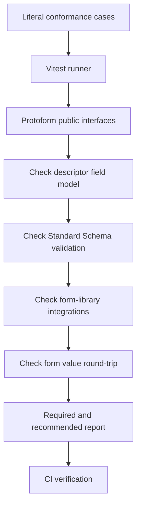

Protoform has a standalone conformance suite for the core and protobuf behavior that form adapters
rely on, plus the supported TanStack Form, Formik, and Final Form integrations. Run it
directly:

```bash
bun run test:conformance
```

The design follows the useful separation in the
[Protocol Buffers conformance suite](https://github.com/protocolbuffers/protobuf/tree/main/conformance):
the runner owns the cases and expected outcomes, while the implementation is exercised through a
small public interface. Protoform currently runs that model in-process with Vitest because the
supported implementation is TypeScript. A subprocess wire protocol would add cost without another
language adapter to test.

The [production-readiness dashboard](/docs/production-readiness) places these passing cases inside a
larger, versioned denominator. Conformance says whether implemented contracts pass; readiness keeps
verified, deferred, unsupported, and externally owned capabilities distinct.



## Contract levels

| Level | Contract | Examples |
| --- | --- | --- |
| **required** | Behavior every supported Protoform release must preserve | Standard Schema v1 metadata, scalar and composite field kinds, typed output, required fields, oneofs, and form-shaped paths |
| **recommended** | Rich behavior expected from the complete protobuf provider and supported integrations | CEL root errors, format rules, all map violations, form-library submission and server errors, wrapper and well-known type round-trip behavior |

Both levels run by default and both block CI. The names describe the portability floor rather than an
allowlist: there are no expected failures, silent skips, or cases that pass only locally.

## What the suite covers

### Descriptor to field model

The suite parses a descriptor containing strings, 64-bit integers, enums, messages, repeated fields,
maps, oneofs, timestamps, durations, and JSON-backed well-known types. It asserts the stable,
schema-agnostic field model that AutoForm consumes, including required state and control hints.

### Form values to protobuf

A full valid fixture passes through `createProtoFormSchema`. The case asserts that Standard Schema
returns a typed protobuf message and preserves bytes, 64-bit integers, maps, and the active oneof
branch.

The scalar matrix also checks signed and unsigned 32- and 64-bit boundaries, float and double special
values, and explicit versus implicit presence. Invalid integer input is rejected at its owning form
path before it can become an out-of-range protobuf value.

### Validation paths

Invalid fixtures cover required scalars, nested messages, repeated items, nested map values, missing
and invalid oneofs, format constraints, CEL rules, and multiple violations from one map entry. The
expected paths are literal form-shaped paths such as:

```text
shippingAddress.city
luckyNumbers.0
officeLocations.0.value.city
preferredContact.value
```

Conversion failures and message-level CEL failures must return visible root issues instead of
throwing or disappearing.

### Protobuf to form round-trip

The round-trip case validates form values, receives a protobuf message, and converts it back with
`protoToFormValues`. It verifies optional fields, wrappers, JSON values, maps, bytes, field masks,
durations, 64-bit values, and oneofs in their form-safe representation.

Dedicated matrix cases extend that contract across every legal map-key type, repeated scalar and
enum families, every scalar wrapper, and `Any` payload packing and unpacking. Malformed base64 and
duplicate rendered map keys stay visible as field errors.

### Protovalidate rule matrices

Table-driven cases cover boolean constants; string values, Unicode and byte lengths, patterns,
affixes, containment, and membership; UUID and trimmed UUID forms; enum constants, aliases, defined
values, and allow and deny lists; repeated and map cardinality; uniqueness; and `Any` type URL lists.

Additional tables cover float/double and every integer family; network and identifier strings; bytes;
Duration, FieldMask, and Timestamp; ignore semantics; custom predefined rules; and non-validating
standard examples surfaced as form guidance. Field and message CEL cases preserve rule IDs, dynamic
messages, nested/repeated paths, every violation, and safe root issues for invalid expressions.

The email contract is exercised through the public Standard Schema interface and the supported form
adapters, so adapter wiring cannot silently weaken descriptor validation.

### Resource API and runtime matrices

Resource cases verify AIP resource metadata, name/ID/display separation, standard fields, every field
behavior, standard Create/Get/List/Update/Delete shapes, singleton shapes, minimal update masks, all
canonical non-OK status codes, structured error details, and preservation of unknown detail types.

Runtime cases add recursive descriptor bounds, malformed and hostile input handling, 50/200/500-field
render-model and conversion budgets, bundle budgets, package compatibility profiles, keyboard-only
step recovery, accessibility scans, browser coverage, and hydration checks.

### TanStack Form integration

The suite also runs the live TanStack Form example. It verifies that Protoform's Standard Schema
issues attach to the owning fields, valid values become a typed protobuf message before submission,
and structured server violations return to the correct TanStack field.

The registry integration suite checks the native TanStack hook and generated AutoForm separately.
It covers native API retention, scalar and repeated fields, oneof branch clearing, every visible
provider issue, validation lifecycle behavior, and update masks derived from TanStack field meta.

### Formik and Final Form integrations

The suite runs live Formik and Final Form examples against the generated request descriptor and local
TypeScript API. It verifies client issues, typed protobuf submission, structured server errors, and
accessible field state. Pure adapter cases also verify nested paths, repeated indices, multiple
issues, and prototype-pollution resistance.

## Running and isolating cases

Run the complete suite:

```bash
bun run test:conformance
```

Use Vitest's name filter while developing one contract:

```bash
bun run test:conformance -- -t "nested map value"
```

The main `quality:gate` command and CI run the complete suite. A change to descriptor parsing,
validation normalization, Standard Schema output, protobuf conversion, or oneof handling should add
or update a literal case here before release.

## Adding coverage

1. Add the smallest descriptor feature to
   `conformance/proto/protoform/conformance/v1/conformance.proto` when the existing matrices do not
   cover it.
2. Regenerate checked-in bindings with `bun run proto:generate`.
3. Add one literal input and expected outcome to the matching file under `conformance/`.
4. Confirm the case fails for the intended missing behavior before changing implementation code.
5. Run the focused case, then `bun run test:conformance` and `bun run quality:gate`.

Keep expected values independent from the implementation. Do not calculate expected paths or field
kinds using the same helper under test; the fixture is the source of truth.
