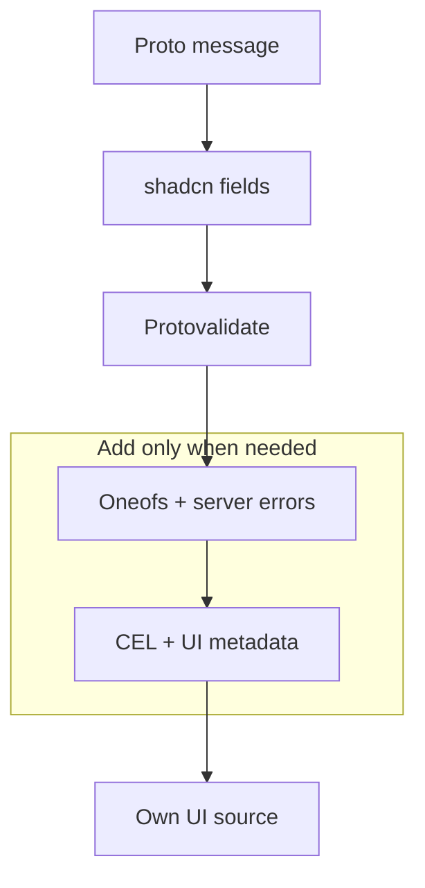

## 1. Add the registry

In `components.json`, point a namespace at the immutable stable registry snapshot:

```json
{
  "registries": {
    "@protoform": "https://raw.githubusercontent.com/malinskibeniamin/protoform/v1.0.0/public/r/{name}.json"
  }
}
```

Pin the Git tag so later upstream changes cannot alter an existing installation. Keep the
`/r/{name}.json` path so shadcn can resolve each `@protoform` item.

Then install:

```bash
bunx shadcn@latest add @protoform/protoform
```

The registry copies the hook, protobuf provider, shared field model, and UI components into your
app. You can inspect, restyle, and version all of that source with the application.

## 2. Configure the public Buf registry

Buf publishes generated Google API modules from its public npm registry. Add its scope to the
consumer's `.npmrc`:

```ini title=".npmrc"
@buf:registry=https://buf.build/gen/npm/v1/
```

No token is required. The registry item declares this module and all other public third-party
dependencies, so `shadcn add` installs them with the copied source. There are no Protoform-owned npm
packages.

## 3. Create a protobuf message

```proto
syntax = "proto3";

package example.v1;

import "buf/validate/validate.proto";

message SignupRequest {
  string email = 1 [(buf.validate.field).string.email = true];
  string display_name = 2 [(buf.validate.field).string = {
    min_len: 2
    max_len: 40
  }];
}
```

Generate TypeScript with Buf, then pass the generated schema to `useProtoForm`.

Install the source generator when the consuming repository will regenerate form bindings:

```bash
bunx shadcn@latest add @protoform/protoc-gen-protoform
```

```yaml
# buf.gen.yaml
version: v2
plugins:
  - local: ["bun", "run", "scripts/protoc-gen-protoform/run.ts"]
    out: src/gen
    opt: target=ts,import_extension=js
```

Protoform supports Protobuf-ES v2 schemas only. If the application still generates v1 message
classes, follow [Migrating to Protobuf-ES v2](/docs/protobuf-v2-migration) before integrating the
form runtime.

## 4. Start simple, then add power



For the complete five-RPC walkthrough, install the bookstore item:

```bash
bunx shadcn@latest add @protoform/bookstore
```

It includes generated bindings, create and edit React Hook Form flows, AutoForm deletion, and the
bounded in-memory example service.
