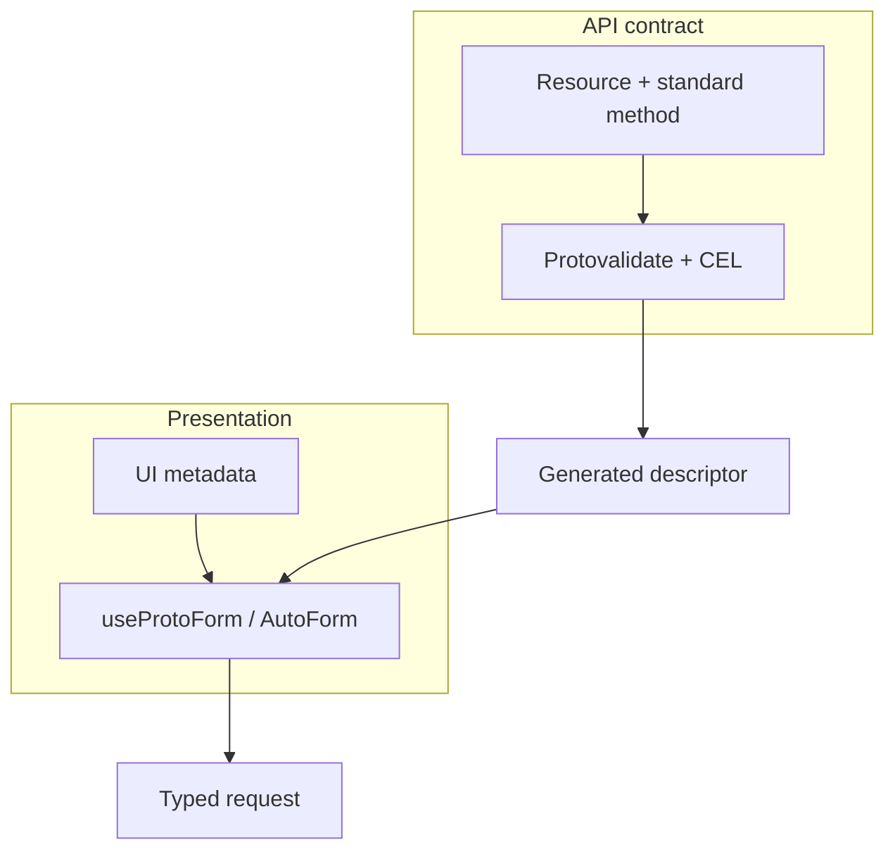

Protoform works best with resource-oriented protobuf APIs. It preserves the resource, validation,
and presentation layers instead of replacing them with a frontend-only DTO.

Protoform does not make an arbitrary API AIP-compliant. API owners still define and enforce the
resource names, standard methods, pagination, update masks, concurrency, and long-running operation
semantics. Protoform then projects that contract into a typed form.

The [production-readiness dashboard](/docs/production-readiness) measures form-relevant AIP support
separately from backend-only semantics. Every applicable client workflow has executable evidence,
while backend and governance responsibilities stay visible as external exclusions.

## Complete General AIP catalog tracking

The official [General AIP catalog](https://google.aip.dev/general) is the complete General AIP catalog
baseline. Every catalog entry has its own stable row in the readiness ledger. A row uses an explicit
readiness status:

- **Executable conformance** for behavior Protoform owns, such as descriptor projection, field
  behavior, update masks, typed requests, structured errors, and redaction.
- **Static schema check** where a protobuf declaration can prove the form-visible part of the rule,
  such as resource associations, request IDs, `validate_only`, resource revisions, soft delete,
  states, expiration, and batch methods.
- **Deferred** or **unsupported** for applicable client behavior without current evidence. These rows
  count against readiness and name the next executable test.
- **External** for backend enforcement, governance, or repository ownership that Protoform cannot
  implement. These rows stay visible but are excluded from the denominator.

**Documentation-only does not count** as readiness evidence. A guide can explain an AIP, but only an
executable test or static schema assertion can mark an applicable row verified. AIP-192 is verified
because the generator test proves public message and field comments become registered form help.

| Catalog family | Tracked entries | Current ownership |
| --- | --- | --- |
| Meta and process | [AIP-1](https://google.aip.dev/1), [AIP-2](https://google.aip.dev/2), [AIP-3](https://google.aip.dev/3), [AIP-8](https://google.aip.dev/8), [AIP-9](https://google.aip.dev/9), [AIP-100](https://google.aip.dev/100), [AIP-200](https://google.aip.dev/200), [AIP-205](https://google.aip.dev/205) | External proposal and API-review governance |
| API concepts | [AIP-111](https://google.aip.dev/111) | External backend plane boundaries |
| Resource design | [AIP-121](https://google.aip.dev/121), [AIP-122](https://google.aip.dev/122), [AIP-123](https://google.aip.dev/123), [AIP-124](https://google.aip.dev/124), [AIP-126](https://google.aip.dev/126), [AIP-128](https://google.aip.dev/128), [AIP-129](https://google.aip.dev/129), [AIP-156](https://google.aip.dev/156) | Executable or static checks for resources, associations, enums, declarative controls, server defaults, and singletons |
| Operations | [AIP-130](https://google.aip.dev/130), [AIP-131](https://google.aip.dev/131), [AIP-132](https://google.aip.dev/132), [AIP-133](https://google.aip.dev/133), [AIP-134](https://google.aip.dev/134), [AIP-135](https://google.aip.dev/135), [AIP-136](https://google.aip.dev/136), [AIP-151](https://google.aip.dev/151), [AIP-231](https://google.aip.dev/231), [AIP-233](https://google.aip.dev/233), [AIP-234](https://google.aip.dev/234), [AIP-235](https://google.aip.dev/235) | Standard, batch, custom, streaming, and long-running methods are classified; operation progress, polling, cancellation, and terminal errors are verified |
| Fields | [AIP-140](https://google.aip.dev/140), [AIP-141](https://google.aip.dev/141), [AIP-142](https://google.aip.dev/142), [AIP-143](https://google.aip.dev/143), [AIP-144](https://google.aip.dev/144), [AIP-145](https://google.aip.dev/145), [AIP-146](https://google.aip.dev/146), [AIP-147](https://google.aip.dev/147), [AIP-148](https://google.aip.dev/148), [AIP-149](https://google.aip.dev/149), [AIP-202](https://google.aip.dev/202), [AIP-203](https://google.aip.dev/203), [AIP-216](https://google.aip.dev/216) | Quantity units, standardized string codes, half-open ranges, sensitive fields, and core field behavior are verified |
| Design patterns | [AIP-152](https://google.aip.dev/152), [AIP-153](https://google.aip.dev/153), [AIP-154](https://google.aip.dev/154), [AIP-155](https://google.aip.dev/155), [AIP-157](https://google.aip.dev/157), [AIP-158](https://google.aip.dev/158), [AIP-159](https://google.aip.dev/159), [AIP-160](https://google.aip.dev/160), [AIP-161](https://google.aip.dev/161), [AIP-162](https://google.aip.dev/162), [AIP-163](https://google.aip.dev/163), [AIP-164](https://google.aip.dev/164), [AIP-165](https://google.aip.dev/165), [AIP-210](https://google.aip.dev/210), [AIP-211](https://google.aip.dev/211), [AIP-214](https://google.aip.dev/214), [AIP-217](https://google.aip.dev/217), [AIP-236](https://google.aip.dev/236) | Job, import/export, cross-collection, criteria-delete, partial responses, unreachable-resource, policy-preview, and the remaining client-owned patterns are verified; authorization enforcement is external |
| Compatibility and versioning | [AIP-180](https://google.aip.dev/180), [AIP-181](https://google.aip.dev/181), [AIP-182](https://google.aip.dev/182), [AIP-185](https://google.aip.dev/185) | Compatibility, dependency, package version, preview, and deprecation presentation are verified |
| Polish | [AIP-190](https://google.aip.dev/190), [AIP-191](https://google.aip.dev/191), [AIP-192](https://google.aip.dev/192), [AIP-193](https://google.aip.dev/193), [AIP-194](https://google.aip.dev/194) | Naming, layout, generated source help, canonical errors, and idempotency-aware retry recovery are verified |
| Protocol buffers | [AIP-127](https://google.aip.dev/127), [AIP-213](https://google.aip.dev/213), [AIP-215](https://google.aip.dev/215) | Well-known components and HTTP path, query, and body roles are verified; API-specific proto ownership is external |

Import descriptor and client workflow helpers from their opt-in subpaths. This keeps long-running
operation metadata out of applications that only use the core form provider.

```ts
import {
  getProtoPartialResult,
  getProtoRetryDecision,
  runProtoOperation,
} from "@/lib/protobuf-provider/aip-client-workflow";
import { getProtoMethodWorkflow } from "@/lib/protobuf-provider/method-workflow";
```

Verified scope is deliberately narrow. AIP-154 means Protoform preserves an `etag`, not that it
enforces concurrency. AIP-158 means page fields stay typed and tokens remain opaque, not that the
client proves server cursor stability. AIP-160 means the request carries `filter` and `order_by`, not
that UI code authorizes or evaluates the filter. AIP-194 means Protoform retries only explicitly
idempotent unary `UNAVAILABLE` calls; service owners still configure the underlying retry policy.



## Canonical resource shape

A resource follows [AIP-121](https://google.aip.dev/121),
[AIP-122](https://google.aip.dev/122), and [AIP-123](https://google.aip.dev/123):

```proto
import "buf/validate/validate.proto";
import "google/api/field_behavior.proto";
import "google/api/resource.proto";

message Connector {
  option (google.api.resource) = {
    type: "example.googleapis.com/Connector"
    pattern: "projects/{project}/locations/{location}/connectors/{connector}"
    singular: "connector"
    plural: "connectors"
  };

  string name = 1 [(google.api.field_behavior) = IDENTIFIER];
  string display_name = 2 [
    (google.api.field_behavior) = REQUIRED,
    (buf.validate.field).string.min_len = 1
  ];
  ConnectorState state = 3 [(google.api.field_behavior) = OUTPUT_ONLY];
  string etag = 4 [(google.api.field_behavior) = OUTPUT_ONLY];
}

enum ConnectorState {
  CONNECTOR_STATE_UNSPECIFIED = 0;
  CONNECTOR_STATE_ACTIVE = 1;
  CONNECTOR_STATE_FAILED = 2;
}
```

This shape is intentional:

- `name` is field 1, contains the full relative resource name, and has `IDENTIFIER` only.
- Display text has its own `display_name` field; a bare ID never masquerades as `name`.
- `(google.api.resource)` declares `type`, `pattern`, `singular`, and `plural`.
- `field_behavior` documents client responsibilities; `buf.validate` and CEL enforce values.
- Enum zero values end in `_UNSPECIFIED`.
- Server-owned `state` and `etag` fields are read-only in edit forms.

## Standard method requests

Use the standard request shapes rather than custom operation envelopes:

```proto
import "google/protobuf/field_mask.proto";

message GetConnectorRequest {
  string name = 1 [
    (google.api.field_behavior) = REQUIRED,
    (google.api.resource_reference).type = "example.googleapis.com/Connector"
  ];
}

message ListConnectorsRequest {
  string parent = 1 [
    (google.api.field_behavior) = REQUIRED,
    (google.api.resource_reference).child_type = "example.googleapis.com/Connector"
  ];
  int32 page_size = 2;
  string page_token = 3;
  string filter = 4;
  string order_by = 5;
}

message ListConnectorsResponse {
  repeated Connector connectors = 1;
  string next_page_token = 2;
}

message CreateConnectorRequest {
  string parent = 1 [
    (google.api.field_behavior) = REQUIRED,
    (google.api.resource_reference).child_type = "example.googleapis.com/Connector"
  ];
  Connector connector = 2 [(google.api.field_behavior) = REQUIRED];
  string connector_id = 3 [
    (google.api.field_behavior) = REQUIRED,
    (buf.validate.field).string.pattern = "^[a-z][a-z0-9-]{2,62}$"
  ];
}

message UpdateConnectorRequest {
  Connector connector = 1 [(google.api.field_behavior) = REQUIRED];
  google.protobuf.FieldMask update_mask = 2
    [(google.api.field_behavior) = REQUIRED];
}

message DeleteConnectorRequest {
  string name = 1 [
    (google.api.field_behavior) = REQUIRED,
    (google.api.resource_reference).type = "example.googleapis.com/Connector"
  ];
  string etag = 2;
}
```

| Method | AIP contract | Form responsibility |
| --- | --- | --- |
| Get / Delete | Send the full resource `name`; Delete may send `etag` | Keep identity separate from editable display fields |
| List | Send `parent`, `page_size`, opaque `page_token`, string `filter`, and `order_by` | Treat tokens as opaque and keep filters stable while paging |
| Create | Send `parent`, `connector`, and `connector_id`; ignore `connector.name` | Validate the ID format outside the resource body |
| Update | Send the resource plus required `update_mask` | Build the mask from editable changes, never server-owned fields |

## Automatic minimal update masks

AutoForm computes an AIP-safe mask from native React Hook Form or TanStack Form dirty state on every
submit. The third
submit argument exposes it as `context.updateMask`:

```tsx
<AutoForm
  defaultValues={profile}
  schema={MaskableProfileSchema}
  withSubmit
  onSubmit={async (nextProfile, _form, context) => {
    if (!context.updateMask?.paths.length) return;

    await updateProfile(create(UpdateMaskableProfileRequestSchema, {
      profile: nextProfile,
      updateMask: context.updateMask,
    }));
  }}
/>
```

The lower-level hook exposes the same behavior through `createUpdateMask()`:

```tsx
const form = useProtoForm(MaskableProfileSchema, { defaultValues: profile });

const onSubmit = form.handleSubmit(async (values) => {
  const updateMask = form.createUpdateMask();
  if (!updateMask.paths.length) return;

  await updateProfile(create(UpdateMaskableProfileRequestSchema, {
    profile: form.createMessage(values),
    updateMask,
  }));
});
```

The generated mask uses protobuf snake-case paths and descriptor order. Nested singular messages keep
the narrowest dirty leaf. Maps and repeated fields collapse to the owning field because protobuf
field masks cannot address a collection index. Oneof group names never enter the mask; Protoform uses
the selected branch, or the initial branch when a user clears it. `IDENTIFIER`, `IMMUTABLE`, and
`OUTPUT_ONLY` fields are omitted even if application code marks them dirty. Calling `reset()` starts a
new dirty baseline.

Read masks are explicit because touched fields cannot reveal which projection a screen wants to fetch.
Use `createFieldMask()` to validate, normalize, deduplicate, and minimize those requested paths:

```ts
const readMask = createFieldMask(MaskableProfileSchema, [
  "displayName",
  "biography",
]);
// readMask.paths: ["display_name", "biography"]
```

Client-generated update masks never contain `name`, immutable, output-only, unknown, wildcard, or bare
oneof paths. The server still validates every mask, applies only its covered fields, and validates the
merged resource rather than only the patch. An `etag` mismatch should return `ABORTED`. List tokens
should encode a stable cursor and reject filter or ordering mismatches. Use
`google.longrunning.Operation` when a method cannot return a resource in steady state immediately.

See [AIP-132](https://google.aip.dev/132), [AIP-133](https://google.aip.dev/133),
[AIP-134](https://google.aip.dev/134), [AIP-135](https://google.aip.dev/135),
[AIP-158](https://google.aip.dev/158), [AIP-160](https://google.aip.dev/160), and
[AIP-161](https://google.aip.dev/161) for the complete standard-method rules.

## Workflow examples vs standard methods

The repository's `SubmitBasicForm` and `SubmitComplexForm` RPCs intentionally demonstrate the
smallest end-to-end form transport. They are workflow examples, not resource-oriented standard
methods. Do not copy their custom `Submit*` shape into an API that creates or updates a resource.

For a create form, keep `parent`, `{resource}_id`, and the resource message in the standard Create
request. For an update form, keep the resource, `update_mask`, and `etag` semantics. A stepper is only
presentation: it can group those request fields without changing their AIP meanings or inventing a
frontend-only DTO.

The [server-error](/docs/server-error-form) and [complex](/docs/complex-example) examples show transport,
validation, and error recovery. The standard request shapes above remain the production API guide.

## How Protoform adheres

| Principle | Protoform behavior |
| --- | --- |
| Protobuf remains the API contract | Generated descriptors drive types, validation paths, oneof branches, and form output |
| Validation is enforceable, not decorative | Protovalidate and CEL execute contract rules; UI annotations only control presentation |
| Resource identity stays distinct | `name`, `{resource}_id`, and `parent` keep their AIP meanings instead of becoming labels |
| Server-owned fields remain server-owned | `IDENTIFIER`, `OUTPUT_ONLY`, and `IMMUTABLE` metadata can be hidden or rendered read-only |
| Updates are explicit | Update forms can derive a field mask from dirty editable fields; the API still validates it |
| Errors preserve field paths | Connect/gRPC field violations map protobuf paths back to native React Hook Form or TanStack Form fields |
| Interop is portable | The protobuf provider exposes validation through Standard Schema v1 |

These are executable behaviors rather than documentation-only recommendations. The AIP conformance
fixture verifies resource `type`, `pattern`, `singular`, and `plural`; distinguishes `name`,
`display_name`, and `{resource}_id`; and projects `REQUIRED`, `OPTIONAL`, `IDENTIFIER`, `OUTPUT_ONLY`,
`IMMUTABLE`, and `INPUT_ONLY` differently for Create and Update request contexts. Standard
Create/Get/List/Update/Delete and singleton request shapes are covered independently.

The client error lifecycle follows [AIP-193](https://google.aip.dev/193): canonical codes and
structured `google.rpc.*` details drive field feedback, recovery, and support context. See
[Server errors](/docs/server-errors) for the complete mapping and retry guidance.

## AutoForm presentation metadata

Keep presentation concerns separate from the resource contract:

```proto
import "protoform/ui/auto_form.proto";

message NotificationConfig {
  oneof delivery {
    WebhookDelivery webhook = 1 [(protoform.ui.oneof).label = "Webhook"];
    QueueDelivery queue = 2 [(protoform.ui.oneof).label = "Queue"];
  }
}
```

AutoForm bindings can carry labels, descriptions, documentation links, examples, sections, and custom
controls without changing resource identity or standard-method semantics.
