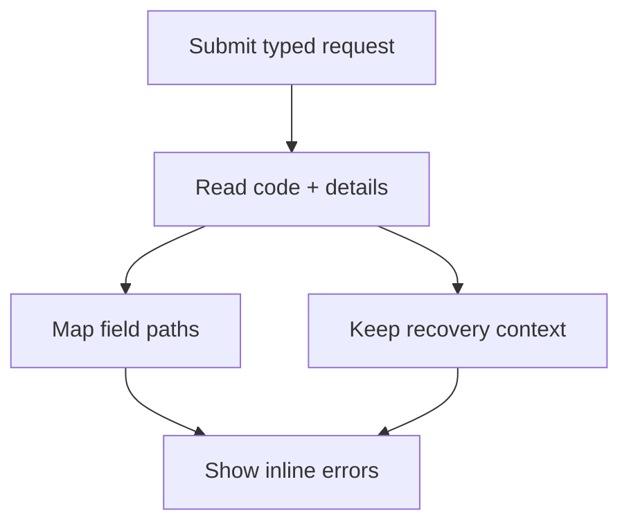

Client validation improves feedback, but the server remains authoritative for authorization,
concurrency, uniqueness, quota, and current-state checks. Protoform maps structured Connect and gRPC
errors into 3 destinations: field errors, an error summary, and diagnostic context.

This follows [AIP-193](https://google.aip.dev/193): use canonical status codes and standard
`google.rpc.*` details instead of parsing message strings. Connect exposes those details through
[`ConnectError.findDetails()`](https://connectrpc.com/docs/web/errors/#error-details).



## Submission lifecycle

Call `clearServerErrorContext()` before a new request, then pass every caught value to
`setServerErrors()`. Keep the returned `unmapped` violations in component state so no backend error is
lost when a path cannot be attached to a field.

```tsx
import type { FieldViolation } from "@/lib/protobuf-provider";
import { Button } from "@/components/ui/button";
import { useState } from "react";
import { toast } from "sonner";

const [unmapped, setUnmapped] = useState<FieldViolation[]>([]);

const onSubmit = form.handleSubmit(async (values) => {
  form.clearServerErrorContext();
  setUnmapped([]);

  try {
    await saveConnector(form.createMessage(values));
  } catch (error) {
    const result = form.setServerErrors(error);
    setUnmapped(result.unmapped);

    if (!result.handled && !result.context.message) {
      toast.error("Connector not saved. Check your connection and try again.");
    }
  }
});

return (
  <form onSubmit={onSubmit}>
    <ServerErrorSummary
      context={form.serverErrorContext}
      unmapped={unmapped}
    />
    {/* Registered fields */}
    <Button disabled={form.formState.isSubmitting} type="submit">
      Save connector
    </Button>
  </form>
);
```

`setServerErrors()` returns:

| Value | Meaning |
| --- | --- |
| `handled` | `true` when at least 1 `BadRequest.FieldViolation` mapped to a form field |
| `unmapped` | Every field violation whose path could not be mapped; render all of them |
| `context` | Status and structured non-field details extracted from the same error |

The same `context` becomes `form.serverErrorContext`. A non-Connect error produces `handled: false`,
an empty `unmapped` array, and an empty context. Keep a generic visible fallback for that case. Do not
reset the form after a failed request because the user needs the submitted values to recover.

## Field-path mapping

Set `serverPathPrefix` when the hook schema represents a nested request field but the backend reports
paths from the RPC request root:

```tsx
const form = useProtoForm(NotificationSchema, {
  serverPathPrefix: "notification",
});
```

| Backend field path | Form path |
| --- | --- |
| `notification.display_name` | `displayName` |
| `notification.shipping_address.postal_code` | `shippingAddress.postalCode` |
| `notification.delivery.webhook.signing_secret_ref` | `delivery.value.signingSecretRef` |
| `notification.delivery` | `delivery` |

Protoform strips the exact prefix, walks the protobuf descriptor, converts protobuf `snake_case` names
to TypeScript `camelCase`, and flattens oneof branches under `{oneofLocalName}.value`. It focuses the
first mapped field and adds every mapped violation with React Hook Form error type `server`. Generic
Protovalidate descriptions use the same actionable copy as client validation, while an empty
description falls back to `Review this value and try again.`

Unknown fields stay in `unmapped`. Bracket-indexed repeated and map paths such as
`contacts[0].email` are also currently unmapped because the mapper resolves descriptor field segments,
not collection indices. Show these violations in the summary instead of dropping them.

## Structured error context

`serverErrorContext` separates user feedback from machine-readable details:

| Detail | Extracted value | Recommended use |
| --- | --- | --- |
| Status code | `code` | Select a broad recovery path; log it |
| `LocalizedMessage` | `message`, `messageLocale` | Customer-facing summary text |
| `ErrorInfo` | `reason`, `domain`, `metadata` | Stable branching, telemetry, and support context |
| `RequestInfo` | `requestId` | Support reference and log correlation |
| `Help` | `helpLinks` | Relevant troubleshooting actions after URL validation |
| `RetryInfo` | `retryAfterSeconds` | Retry countdown or retry-action availability |
| `PreconditionFailure` | `preconditionViolations` | Explain state that must change before retrying |
| `QuotaFailure` | `quotaViolations` | Explain the exhausted quota and next action |
| `ResourceInfo` | `resource` | Identify the affected resource when disclosure is safe |
| `DebugInfo` | `debug` | Development logs only; never render stack entries to customers |
| Unknown detail type | `unmappedDetails` | Preserve its type name for fallback UI and telemetry rather than dropping it |

`RequestInfo.request_id` takes precedence over a request ID copied into `ErrorInfo.metadata`.
`LocalizedMessage` takes precedence over the raw Connect message. Without a localized detail,
`context.message` falls back to the developer-facing `rawMessage`, so only render it when the API
contract guarantees that it is safe customer copy.

Never branch on error message text. Branch on the canonical status code or the stable
`ErrorInfo.reason` and `ErrorInfo.domain` pair. Treat metadata as untrusted data, allowlist fields sent
to telemetry, and do not log secrets or user-submitted sensitive values.

## Accessible error summary

Inline errors are necessary but not sufficient. A summary must also include every unmapped,
precondition, and quota violation. Keep diagnostic values such as `DebugInfo` out of the DOM.

```tsx
import type {
  ConnectErrorContext,
  FieldViolation,
} from "@/lib/protobuf-provider";
import { Alert, AlertDescription, AlertTitle } from "@/components/ui/alert";

function getSafeHelpUrl(value: string): string | undefined {
  if (!URL.canParse(value)) {
    return;
  }
  const url = new URL(value);
  return url.protocol === "https:" ? url.href : undefined;
}

function ServerErrorSummary({
  context,
  unmapped,
}: {
  context: ConnectErrorContext | undefined;
  unmapped: FieldViolation[];
}) {
  if (!context) {
    return null;
  }

  const helpLinks = context.helpLinks.flatMap((link) => {
    const href = getSafeHelpUrl(link.url);
    return href ? [{ ...link, href }] : [];
  });
  const localizedMessage = context.messageLocale ? context.message : undefined;
  const hasSummary = Boolean(
    context.message ||
      context.requestId ||
      helpLinks.length ||
      unmapped.length ||
      context.preconditionViolations.length ||
      context.quotaViolations.length
  );

  if (!hasSummary) {
    return null;
  }

  return (
    <Alert aria-live="polite" variant="destructive">
      <AlertTitle>Connector not saved</AlertTitle>
      <AlertDescription>
        <p>
          {localizedMessage ??
            "Check the highlighted fields and the details below, then try again."}
        </p>

        {unmapped.length > 0 && (
          <ul>
            {unmapped.map((violation) => (
              <li key={`${violation.field}:${violation.description}`}>
                {violation.description || `Check ${violation.field}.`}
              </li>
            ))}
          </ul>
        )}

        {context.preconditionViolations.length > 0 && (
          <ul>
            {context.preconditionViolations.map((violation) => (
              <li key={`${violation.type}:${violation.subject}`}>
                {violation.description}
              </li>
            ))}
          </ul>
        )}

        {context.quotaViolations.length > 0 && (
          <ul>
            {context.quotaViolations.map((violation) => (
              <li key={`${violation.subject}:${violation.description}`}>
                {violation.description}
              </li>
            ))}
          </ul>
        )}

        {helpLinks.map((link) => (
          <p key={link.href}>
            <a href={link.href} rel="noreferrer" target="_blank">
              {link.description}
            </a>
          </p>
        ))}

        {context.requestId && <p>Support reference: {context.requestId}</p>}
      </AlertDescription>
    </Alert>
  );
}
```

Use `aria-invalid` on fields with errors, connect each error to its input with `aria-describedby`, and
render all messages rather than only the first. `setServerErrors()` requests focus for the first mapped
field. The summary uses `aria-live="polite"` so unmapped failures are announced without interrupting
the current field interaction.

### Stepper recovery

When AutoForm uses `stepper`, an asynchronous submit can report a field that is not mounted on the
current step. AutoForm inspects the submitted form state after the handler settles, opens the step
that owns the first error, renders every field error, and then focuses the first invalid control.
Values on every step remain intact. Root and unmapped errors stay in the form-level alert because
there is no safe field destination.

This requires stable top-level step ownership metadata. See [Steppers](/docs/steppers), the focused
[server-error form](/docs/server-error-form), and the combined
[complex end-to-end example](/docs/complex-example).

## Retry decisions

`RetryInfo` is a server hint, not permission to replay every mutation. Follow
[AIP-194](https://google.aip.dev/194): automatic retries are for unary, non-transactional operations
whose repeated execution cannot create unintended state changes.

| Code | Form recovery |
| --- | --- |
| `invalid_argument` | Show field and summary errors; retry only after values change |
| `failed_precondition` | Show every precondition; retry after the required state changes |
| `already_exists` / `not_found` | Explain the conflicting or missing resource; do not loop |
| `unauthenticated` | Restore authentication before retrying |
| `permission_denied` | Explain the allowed next action without revealing hidden resources |
| `aborted` | Refetch current state and let the user review changes before retrying the transaction |
| `resource_exhausted` | Show quota details; generally do not retry automatically |
| `unavailable` | Retry only an idempotent unary request, using bounded backoff and jitter |
| `deadline_exceeded` | Surface the timeout because the operation may have completed |
| `internal` / `unknown` / `data_loss` | Show a stable fallback and request ID; report the failure |
| `canceled` | Stop quietly when cancellation was initiated by the user |

Create and update operations are not automatically idempotent. If the API supports safe replay, put
an optional `request_id` on the request and honor the idempotency guarantees in
[AIP-155](https://google.aip.dev/155). Preserve the same request ID across retries of the same logical
operation.

## Server contract

For predictable client behavior, the API should:

- return canonical `google.rpc.Code` values and a brief developer-facing English status message
- attach one `ErrorInfo` with a stable UPPER_SNAKE_CASE reason, globally unique domain, and metadata
- use `BadRequest.FieldViolation` for each invalid request field and populate `description`, because
  the current Protoform mapper renders that value inline
- use protobuf request paths, including the request wrapper prefix when applicable
- attach `LocalizedMessage` for safe customer-facing copy and `Help` for relevant HTTPS guidance
- attach `RequestInfo` so support can correlate the failure without exposing debug internals
- attach `RetryInfo`, `PreconditionFailure`, `QuotaFailure`, and `ResourceInfo` only when their semantics
  match the failure
- keep `DebugInfo` restricted to trusted development and observability systems
- check permission before existence so `permission_denied` does not disclose a hidden resource

Protoform preserves these details but does not invent missing server semantics. If a backend returns
only an unstructured string, the form can show a generic fallback but cannot reliably map fields,
choose a recovery action, or correlate a support request.

## Verification matrix

Test the error path as part of the form contract:

- scalar, nested, oneof-group, and oneof-branch violations map to the expected field
- request-wrapper prefixes are stripped only when configured
- unknown and bracket-indexed paths appear in the summary
- every mapped and unmapped violation remains visible
- missing descriptions use the inline fallback
- localized messages, request IDs, help links, quota, and precondition details render correctly
- unsafe or relative help URLs are not rendered as links
- debug details and unapproved metadata never enter the DOM or customer telemetry
- non-Connect errors show a visible generic fallback
- retry controls respect code, idempotency, request ID, and `RetryInfo`
- a new submit attempt clears stale `serverErrorContext`
