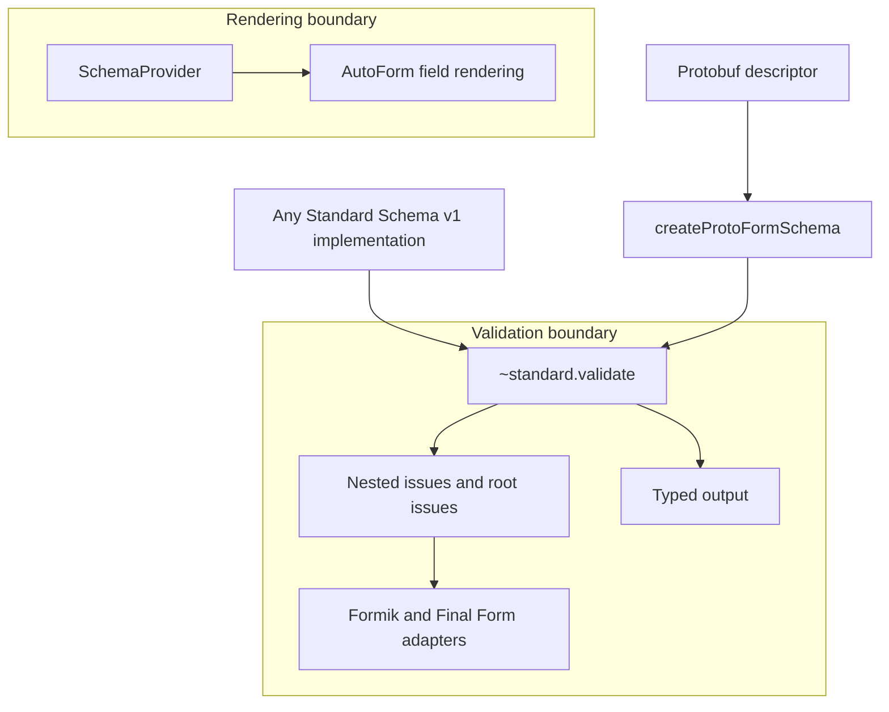

Protoform treats [Standard Schema v1](https://standardschema.dev/schema) as its validation boundary.
The copied Protoform core depends on the standard, not on Zod, Valibot, ArkType, or another
schema vendor. A conforming implementation can therefore use the same form-library adapters without
a vendor-specific package or code path.

This page describes the supported contract. The named libraries in the conformance table are test
evidence, not an allowlist.

## Capability matrix

| Capability | Support and behavior |
| --- | --- |
| Object implementations | **Supported.** Accepts an object with a conforming `~standard` property |
| Callable implementations | **Supported.** Accepts a function that also exposes the conforming `~standard` property |
| Synchronous validation | **Supported.** Returns form errors without forcing a promise |
| Asynchronous validation | **Supported.** Formik and Final Form await it |
| Nested issues | **Supported.** Preserves string, number, and `{ key }` path segments in a nested error tree |
| Root issues | **Supported.** Maps pathless issues to the form library's root-error channel |
| Multiple issues | **Supported.** Keeps every issue and joins messages for the same field with newlines |
| Typed output | **Supported.** Available from `~standard.validate` after successful validation |
| `libraryOptions` | **Supported.** Forwards vendor options unchanged to `~standard.validate` |
| Automatic field rendering | **Requires a provider.** AutoForm needs a `SchemaProvider` for fields, defaults, and UI metadata |

## Architecture boundary



Standard Schema describes validation input, typed output, and issues. It does not standardize field
discovery, default values, widgets, layout, or UI annotations. Those rendering concerns stay behind
`SchemaProvider`, so adding another schema library does not change Protoform's core architecture.

## Zod 4

Zod 4 implements Standard Schema directly. Pass a Zod schema to a Protoform adapter without a Zod
adapter or conversion step:

```tsx
import { createFormikValidator } from "@/lib/core"
import * as z from "zod"

const profileSchema = z.object({
  profile: z.object({
    displayName: z.string().min(2),
  }),
})

const validate = createFormikValidator(profileSchema)
```

Zod is a conformance dependency for testing only. It is not imported by
Protoform core.

## Zod Mini

[Zod Mini](https://zod.dev/packages/mini) exposes the same Standard Schema contract through its
functional, tree-shakable API:

```tsx
import { createFormikValidator } from "@/lib/core"
import { minLength, object, string } from "zod/mini"

const profileSchema = object({
  profile: object({
    displayName: string().check(minLength(2)),
  }),
})

const validate = createFormikValidator(profileSchema)
```

Protoform does not inspect Zod classes or methods. Zod 4 and Zod Mini reach the same
`~standard.validate` seam as every other conforming implementation.

## Adapter recipes

The adapters translate Standard Schema issues into each form library's nested error shape. They do
not own field rendering or submission.

### Formik

Formik accepts synchronous or asynchronous form-level validation:

```tsx
import { createFormikValidator } from "@/lib/core"

const validate = createFormikValidator(profileSchema)
```

Pathless issues use `_form`. See the complete [Formik integration](/docs/formik).

### Final Form

Pass Final Form's `FORM_ERROR` symbol as the root issue key:

```tsx
import { createFinalFormValidator } from "@/lib/core"
import { FORM_ERROR } from "final-form"

const validate = createFinalFormValidator(profileSchema, {
  rootErrorKey: FORM_ERROR,
})
```

See the complete [Final Form integration](/docs/final-form).

TanStack Form accepts Standard Schema natively. Protoform's optional native facade adds protobuf
messages, update masks, oneof helpers, and server-error mapping without replacing the TanStack API.
See the [TanStack Form integration](/docs/tanstack-form). React Hook Form can use its generic
`standardSchemaResolver`; protobuf applications should normally prefer its native `useProtoForm`
facade for protobuf-specific issue mapping and validation behavior.

## Typed output and transforms

Form-library validation callbacks return errors, not a schema's successful value. Validate in the
submit handler when the schema transforms its input or produces another output type:

```tsx
import type { StandardSchemaV1 } from "@/lib/core"

type ProfileValues = StandardSchemaV1.InferInput<typeof profileSchema>

async function submit(values: ProfileValues) {
  const result = await profileSchema["~standard"].validate(values)
  if (result.issues) return

  await saveProfile(result.value)
}
```

`result.value` keeps the output type declared by the schema. For a Protoform protobuf schema, it is
the generated message expected by the API client.

## Vendor library options

If an implementation supports extra validation options, pass them through the adapter:

```tsx
const validate = createFormikValidator(profileSchema, {
  libraryOptions: {
    locale: "en-GB",
  },
})
```

Protoform forwards `libraryOptions` unchanged and does not interpret vendor keys. The schema
implementation remains responsible for their meaning and support.

## Conformance evidence

| Implementation | What the suite verifies |
| --- | --- |
| Protoform protobuf schema | Standard Schema metadata, validation issues, and typed message output |
| Callable fixture | Runtime detection and `libraryOptions` forwarding |
| Zod 4 | Direct acceptance plus nested issue mapping through every adapter |
| Zod Mini | Direct acceptance plus nested issue mapping through every adapter |

Run the public evidence with:

```bash
bun run test:conformance -- -t "Standard Schema"
```

Any library implementing Standard Schema v1 should use the same seam. Add a conformance fixture
before advertising a named library as verified.
