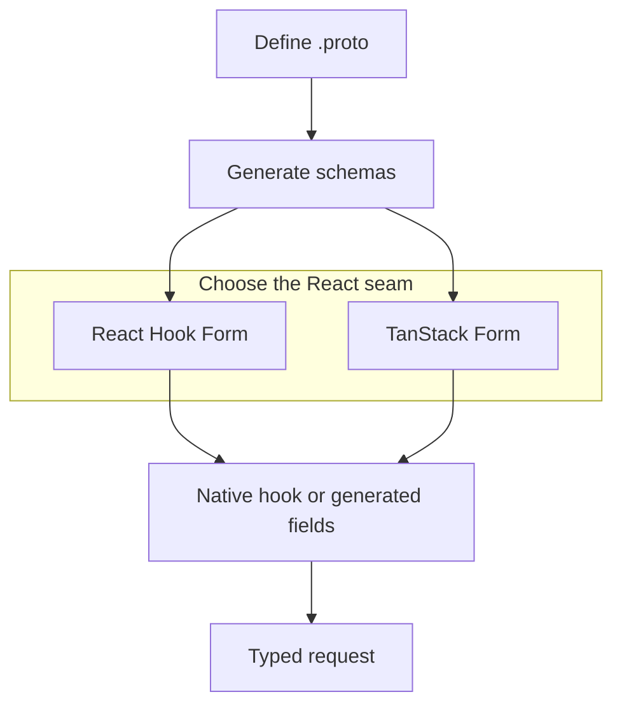

Protoform is a shadcn-style registry for forms where protobuf is the source of truth.
It combines:

- **Protovalidate** for validation rules that work across client and server.
- **React Hook Form** as the default generated AutoForm engine, plus a native hook and generated
  AutoForm for **TanStack Form**.
- **Formik** and **Final Form** validation adapters for applications that keep those state APIs.
- **CEL expressions** for conditional business rules.
- **AutoForm annotations** for generated UI from protobuf descriptors.
- **Connect/gRPC error mapping** for server-side field violations.
- **[Standard Schema](/docs/standard-schema)** as a portable validation interface for other form
  libraries.
- **A conformance suite** for descriptor parsing, validation, form paths, and value conversion.
- **A production-readiness profile** that measures verified coverage and names every remaining test.
- **Five focused interactive demo hubs** for [Protobuf](/docs/protobuf-examples),
  [Protovalidate](/docs/protovalidate-examples), [CEL](/docs/cel-examples),
  [production behavior](/docs/production-examples), and AIPs.
- **[One live form for every applicable AIP](/docs/aip-example-catalog)** in a single hub, with
  stable deep links tied to executable compatibility evidence.

## Why it exists

Most form stacks start with a TypeScript schema and then drift from the API contract.
Protoform starts from the protobuf contract instead: a message descriptor gives you types,
validation, UI metadata, oneof structure, server error paths, and future code generation hooks.

```bash
bunx shadcn@latest add @protoform/protoform
```

## The story

1. Keep the React Hook Form or TanStack Form API already used by the application.
2. Swap the native hook import for the matching `useProtoForm(schema, options)`.
3. Use Protovalidate annotations instead of duplicated frontend validation.
4. Add CEL for cross-field logic.
5. Annotate proto files to generate forms automatically.
6. Map backend `BadRequest.FieldViolation` errors to exact fields.
7. Migrate Zod schemas incrementally with the LLM migration prompt.
8. Lock the public behavior with `bun run test:conformance`.
9. Track the remaining production work with `bun run readiness:report`.

Existing Protobuf-ES v1 applications should start with the
[v2 migration guide](/docs/protobuf-v2-migration); Protoform accepts v2 generated schemas only.

See the live [production-readiness dashboard](/docs/production-readiness) for the current score by
Protobuf, Protovalidate, CEL, Google AIP, and runtime area.



{/* docs-directory:start */}
## Documentation directory

Use these body links to move directly between every maintained guide and example.

- **Languages:** [Polski](/docs/pl), [简体中文](/docs/zh), [繁體中文](/docs/zh-TW)
- **API reference:** [Library RPC reference](/docs/reference)
- **AIP examples:** [AIP examples](/docs/aip-example-catalog)
- **Build forms:** [AutoForm annotations](/docs/auto-form), [Final Form](/docs/final-form), [Formik](/docs/formik), [Oneof and edge cases](/docs/oneof-edge-cases), [React Hook Form](/docs/react-hook-form), [Steppers](/docs/steppers), [TanStack Form](/docs/tanstack-form)
- **Learning examples:** [AIP resource form](/docs/aip-resource-form), [Bare-bones form](/docs/bare-bones-form), [CEL and RE2 form](/docs/cel-re2-form), [Complex end-to-end example](/docs/complex-example), [Deeply nested form](/docs/deeply-nested), [Kitchen sink](/docs/kitchen-sink), [Oneof form](/docs/oneof-form), [Server-error form](/docs/server-error-form), [Two-step form](/docs/two-step-form)
- **Feature examples:** [CEL examples](/docs/cel-examples), [Production examples](/docs/production-examples), [Protobuf examples](/docs/protobuf-examples), [Protovalidate examples](/docs/protovalidate-examples)
- **Migrations:** [LLM migration playbook](/docs/llm-migration-playbook), [Migrating from Yup](/docs/yup-migration), [Migrating from Zod](/docs/zod-migration), [Migrating to Protobuf-ES v2](/docs/protobuf-v2-migration)
- **More guides:** [Presets](/docs/presets)
- **Production:** [Conformance suite](/docs/conformance), [Deployment](/docs/deployment), [Port audit](/docs/port-audit), [Production readiness](/docs/production-readiness), [Testing forms](/docs/testing-forms)
- **Start here:** [Bookstore walkthrough](/docs/bookstore), [Getting started](/docs/getting-started), [Registry install](/docs/registry-install)
- **Validation and APIs:** [API recipes](/docs/api-recipes), [CEL expressions](/docs/cel-expressions), [Google AIP and protobuf design](/docs/aip-protobuf), [Protovalidate](/docs/protovalidate), [Server errors](/docs/server-errors), [Standard Schema](/docs/standard-schema)
{/* docs-directory:end */}
