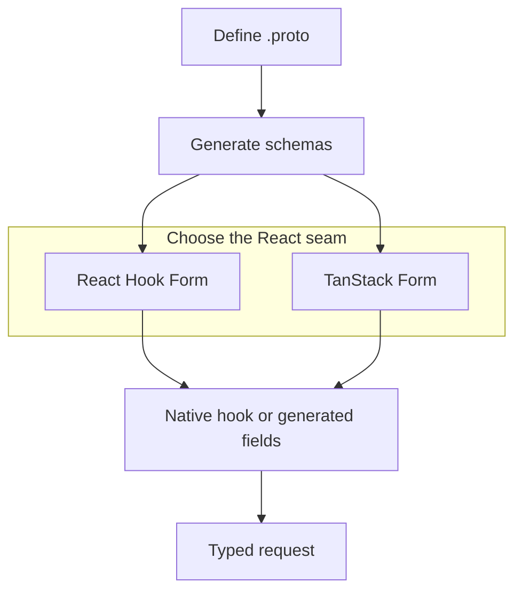

Protoform is a shadcn-style registry for forms where protobuf is the source of truth.
It combines:

- **Protovalidate** for validation rules that work across client and server.
- **React Hook Form** as the default generated AutoForm engine, plus a native hook and generated
  AutoForm for **TanStack Form**.
- **Formik** and **Final Form** validation adapters for applications that keep those state APIs.
- **CEL expressions** for conditional business rules.
- **AutoForm annotations** for generated UI from protobuf descriptors.
- **Connect/gRPC error mapping** for server-side field violations.
- **[Standard Schema](/docs/standard-schema)** as a portable validation interface for other form
  libraries.
- **A conformance suite** for descriptor parsing, validation, form paths, and value conversion.
- **A production-readiness profile** that measures verified coverage and names every remaining test.
- **[A focused feature demo catalog](/docs/feature-example-catalog)** spanning Protobuf, Bufbuild
  descriptors, Protovalidate, CEL, RE2, well-known types, steppers, and production behavior.
- **[One live form for every applicable AIP](/docs/aip-example-catalog)**, with 61 dedicated pages
  tied to executable compatibility evidence.

## Why it exists

Most form stacks start with a TypeScript schema and then drift from the API contract.
Protoform starts from the protobuf contract instead: a message descriptor gives you types,
validation, UI metadata, oneof structure, server error paths, and future code generation hooks.

```bash
bunx shadcn@latest add @protoform/protoform
```

## The story

1. Keep the React Hook Form or TanStack Form API already used by the application.
2. Swap the native hook import for the matching `useProtoForm(schema, options)`.
3. Use Protovalidate annotations instead of duplicated frontend validation.
4. Add CEL for cross-field logic.
5. Annotate proto files to generate forms automatically.
6. Map backend `BadRequest.FieldViolation` errors to exact fields.
7. Migrate Zod schemas incrementally with the LLM migration prompt.
8. Lock the public behavior with `bun run test:conformance`.
9. Track the remaining production work with `bun run readiness:report`.

Existing Protobuf-ES v1 applications should start with the
[v2 migration guide](/docs/protobuf-v2-migration); Protoform accepts v2 generated schemas only.

See the live [production-readiness dashboard](/docs/production-readiness) for the current score by
Protobuf, Protovalidate, CEL, Google AIP, and runtime area.


