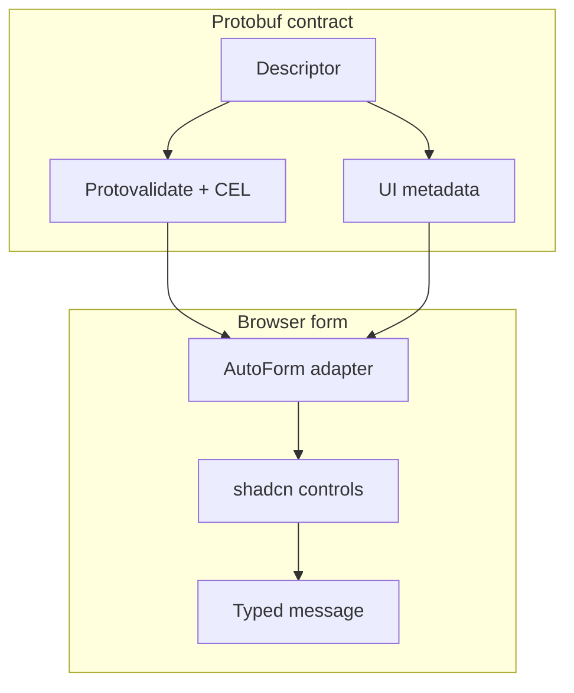

AutoForm odczytuje deskryptory protobuf i opcjonalne adnotacje interfejsu, aby generować pola.
Używaj go w panelach administracyjnych, procesach konfiguracji początkowej, konfiguracji konektorów oraz formularzach, które powinny ewoluować wraz ze schematem proto.

Domyślny element rejestru `auto-form` używa React Hook Form. Zainstaluj `auto-form-tanstack` i zaimportuj
z `@/components/auto-form-tanstack`, aby TanStack Form pozostał właścicielem stanu. Oba wpisy używają
tego samego renderera, pól, cyklu walidacji, formularza krokowego i kontraktu przesyłania protobuf.

```tsx
import { AutoForm } from "@/components/auto-form";
import { CreateConnectorRequestSchema } from "@/gen/example/v1/connector_pb";

export function ConnectorForm() {
  return (
    <AutoForm
      schema={CreateConnectorRequestSchema}
      onSubmit={(message) => console.log(message)}
      modes={["simple", "advanced", "json"]}
    />
  );
}
```

W przypadku schematów protobuf funkcja `onSubmit` otrzymuje automatyczną maskę aktualizacji zmodyfikowanych pól oraz `AbortSignal` jako
trzeci argument. Użyj maski podczas konstruowania żądania aktualizacji AIP; pusta tablica `paths` oznacza, że
nic się nie zmieniło. Przekaż sygnał do transportów obsługujących przerywanie, aby odmontowanie komponentu i nowsze próby zatrzymywały nieaktualne operacje:

```tsx
<AutoForm
  defaultValues={connector}
  schema={ConnectorSchema}
  withSubmit
  onSubmit={(nextConnector, _form, { signal, updateMask }) =>
    updateConnector(create(UpdateConnectorRequestSchema, {
      connector: nextConnector,
      updateMask,
    }), { signal })
  }
/>
```

Niestandardowa funkcja `SchemaProvider.validateSchema(values, context)` otrzymuje ten sam sygnał. AutoForm przerywa
zastąpioną walidację kroku, przerywa aktywną walidację i przesyłanie po odmontowaniu oraz ignoruje wyniki,
które pojawią się po anulowaniu.

## Przykłady metadanych interfejsu

Protoform obsługuje adnotacje dotyczące:

- etykiet i opisów
- tekstu pomocy i linków do dokumentacji
- kolejności pól i zwartych wierszy
- stabilnego przypisania do kroków w liniowych formularzach wieloetapowych
- widoczności w trybie prostym i zaawansowanym
- widoczności i stanów wyłączenia sterowanych przez CEL
- opcji wyboru i grup opcji
- niestandardowych komunikatów walidacyjnych
- przykładów wyrażeń regularnych
- reguł wyłączenia lub warunkowej widoczności

```proto
message ConnectorConfig {
  string bootstrap_servers = 1 [
    (protoform.ui.field).label = "Bootstrap servers",
    (protoform.ui.field).help = "Comma-separated host:port list",
    (protoform.ui.field).step = "connection"
  ];
}
```

Przekaż uporządkowane definicje kroków przez `stepper={{ steps }}`. AutoForm po wybraniu opcji Kontynuuj waliduje tylko bieżący
krok, po wybraniu opcji Prześlij waliduje całe żądanie i zwraca ustrukturyzowane błędy pól do
kroków, do których należą. Zobacz [Formularze krokowe](/docs/steppers).

## Obsługa oneof

Pola oneof są spłaszczane na potrzeby formularza, a jednocześnie nadal tworzą prawidłowe komunikaty protobuf:

```tsx
form.setOneofValue("auth", "sasl", { username: "", password: "" });
```

## Niestandardowe renderery pól

Rozszerz typowany rejestr, gdy aplikacja hostująca potrzebuje kontrolki, której nie ma w pakiecie. Niestandardowa nazwa jest przekazywana
przez `fieldConfig`, rejestr, pola zagnieżdżone, klasyfikację i oba adaptery formularzy bez
rzutowań. Jeśli konfiguracja wskazuje renderer bez komponentu, AutoForm wyświetla błąd
konfiguracji na poziomie pola zamiast przerywać działanie.

```tsx
import {
  AutoForm,
  defaultRegistry,
  type AutoFormFieldProps,
} from "@/components/auto-form";
import { Textarea as CodeEditor } from "@/components/ui/textarea";

function CodeField({ id, inputProps }: AutoFormFieldProps) {
  const { onValueChange, testId, value, ...controlProps } = inputProps;
  return (
    <CodeEditor
      {...controlProps}
      data-testid={testId}
      id={id}
      value={String(value ?? "")}
      onChange={(event) => onValueChange(event.target.value)}
    />
  );
}

const registry = defaultRegistry.clone().register({
  name: "code",
  priority: 100,
  match: (field) => field.key === "source",
  component: CodeField,
});

<AutoForm
  schema={schema}
  fieldRegistry={registry}
  formComponents={{ code: CodeField }}
  fieldConfig={{ "settings.source": { fieldType: "code" } }}
/>;
```

## Powtarzane ciągi znaków

Konwersja protobuf domyślnie odrzuca puste wpisy i wpisy zawierające wyłącznie białe znaki z powtarzanych pól typu string.
Pozostałe powtarzane pola skalarne, wyliczeniowe, bajtowe i komunikatowe pozostają bez zmian. Aby zachować puste wiersze
dla określonego pola, użyj jego ścieżki deskryptora:

```tsx
<AutoForm
  schema={RequestSchema}
  fieldConfig={{ aliases: { emptyRepeatedStringPolicy: "preserve" } }}
/>;

useProtoForm(RequestSchema, {
  emptyRepeatedStringPolicies: { "settings.aliases": "preserve" },
});
```

Ścieżki zagnieżdżonych komunikatów i komunikatów oneof używają notacji kropkowej.

## Cykl życia stanu zmian

Funkcja `onDirtyChange` zgłasza początkowy stan `false` i każde odrębne przejście. Obejmuje zmiany wartości skalarnych,
zagnieżdżonych, tablic, map i oneof. Przywrócenie czystego stanu bazowego ponownie zgłasza `false`. Po
udanym zapisie ustaw przesłane wartości jako nowy stan bazowy przed nawigacją:

```tsx
<AutoForm
  schema={RequestSchema}
  onDirtyChange={setHasUnsavedChanges}
  onSubmit={async (message, _nativeForm, { form }) => {
    await save(message);
    form.markClean();
    navigate({ to: "/resources" });
  }}
/>;
```

Funkcja `markClean()` aktualizuje callback synchronicznie, dzięki czemu blokady tras wykrywają czysty stan w ramach
tego samego callbacku przesyłania.

## Nagłówek główny i przestarzałe pola

Tytuł główny i opis pochodzące ze schematu są domyślnie renderowane. Użyj `rootHeader="hidden"`, aby je
pominąć, lub `renderRootHeader={(metadata) => ...}`, aby renderować je w powłoce należącej do aplikacji hostującej.

Pola oznaczone jako przestarzałe przez deskryptor protobuf pozostają domyślnie widoczne. Ustaw
`deprecatedFields="disable"`, aby uniemożliwić edycję, lub `deprecatedFields="hide"`, aby je pominąć, w tym
pola zagnieżdżone i opcje oneof. Ukryte i wyłączone wartości pozostają w danych formularza, dzięki czemu edycja
nowszego pola nie usuwa po cichu istniejących danych.

## Błędy pól z serwera

Oba hooki formularzy protobuf mapują ścieżki pól z serwera na odpowiadające im kontrolki, przekształcają ogólne opisy ograniczeń
na bardziej zrozumiałe, ustawiają fokus na pierwszym zmapowanym polu, jeśli adapter to obsługuje, oraz zachowują niezmapowane
naruszenia do obsługi w podsumowaniu lub powiadomieniu. W przypadku pustych opisów z serwera używany jest praktyczny komunikat zastępczy
„Sprawdź tę wartość i spróbuj ponownie”. Kontekst szczegółów błędu pozostaje dostępny przez
`serverErrorContext`.


## Zakres kontrolek zgodnych z shadcn

AutoForm przekształca adnotacje protobuf i konfigurację pól w komponenty interfejsu należące do kodu źródłowego. Domyślny
element rejestru kopiuje środowisko uruchomieniowe i poniższe cele renderowania do aplikacji:

| Adnotacja / konfiguracja | Kontrolka w stylu shadcn |
| --- | --- |
| `CONTROL_TYPE_TEXT`, `email`, `url`, `password` | `Input` |
| `CONTROL_TYPE_TEXTAREA` | `Textarea` |
| `CONTROL_TYPE_CHECKBOX`, `SWITCH`, `TOGGLE` | `Checkbox`, `Switch`, `Toggle` |
| `CONTROL_TYPE_RADIO_GROUP`, `SELECT`, `COMBOBOX`, `MULTI_SELECT` | `RadioGroup`, `Select`, `Command`, `Popover`, `Badge` |
| `CONTROL_TYPE_DATE`, `TIMESTAMP` | `Calendar`, `Popover`, `InputGroup` |
| `CONTROL_TYPE_JSON`, `KEY_VALUE`, `SLIDER` | wyspecjalizowane komponenty pól w stylu shadcn |



Manifest zakresu obejmuje teraz każdy dołączony komponent shadcn Base UI. Prymitywy wprowadzania danych są renderowane bezpośrednio na podstawie adnotacji proto; prymitywy wyświetlania i powłoki są dostępne do komponowania AutoForm, podsumowań, slotów, pomocy, stanów ładowania i interfejsu trybów bez zależności od Radix.

### Pełny zakres dołączonych komponentów

| Rola komponentu | Komponenty |
| --- | --- |
| Bezpośrednie kontrolki pól | `Input`, `Textarea`, `Checkbox`, `Switch`, `Toggle`, `RadioGroup`, `Select`, `Combobox`, `MultiSelect`, `Calendar`, `Slider`, `JsonField`, `KeyValueField`, `Tags`, `ToggleGroup`, `Choicebox` |
| Kompozycja pól | `Button`, `Badge`, `InputGroup`, `Popover`, `Command`, `Collapsible`, `Dialog` |
| Powłoka i stan formularza | `Field`, `Group`, `Label`, `Tooltip`, `Tabs`, `Spinner`, `Typography`, `Alert` |
| Prymitywy tylko do wyświetlania i demonstracji | `Card`, `Separator`, `CopyButton` |

Manifest znajduje się w `shadcn-controls.ts` i jest objęty testami, dlatego dodanie nowego dołączonego komponentu shadcn wymaga określenia, czy jest to pole renderowane z proto, element kompozycji pola, powłoka formularza czy prymityw tylko do wyświetlania.
