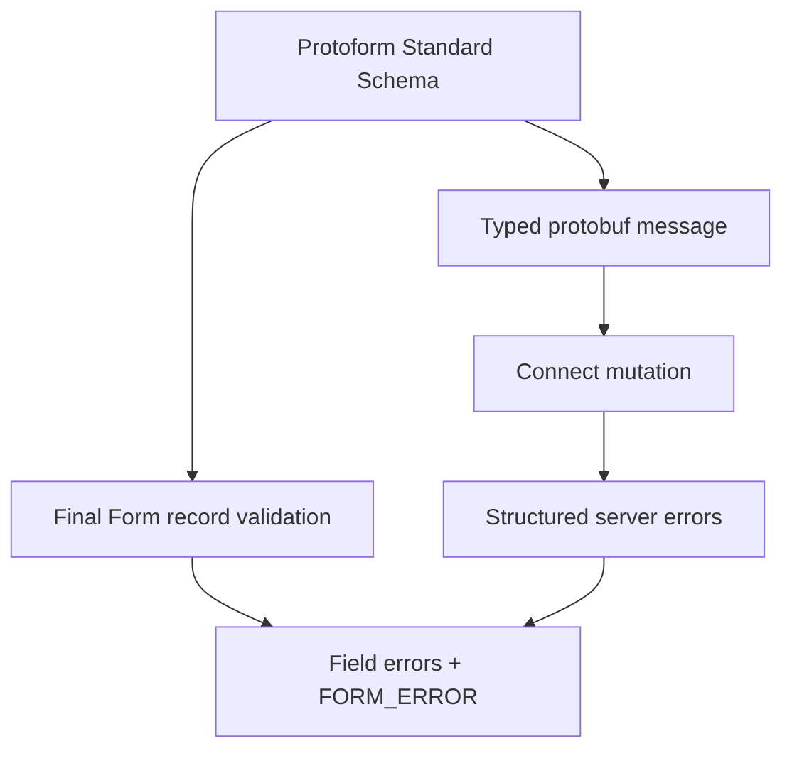

Protoform udostępnia walidację protobuf jako Standard Schema i dostosowuje zgłaszane problemy do kontraktu walidacji całego rekordu w Final Form. Formularz pozostaje tworzony ręcznie, a walidacja i typowane przesyłanie nadal korzystają z wygenerowanego deskryptora protobuf.

```bash
bun add final-form react-final-form
bunx shadcn@latest add @protoform/protoform-core @protoform/protobuf-provider
```

## Przykład interaktywny

Ten formularz używa wygenerowanego deskryptora żądania, lokalnego API TypeScript, walidacji po stronie klienta, typowanego przesyłania protobuf oraz ustrukturyzowanych błędów serwera. Prześlij go bez danych, aby zobaczyć walidację deskryptora. Użyj adresu `ada@blocked.example`, aby zobaczyć naruszenie zwrócone przez serwer do pola adresu e-mail.

<div className="my-8 rounded-2xl border p-6">
  <FinalFormExample />
</div>

## Utwórz współdzielony schemat

```tsx
import { createProtoFormSchema } from "@/lib/protobuf-provider"

interface ProfileValues {
  displayName: string
  email: string
}

const schema = createProtoFormSchema<
  ProfileValues,
  typeof SubmitProfileRequestSchema
>(SubmitProfileRequestSchema)
```

## Waliduj za pomocą Final Form

React Final Form obsługuje walidację rekordu, która zwraca obiekt błędów lub obietnicę. Przekaż klucz `FORM_ERROR`, aby problemy główne korzystały z kanału błędów formularza udostępnianego przez framework.

```tsx
import { createFinalFormValidator } from "@/lib/core"
import { FORM_ERROR } from "final-form"
import { Form } from "react-final-form"

const validate = createFinalFormValidator(schema, {
  rootErrorKey: FORM_ERROR,
})

<Form
  initialValues={{ displayName: "", email: "" }}
  validate={validate}
  onSubmit={async (values) => {
    const result = await schema["~standard"].validate(values)
    if (result.issues) return { [FORM_ERROR]: "Review the form." }

    try {
      await client.submitProfile(result.value)
    } catch (error) {
      return mapStructuredServerErrors(error, FORM_ERROR)
    }
  }}
>
  {({ handleSubmit }) => <form onSubmit={handleSubmit}>{/* fields */}</form>}
</Form>
```

Przeprowadź walidację w procedurze obsługi przesyłania, aby uzyskać wygenerowany, typowany komunikat protobuf. Sam adapter walidacji zwraca zagnieżdżone błędy oczekiwane przez Final Form.

## Błędy przesyłania

Final Form oczekuje, że przewidywane niepowodzenia przesyłania zostaną rozwiązane z obiektem błędów. Odrzucenie obietnicy zarezerwuj dla błędów transportu lub programowania. Zwracaj zmapowane, ustrukturyzowane błędy serwera z `onSubmit`, wyświetlaj `submitError` i ustaw fokus na pierwszym polu, którego dotyczy naruszenie zgłoszone przez serwer.

Wyświetlaj wszystkie komunikaty główne i komunikaty pól, zachowuj wprowadzone wartości oraz ustawiaj `aria-invalid` dla nieprawidłowych pól. Ścieżki protobuf należy konwertować za pomocą `extractFieldViolations` i `protoPathToFormPath`; niezmapowane niepowodzenia pozostają widoczne na poziomie formularza.



Informacje o semantyce walidacji rekordu i przesyłania znajdziesz w opisie [kontraktu `Form` biblioteki React Final Form](https://final-form.org/docs/react-final-form/types/FormProps). Wygenerowane adaptery AutoForm są obecnie przeznaczone dla React Hook Form i TanStack Form. Użyj tego adaptera z istniejącym formularzem Final Form utworzonym ręcznie.
