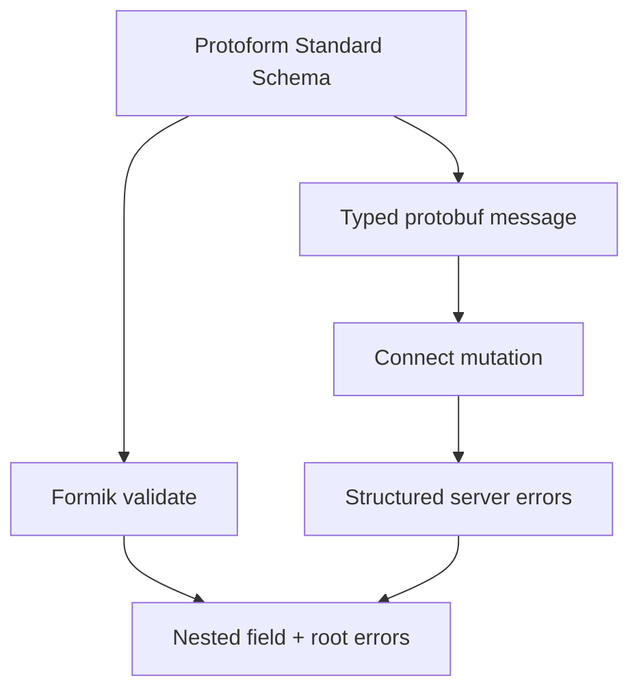

Protoform łączy Formik z tym samym Standard Schema, którego używają wszystkie pozostałe integracje. Adapter
mapuje każdy problem walidacji na zagnieżdżony obiekt błędów Formik, podczas gdy protobuf pozostaje kontraktem
walidacji i przesyłania.

```bash
bun add formik
bunx shadcn@latest add @protoform/protoform-foundation @protoform/protobuf-provider
```

## Przykład interaktywny

Ten formularz korzysta z wygenerowanego deskryptora żądania, lokalnego API TypeScript, walidacji po stronie klienta,
przesyłania typowanego protobuf oraz ustrukturyzowanych błędów serwera. Prześlij pusty formularz, aby zobaczyć walidację deskryptora. Użyj
`ada@blocked.example`, aby zobaczyć naruszenie po stronie serwera przypisane do pola adresu e-mail.

<div className="my-8 rounded-2xl border p-6">
  <FormikExample />
</div>

## Tworzenie współdzielonego schematu

```tsx
import { createProtoFormSchema } from "@/lib/protobuf-provider"

interface ProfileValues {
  displayName: string
  email: string
}

const schema = createProtoFormSchema<
  ProfileValues,
  typeof SubmitProfileRequestSchema
>(SubmitProfileRequestSchema)
```

## Walidacja za pomocą Formik

Formik akceptuje synchroniczne lub asynchroniczne funkcje `validate` na poziomie formularza. Przekaż
`createFormikValidator(schema)` do `validate`, a nie do `validationSchema`; ta druga właściwość oczekuje
interfejsu schematu właściwego dla konkretnej biblioteki.

```tsx
import { createFormikValidator } from "@/lib/core"
import { Formik } from "formik"

const validate = createFormikValidator(schema)

<Formik
  initialValues={{ displayName: "", email: "" }}
  validate={validate}
  onSubmit={async (values, helpers) => {
    const result = await schema["~standard"].validate(values)
    if (result.issues) return

    try {
      await client.submitProfile(result.value)
    } catch (error) {
      helpers.setErrors(mapStructuredServerErrors(error))
    }
  }}
>
  {({ handleSubmit }) => <form onSubmit={handleSubmit}>{/* fields */}</form>}
</Formik>
```

Adapter walidacji zwraca wyłącznie błędy zgodne ze strukturą formularza. Przeprowadź walidację w procedurze obsługi przesyłania, aby uzyskać
przekształcone dane wyjściowe schematu, w tym wygenerowaną, typowaną wiadomość protobuf.

## Błędy główne i błędy serwera

Główne problemy walidacji domyślnie używają `_form`. Wyświetl każdą główną wiadomość w widocznym alercie. Mapuj
ustrukturyzowane błędy serwera ze ścieżek protobuf za pomocą `extractFieldViolations` i
`protoPathToFormPath`, wywołaj `setErrors` i ustaw fokus na pierwszym zmapowanym polu. Niezmapowane błędy transportu i
serwera umieść w alercie na poziomie formularza zamiast je po cichu ignorować.

Wiele problemów dotyczących jednego pola jest rozdzielanych znakami nowego wiersza. Rozdziel je podczas renderowania, aby każdy błąd był
widoczny, i ustaw `aria-invalid` na odpowiednim polu wejściowym.



Informacje o cyklu walidacji Formik znajdziesz w [przewodniku po walidacji Formik](https://formik.org/docs/guides/validation).
Wygenerowane adaptery AutoForm są obecnie przeznaczone dla React Hook Form i TanStack Form. Użyj tego
adaptera w istniejącym, ręcznie utworzonym formularzu Formik.
