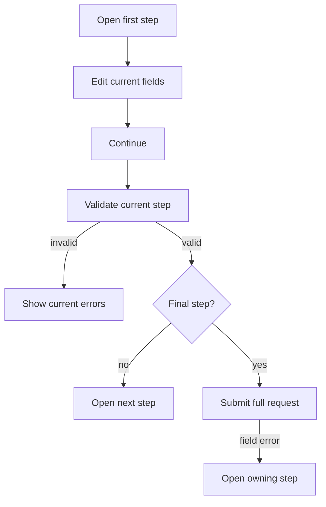

Formularz krokowy Protoform to opcjonalny tryb prezentacji AutoForm. Wykorzystuje należące do kodu źródłowego prymitywy shadcn `Button`
i typografii, otaczające semantyczny punkt orientacyjny nawigacji oraz listę uporządkowaną. shadcn nie
udostępnia natywnego komponentu Stepper w swoim [katalogu komponentów](https://ui.shadcn.com/docs/components),
dlatego implementacja opiera się na utrwalonych wytycznych dotyczących formularzy wielostronicowych i wskaźników kroków, zamiast
przystosowywać Tabs do innego zastosowania.

Tabs przełączają równorzędne panele w dowolnej kolejności. Formularz krokowy jest zadaniem liniowym z walidacją bieżącego kroku,
akcjami Wstecz i Kontynuuj oraz końcową akcją Prześlij. To rozróżnienie odpowiada
[wzorcowi formularza wielostronicowego W3C](https://www.w3.org/WAI/tutorials/forms/multi-page/) oraz
[wytycznym USWDS dotyczącym wskaźnika kroków](https://designsystem.digital.gov/components/step-indicator/).

## Zalecenie: zachowaj kontrolę nad kompozycją

Zachowaj istniejącą implementację rejestru. Nie dodawaj biblioteki stanu formularza krokowego ani ogólnej zależności Stepper.
Formularz już zarządza wartościami, walidacją, przesyłaniem i błędami serwera; dodanie kolejnej
maszyny stanów wymagałoby synchronizacji bez poprawy interfejsu użytkownika.

Zbuduj ten wzorzec z prymitywów shadcn:

- `Button` dla akcji Wstecz, Kontynuuj i Prześlij.
- Tokeny typografii dla nazwy i opisu kroku.
- Natywne `<nav>` i `<ol>` zapewniające semantykę postępu.
- Responsywne etykiety poziome, które przenoszą się pod numery, a następnie znikają, zanim lista uporządkowana
  musiałaby zawijać się do kolejnego wiersza.
- Opcjonalny pionowy pasek dla dłuższych nazw kroków.
- `Separator`, `Field` i `Alert` tam, gdzie formularz już ich używa; żaden z nich nie zarządza stanem nawigacji.

Minimalny wskaźnik należący do kodu źródłowego korzysta ze zwykłego Reacta i HTML:

```tsx
<nav aria-label="Form progress">
  <ol>
    {steps.map((step, index) => (
      <li
        aria-current={index === currentStepIndex ? "step" : undefined}
        key={step.id}
      >
        <span>{index + 1}</span>
        <span>{step.title}</span>
      </li>
    ))}
  </ol>
</nav>
```

Nie zastępuj go komponentami Tabs, Breadcrumb, Carousel ani klikalnym rzędem przycisków. Tabs reprezentują równorzędne widoki,
Breadcrumb opisuje położenie, Carousel służy do przeglądania treści, a bezpośrednie przyciski kroków pozwalają użytkownikom ominąć
kontrakt walidacji formularza. Jeśli produkt dopuści później nawigację nieliniową, wprowadź ją jako
jawną politykę AutoForm z testami, zamiast zmieniać semantykę wskaźnika.

## Konfigurowanie kroków

```tsx
const steps = [
  { id: "basics", title: "Basics", description: "Name the resource." },
  { id: "runtime", title: "Runtime", description: "Choose capacity." },
  { id: "review", title: "Review", description: "Confirm and submit." },
];

<AutoForm
  schema={CreateEnvironmentRequestSchema}
  stepper={{ steps, defaultStep: "basics" }}
  withSubmit
/>
```

Układ poziomy jest domyślny. Pozostaje w jednym wierszu i dostosowuje się do dostępnej szerokości: wąskie
kontenery pokazują tylko numery, średnie umieszczają etykiety pod numerami, a szerokie
umieszczają etykiety w tym samym wierszu.

Użyj pionowego paska, gdy nazwy kroków wymagają więcej miejsca:

```tsx
<AutoForm
  schema={CreateEnvironmentRequestSchema}
  stepper={{ steps, orientation: "vertical" }}
  withSubmit
/>
```

Na szerszych ekranach pionowy pasek znajduje się obok aktywnego panelu, a na wąskich
przenosi się nad niego. Obie orientacje zachowują tę samą semantykę listy uporządkowanej i liniowe działanie walidacji.

`stepper` wymaga co najmniej 2 kroków z niepustymi, unikalnymi identyfikatorami. Identyfikator stanowi kontrakt między
uporządkowaną konfiguracją Reacta a metadanymi interfejsu użytkownika protobuf:

```proto
message CreateEnvironmentRequest {
  string display_name = 1 [
    (protoform.v1.field_ui).step = "basics"
  ];

  oneof credentials {
    option (protoform.v1.oneof_ui).step = "runtime";
    ApiKeyCredentials api_key = 2;
    ServiceAccountCredentials service_account = 3;
  }
}
```

Pola bez adnotacji i nieznane identyfikatory kroków trafiają do pierwszego kroku, dzięki czemu ewolucja schematu nie ukrywa
nowych danych żądania. Przypisanie do kroków dotyczy obecnie pól najwyższego poziomu i oneof.

Gdy `showSummary` jest włączone razem z formularzem krokowym, Protoform ukrywa podsumowanie aż do ostatniego
kroku. Pozwala to zachować skupiony przebieg, a jednocześnie zapewnia użytkownikowi pełny przegląd przed przesłaniem.

## Kontrakt interakcji



| Akcja | Działanie |
| --- | --- |
| Wstecz | Anuluje oczekującą walidację kroku, przechodzi wstecz i zachowuje wartości |
| Kontynuuj | Waliduje bieżący krok; pozostaje wyłączone podczas walidacji asynchronicznej |
| Prześlij | Waliduje kompletne żądanie; pozostaje wyłączone podczas wykonywania mutacji |
| Błąd pola z serwera | Otwiera krok zawierający pole, wyświetla błąd i ustawia fokus na tym polu |
| Błąd główny lub nieprzypisany | Pozostaje na bieżącym kroku i wyświetla alert na poziomie formularza |

Formularze oparte na resolverze walidują kompletne żądanie, dzięki czemu niezmienniki na poziomie głównym mogą zablokować akcję Kontynuuj,
a następnie zachowują tylko problemy główne i dotyczące bieżącego kroku. Formularze oparte na providerze przeprowadzają walidację raz i stosują ten sam
filtr bieżącego kroku. Resolver protobuf zachowuje zgodność ze Standard Schema v1, a jednocześnie obsługuje
ścieżki charakterystyczne dla protobuf, normalizację oneof i typowane dane wyjściowe wiadomości.

## Dostępność

- Wskaźnik postępu ma postać `<nav aria-label="Form progress"><ol>…</ol></nav>`.
- Bieżący element listy ma `aria-current="step"`; ukończone stany zawierają tekst dla czytników ekranu.
- `Step X of Y` korzysta z grzecznego obszaru aktywnego.
- Każdy panel jest sekcją z etykietą i występuje zgodnie z kolejnością DOM.
- Akcje używają prawdziwych przycisków z widocznymi stylami fokusu i co najmniej standardowym rozmiarem obszaru interakcji określonym w rejestrze.
- Pola z błędami używają `aria-invalid` i `aria-describedby`; błędy przesyłania przenoszą fokus z powrotem do pierwszego
  pola wymagającego uwagi.
- Postęp nie jest sygnalizowany wyłącznie kolorem.

Nazwy kroków powinny być krótkie. Używaj co najmniej 3 kroków tylko wtedy, gdy zadanie ma stabilne fazy wysokiego poziomu, i nie
zmieniaj uporządkowanej listy kroków, gdy użytkownik wypełnia formularz. Pola warunkowe powinny znajdować się
wewnątrz stabilnego kroku. W przypadku krótkiego formularza wyświetl standardowy jednostronicowy AutoForm.

Zacznij od [formularza dwuetapowego](/docs/two-step-form), a następnie skorzystaj ze
[złożonego przykładu kompleksowego](/docs/complex-example), aby poznać połączony przepływ pracy, oraz z
[pełnego zestawu przykładów](/docs/kitchen-sink), aby zobaczyć najszerszy kontrakt pięcioetapowy.
