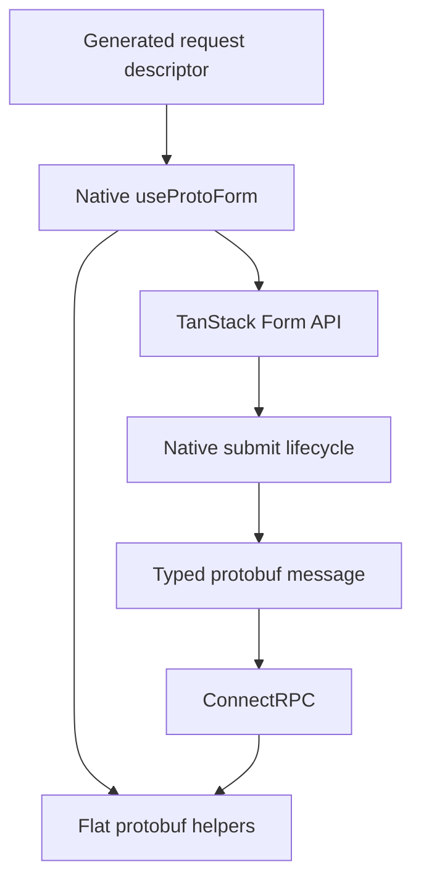

Protoform pozostawia zarządzanie stanem formularza bibliotece TanStack Form. Natywne interfejsy API `Field`, `Subscribe`, store,
walidatorów, listenerów i przesyłania pozostają dostępne. Protoform dodaje konwersję protobuf,
maski aktualizacji, aktualizacje oneof oraz błędy pól Connect/gRPC do tego samego obiektu formularza.

## Zainstaluj natywny hook

```bash
bunx shadcn@latest add @protoform/use-proto-form-tanstack
```

Migrację rozpocznij od zmiany importu:

```diff
- import { useForm } from "@tanstack/react-form";
+ import { useProtoForm } from "@/hooks/use-proto-form-tanstack";
```

Przekaż deskryptor protobuf przed używanymi już opcjami TanStack:

```tsx
import { Button } from "@/components/ui/button";
import { Field, FieldError, FieldLabel } from "@/components/ui/field";
import { Input } from "@/components/ui/input";
import { useProtoForm } from "@/hooks/use-proto-form-tanstack";
import { SignupRequestSchema } from "@/gen/example/v1/signup_pb";

export function SignupForm() {
  const form = useProtoForm(SignupRequestSchema, {
    defaultValues: { email: "", displayName: "" },
    validators: {
      onChange: ({ value }) =>
        value.email.endsWith("@example.com")
          ? undefined
          : { fields: { email: "Use your example.com address." } },
    },
    onSubmit: async ({ value }) => {
      await client.signup(form.createMessage(value));
    },
  });

  return (
    <form
      onSubmit={(event) => {
        event.preventDefault();
        event.stopPropagation();
        form.handleSubmit().catch(reportSubmissionError);
      }}
    >
      <form.Field name="email">
        {(field) => (
          <Field data-invalid={!field.state.meta.isValid}>
            <FieldLabel htmlFor={field.name}>Email</FieldLabel>
            <Input
              aria-invalid={!field.state.meta.isValid}
              id={field.name}
              name={field.name}
              onBlur={field.handleBlur}
              onChange={(event) => field.handleChange(event.target.value)}
              type="email"
              value={field.state.value}
            />
            {!field.state.meta.isValid ? (
              <FieldError>{field.state.meta.errors.join("\n")}</FieldError>
            ) : null}
          </Field>
        )}
      </form.Field>
      <Button type="submit">Create account</Button>
    </form>
  );
}
```

Hook łączy walidację protobuf z istniejącymi synchronicznymi i asynchronicznymi walidatorami przesyłania,
zamiast je zastępować.

<div className="my-8 border-y border-border/60 py-8">
  <TanStackFormExample />
</div>

Prześlij pusty formularz, aby zobaczyć problemy protobuf w natywnych metadanych pól TanStack. Użyj
`ada@blocked.example`, aby zobaczyć, jak `setServerErrors` mapuje ustrukturyzowane naruszenie po stronie serwera z powrotem na pole
adresu e-mail.



## Płaskie funkcje pomocnicze Protoform

Zwracana wartość to pełne API formularza TanStack z następującymi dodatkami:

- `createMessage(values?)` konwertuje wartości formularza na komunikat protobuf.
- `createUpdateMask()` zwraca zmodyfikowane, zapisywalne ścieżki protobuf.
- `setOneofValue(path, case, value)` zmienia oneof bez zachowywania poprzedniej gałęzi.
- `setServerErrors(error)` mapuje ustrukturyzowane naruszenia pól Connect/gRPC na metadane pól TanStack.
- `getNestedErrors(path)` odczytuje błędy pól znajdujących się pod zagnieżdżonym obiektem.
- `serverErrorContext` i `clearServerErrorContext()` udostępniają szczegóły niezmapowanych błędów serwera.

## Wygeneruj formularz

Zainstaluj TanStack AutoForm, gdy pola mają być renderowane na podstawie deskryptora:

```bash
bunx shadcn@latest add @protoform/auto-form-tanstack
```

```tsx
import { AutoForm } from "@/components/auto-form-tanstack";
import { SignupRequestSchema } from "@/gen/example/v1/signup_pb";

export function SignupForm() {
  return (
    <AutoForm
      schema={SignupRequestSchema}
      validationMode="blur"
      revalidationMode="change"
      formOptions={{
        listeners: {
          onChange: ({ fieldApi }) => console.log(fieldApi.name),
        },
      }}
      onFormInit={(form) => {
        // Native TanStack API, including Field, Subscribe, and store.
        console.log(form.state.values);
      }}
      onSubmit={async (message, form, { updateMask, signal }) => {
        await client.signup(message, { signal });
        console.log(form.state.isSubmitted, updateMask?.paths);
      }}
      withSubmit
    />
  );
}
```

`formOptions` jest przekazywane do TanStack Form. `onFormInit`, `onFieldChange` i `onSubmit` otrzymują
natywną instancję formularza TanStack, więc rzadziej spotykany natywny przypadek użycia nie wymaga zastępczego
API Protoform.

## Wspólny cykl życia AutoForm

Oba silniki AutoForm przyjmują te same właściwości cyklu życia:

| Właściwość | Wartości | Domyślna |
| --- | --- | --- |
| `validationMode` | `"submit"`, `"blur"`, `"change"` | `"submit"` |
| `revalidationMode` | `"blur"`, `"change"` | `"change"` |

Kontrakty generowanych pól, tablic, map, obiektów, oneof, formularzy krokowych, dostępności i przesyłania
protobuf są współdzielone z domyślnym AutoForm opartym na React Hook Form. Stan formularza i natywne mechanizmy
rozszerzania pozostają zarządzane przez TanStack Form.

## Wybierz rozwiązanie

| Punkt wyjścia | Użyj |
| --- | --- |
| Istniejące pola i stan TanStack | `use-proto-form-tanstack` |
| Pola generowane na podstawie deskryptora | `auto-form-tanstack` |
| Walidacja poza React | `createProtoFormSchema` |
| Istniejący kod React Hook Form | Domyślne [`useProtoForm` i `auto-form`](/docs/react-hook-form) |

Formik i Final Form zachowują swoje mniejsze adaptery walidacji. Protoform nie opakowuje ich interfejsów API
stanu ani nie deklaruje dla nich zgodności z generowanym AutoForm.
