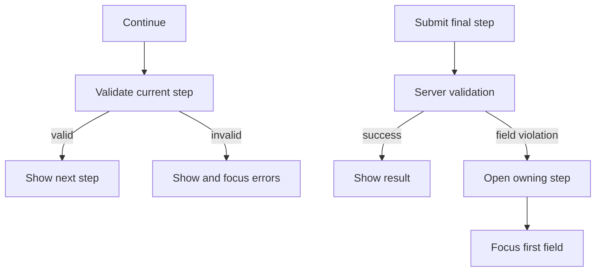

Złożony przykład korzysta z tego samego serwera TypeScript co formularz błędów serwera. Żądanie dodaje 4 stabilne
kroki, poświadczenia oneof, zredagowane podsumowanie oraz regułę biznesową, która przenosi użytkownika z powrotem
do pola wymagającego uwagi.

```bash
bun run examples:generate
bun run examples:dev
```

<div className="my-8 border-y border-border/60 py-8">
  <ComplexFormExample />
</div>

## Stabilne metadane kroków

Pola najwyższego poziomu i oneof są przypisywane do kroku za pomocą metadanych prezentacji:

```proto
message SubmitComplexFormRequest {
  string project_id = 1 [
    (buf.validate.field).required = true,
    (protoform.v1.field_ui).step = "project"
  ];

  oneof credentials {
    option (buf.validate.oneof).required = true;
    option (protoform.v1.oneof_ui).step = "access";

    ApiKeyCredentials api_key = 6;
    ServiceAccountCredentials service_account = 7;
  }
}
```

Komponent dostarcza uporządkowane etykiety i opisy:

```tsx
const steps = [
  { id: "project", title: "Project" },
  { id: "runtime", title: "Runtime" },
  { id: "access", title: "Access" },
  { id: "review", title: "Review" },
];

<AutoForm
  schema={SubmitComplexFormRequestSchema}
  stepper={{ steps }}
  showSummary
  renderSummary={renderRedactedSummary}
  withSubmit
/>
```

## Walidacja i obsługa błędów



- **Wstecz** nigdy nie uruchamia walidacji ani nie odrzuca wartości.
- **Kontynuuj** sprawdza tylko pola należące do bieżącego kroku.
- **Prześlij** sprawdza kompletne żądanie i blokuje wielokrotne przesłanie.
- Ustrukturyzowane naruszenie dotyczące pola otwiera przypisany do niego krok, zachowuje wszystkie wartości, ustawia `aria-invalid` i
  przenosi fokus na pierwsze nieprawidłowe pole.
- Błędy sieciowe i nieustrukturyzowane pozostają widoczne u góry formularza.

## Stan oneof

Przełączanie poświadczeń wykorzystuje strukturę oneof protobuf, dlatego tylko aktywna gałąź może trafić do serwera.
Poprzednia gałąź jest czyszczona, zamiast pozostawać jako ukryte dane. Podsumowanie celowo
pojawia się tylko w ostatnim kroku i maskuje demonstracyjny klucz API. Podsumowania produkcyjne muszą stosować tę samą
regułę do każdego pola zawierającego dane poufne.

## Granica projektu API

`SubmitComplexForm` przedstawia żądanie przepływu pracy. Nie jest to standardowa metoda zorientowana na zasoby.
W przypadku API zasobów zachowaj `parent`, `{resource}_id`, komunikat zasobu, maski aktualizacji, etagi,
paginację, filtry i semantykę operacji długotrwałych w ich standardowych strukturach żądań protobuf.
Formularz nadal może korzystać z kroków bez zmiany tego kontraktu API.

Zobacz [Kreatory krokowe](/docs/steppers), [Błędy serwera](/docs/server-errors) oraz
[Projektowanie zgodne z Google AIP i protobuf](/docs/aip-protobuf), aby poznać reguły wielokrotnego użytku.
