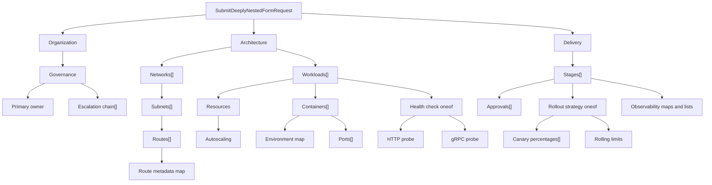

**Poziom 3 z 8**

**Wymaganie wstępne:** [Formularz dwuetapowy](/docs/two-step-form)

Ten przykład jest celowo trudny dla ręcznie tworzonego renderera formularzy. Żądanie zawiera sześć poziomów
zagnieżdżenia komunikatów, powtarzane komunikaty wewnątrz powtarzanych komunikatów, mapy na kilku poziomach, dwa zagnieżdżone
oneof, pola liczbowe z ograniczonym zakresem, kontrolki adresów e-mail i URI oraz końcowy dynamiczny element `Struct`.

Interfejs użytkownika nadal pochodzi z jednego AutoForm:

```tsx
export function DeeplyNestedFormExample() {
  return (
    <AutoForm<SubmitDeeplyNestedFormRequest>
      defaultValues={defaultValues}
      schema={SubmitDeeplyNestedFormRequestSchema}
    />
  );
}
```

`defaultValues` jest długie, ponieważ zawiera realistyczny plan konfiguracji. Definicja formularza — nie. W komponencie
przykładowym nie ma przełącznika komponentów, konfiguracji rekurencyjnego renderera, kontrolera kolekcji, maszyny stanów oneof
ani ręcznie złożonej ścieżki walidacji.

<div className="my-8 border-y border-border/60 py-8">
  <DeeplyNestedFormExample />
</div>

## Co dodaje ten przykład

- Sześć poziomów zagnieżdżonych komunikatów.
- Powtarzane komunikaty i mapy na kilku poziomach.
- Zagnieżdżone oneof z indeksowanymi ścieżkami walidacji.

W odróżnieniu od późniejszego przykładu kitchen sink ten etap dotyczy głębokości deskryptora, a nie reguł między polami.

## Drzewo deskryptorów



Najdłuższa renderowana ścieżka kolekcji to
`architecture.networks[0].subnets[0].routes[0].metadata`. Protoform wyprowadza tę ścieżkę z
deskryptora i zachowuje ją podczas operacji dodawania i usuwania, walidacji, zarządzania stanem formularza oraz konwersji
do protobuf.

## Za co odpowiada Protoform

| Trudne zagadnienie | Zachowanie sterowane deskryptorem |
| --- | --- |
| Zagnieżdżone sekcje | Deskryptory komunikatów stają się semantycznymi poziomami nagłówków i sekcjami |
| Kolekcje komunikatów | Pola powtarzane otrzymują stabilne wiersze, akcje Dodaj/Usuń, wartości domyślne i indeksowane ścieżki |
| Mapy głęboko wewnątrz wierszy | Wpisy map stają się kontrolkami klucz/wartość i są z powrotem konwertowane na mapy protobuf |
| Zagnieżdżone oneof | Selektor zarządza aktywną gałęzią i czyści poprzednią gałąź przy przełączeniu |
| Ograniczenia | Wymagania, wzorce, zakresy, limity map i limity pól powtarzanych z Protovalidate stają się błędami formularza |
| Typowany wynik | Przesłanie formularza tworzy `SubmitDeeplyNestedFormRequest`, a nie doraźne przybliżenie w formacie JSON |

Kluczową granicą jest kontrakt protobuf. Przeniesienie pola głębiej, dodanie kolejnego powtarzanego
komunikatu lub wprowadzenie nowej gałęzi oneof zmienia deskryptor i ponownie wygenerowane typy; miejsce wywołania w React
pozostaje bez zmian.

## Dodaj przesyłanie bez dodawania kodu pól

Przykład renderowania działa wyłącznie lokalnie. Rzeczywista aplikacja dodaje mutację na istniejącej granicy
formularza bez przepisywania zagnieżdżonego interfejsu użytkownika:

```tsx
<AutoForm<SubmitDeeplyNestedFormRequest>
  defaultValues={defaultValues}
  onSubmit={saveBlueprint}
  schema={SubmitDeeplyNestedFormRequestSchema}
  withSubmit
/>
```

Użyj [formularzy krokowych](/docs/steppers), gdy grupy najwyższego poziomu reprezentują stabilny przepływ pracy użytkownika. Zachowaj
jedną stronę, gdy doświadczeni użytkownicy muszą przeglądać i porównywać całą hierarchię. Zobacz
[kitchen sink](/docs/kitchen-sink), aby poznać to samo podejście oparte na deskryptorach, zastosowane do maksymalnie rozbudowanego CEL.

**Dalej:** [Formularz CEL i RE2](/docs/cel-re2-form)
