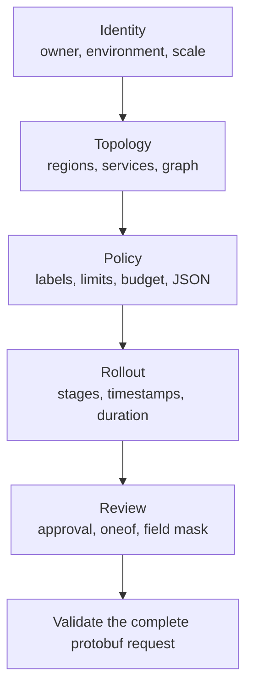

**Poziom 8 z 8**

**Wymaganie wstępne:** [Formularz zasobu AIP](/docs/aip-resource-form)

Ten przykład celowo łączy funkcje, które zwykle występują w oddzielnych formularzach. Jest to wykonywalny
przypadek testu obciążeniowego, a nie zalecenie, by umieszczać każdą regułę biznesową w jednym żądaniu. Ten sam
deskryptor protobuf v2 definiuje pola, walidację w przeglądarce, typowany ładunek, warunkowy interfejs, podsumowanie
do przeglądu oraz pięcioetapowy przepływ.

<div className="my-8 border-y border-border/60 py-8">
  <KitchenSinkExample />
</div>

## Co dodaje ten przykład

Nie należy zaczynać nauki od tego przykładu. To podsumowanie łączy wcześniejsze poziomy, aby wykazać, że ich
kontrakty nadal współdziałają w ramach jednego dużego żądania.

## Co obejmuje żądanie

| Obszar | Funkcje |
| --- | --- |
| Protobuf v2 | typy skalarne, `uint64`, typy wyliczeniowe, opcjonalna obecność, powtarzane komunikaty, mapy, oneof, `Timestamp`, `Duration`, `Struct` i `FieldMask` |
| Protovalidate | wymagane wartości, zakresy, unikatowość, reguły kluczy i wartości map, reguły URI i adresów e-mail oraz CEL dla komunikatów |
| CEL | zagnieżdżone wyrażenia składane, przynależność, indeksowanie map, obecność, wyrażenia regularne, działania arytmetyczne na znacznikach czasu, porównywanie czasu trwania, konwersja liczb, warunki i dynamiczny tekst błędów |
| Interfejs | grupa przycisków opcji, przełącznik, pole wyboru, URL, waluta, JSON, warunkowa widoczność, podsumowanie do przeglądu i kroki zarządzane przez źródło |
| Działanie formularza | bezstratne wartości 64-bitowe, walidacja bieżącego kroku, zachowane wartości, wysyłanie pełnego żądania i widoczne błędy główne |

Aktywny formularz początkowo zawiera poprawne wdrożenie produkcyjne. Zmień nazwę usługi, region,
zależność, budżet, etap wdrożenia lub trasę powiadomień, aby kontrakt nie przeszedł walidacji
na swojej publicznej granicy.



## Spójność grafu między kolekcjami

`kitchen_sink.graph.integrity` traktuje powtarzane komunikaty i mapy jako jeden graf wdrożenia. Sprawdza,
czy nazwy usług są unikatowe, każdy region jest używany, zależności istnieją, żadna usługa nie zależy
od samej siebie, nie występuje bezpośredni cykl między dwiema usługami, klucze limitów szybkości wskazują
istniejące usługi oraz każda publiczna usługa ma wystarczającą przepustowość.

```js CEL
this.services.size() >= 2 &&
this.services.all(service,
  this.regions.exists(region,
    region == service.primary_region
  ) &&
  this.services.filter(candidate,
    candidate.name == service.name
  ).size() == 1 &&
  (!service.public_endpoint || service.health_path.startsWith('/')) &&
  service.dependencies.all(dependency,
    dependency != service.name &&
    this.services.exists(candidate,
      candidate.name == dependency
    )
  )
) &&
!this.services.exists(service,
  service.dependencies.exists(dependency,
    this.services.exists(candidate,
      candidate.name == dependency &&
      candidate.dependencies.exists(back,
        back == service.name
      )
    )
  )
) &&
this.regions.all(region,
  this.services.exists(service,
    service.primary_region == region
  )
) &&
this.rate_limits.all(name,
  this.services.exists(service,
    service.name == name
  )
) &&
this.services.filter(service,
  service.public_endpoint
).all(service,
  service.name in this.rate_limits &&
  this.rate_limits[service.name] >= 100
)
```

CEL nie jest bazą danych grafów: ta reguła celowo wykrywa tylko bezpośrednie cykle. Jeśli wykrywanie
cykli o dowolnej głębokości stanie się wymaganiem, zaimplementuj je w ograniczonym algorytmie backendu
i zwróć ustrukturyzowane naruszenie pola, zamiast próbować wprowadzać rekurencję do CEL.

## Zasady produkcyjne obejmujące pola, mapy i obecność

`kitchen_sink.production.policy` ma zastosowanie wyłącznie do produkcyjnej wartości typu wyliczeniowego. Łączy
opcjonalną obecność za pomocą `has(`, predykaty powtarzanych komunikatów, przynależność do map i indeksowanie,
wyrażenia regularne oraz ograniczony słownik klasyfikacji.

```js CEL
this.environment != 3 || (
  this.regions.size() >= 2 &&
  this.acknowledge_risk &&
  has(this.approval_ticket) &&
  this.approval_ticket.matches('^CHG-[0-9]{6}$') &&
  this.services.all(service,
    service.replicas >= 3
  ) &&
  'owner' in this.labels &&
  this.labels['owner'].matches('^[a-z][a-z0-9-]+$') &&
  (
    !('data-classification' in this.labels) ||
    this.labels['data-classification'] in [
      'public',
      'internal',
      'restricted'
    ]
  )
)
```

## Zakresy liczbowe i czasowe

Reguła budżetu konwertuje całkowitą liczbę replik za pomocą `double()`, zanim porówna każdą usługę
z równym udziałem w budżecie zmiennoprzecinkowym:

```js CEL
this.services.size() == 0 ||
this.services.all(service,
  double(service.replicas) * service.monthly_cost_per_replica <=
  this.monthly_budget / double(this.services.size())
)
```

Reguła okna zmian wymaga jednoczesnej obecności obu znaczników czasu, prawidłowej kolejności,
odejmowania znaczników czasu oraz porównania z `duration(`:

```js CEL
has(this.window_start) == has(this.window_end) &&
(
  !has(this.window_start) ||
  (
    this.window_end > this.window_start &&
    this.window_end - this.window_start <= duration('14400s')
  )
)
```

## Dynamiczne błędy wdrożenia

`kitchen_sink.rollout.sequence` jest regułą zwracającą ciąg znaków. Pusty ciąg oznacza powodzenie,
a pierwsza niepusta gałąź staje się treścią naruszenia. Zagnieżdżony warunek informuje, czy wdrożenie
jest zbyt krótkie, zaczyna się nieprawidłowo, kończy się nieprawidłowo albo zawiera nieobsługiwany
lub powtórzony etap.

```js CEL
this.dry_run ? '' :
this.rollout_percentages.size() < 2 ?
  'Use at least two rollout stages.' :
this.rollout_percentages[0] != 5 ?
  'The rollout must begin at 5%.' :
this.rollout_percentages[
  this.rollout_percentages.size() - 1
] != 100 ?
  'The rollout must finish at 100%.' :
!this.rollout_percentages.all(percent,
  percent in [5, 25, 50, 100] &&
  this.rollout_percentages.filter(candidate,
    candidate == percent
  ).size() == 1
) ?
  'Use unique rollout stages from 5%, 25%, 50%, and 100%.' :
''
```

Reguły logiczne wymagają niepustego komunikatu adnotacji. W regule zwracającej ciąg znaków komunikat
adnotacji pozostaje pusty, ponieważ wyrażenie generuje własny tekst. Każda reguła ma stabilny,
unikatowy identyfikator, a przykład jest kompilowany przez `buf lint` i wykonywany przez ten sam
walidator TypeScript, którego używa formularz. Kontrakty bazowe opisują oficjalne
[reguły lint CEL w Protovalidate](https://buf.build/docs/lint/rules/) oraz
[specyfikacja języka CEL](https://github.com/google/cel-spec).

## Wybór formularza krokowego

Ten kompleksowy przykład korzysta z formularza krokowego Protoform dostępnego już w rejestrze:
kompozycji shadcn zarządzanej przez źródło, bez zewnętrznej zależności formularza krokowego. Wskaźnik
postępu jest punktem orientacyjnym nawigacji zawierającym uporządkowaną listę, bieżący element ma
`aria-current="step"`, a `Button` odpowiada za akcje Wstecz, Kontynuuj i Wyślij. Dzięki temu wartości
i walidacja pozostają w integracji formularza bez wprowadzania drugiej maszyny stanów. Wzorzec opisano
w sekcji [Formularze krokowe](/docs/steppers), a wskazówki dotyczące utrzymywania rozbudowanych reguł
znajdziesz w sekcji [Wyrażenia CEL](/docs/cel-expressions).
