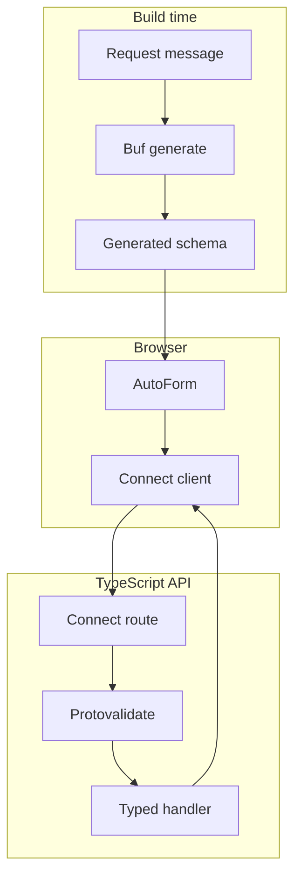

**Poziom 6 z 8**

**Wymaganie wstępne:** [Formularz oneof](/docs/oneof-form)

To pierwszy przykład w ścieżce nauki, który wymaga serwera. Formularz pozostaje niewielki, aby nowa koncepcja
była czytelna: typowany błąd ConnectRPC wraca do pola, którego dotyczy.

## Co dodaje ten przykład

- Wygenerowaną mutację Connect Query.
- Walidację Protovalidate po stronie serwera.
- Mapowanie `google.rpc.BadRequest.FieldViolation` z powrotem do jednego pola.
- Widoczne stany oczekiwania, powodzenia i błędu.

Uruchom jednocześnie przykładowe API i aplikację dokumentacji:

```bash
bun run examples:generate
bun run examples:dev
```

<div className="my-8 border-y border-border/60 py-8">
  <ServerErrorFormExample />
</div>

Formularz na żywo wysyła dane do `http://127.0.0.1:55012`. Użyj adresu kończącego się na
`@blocked.example`, aby zobaczyć, jak ustrukturyzowany błąd serwera zostaje przypisany do pola adresu e-mail.

## Ścieżka żądania



Przeglądarka wysyła bezpośrednio typowany `SubmitBasicFormRequest` z resolvera. Nie ma ręcznie napisanego
DTO formularza ani warstwy konwersji.

## Kontrakt

Komunikat protobuf definiuje reguły danych i opcjonalne wskazówki dotyczące prezentacji:

```proto
message SubmitBasicFormRequest {
  string display_name = 1 [
    (buf.validate.field).required = true,
    (buf.validate.field).string = { min_len: 2, max_len: 40 },
    (protoform.v1.field_ui).placeholder = "Ada Lovelace"
  ];

  string email = 2 [
    (buf.validate.field).required = true,
    (buf.validate.field).string.email = true,
    (protoform.v1.field_ui).control = CONTROL_TYPE_EMAIL
  ];
}
```

## Providery Connect Query

```tsx
import { TransportProvider } from "@connectrpc/connect-query"
import { createConnectTransport } from "@connectrpc/connect-web"
import { QueryClient, QueryClientProvider } from "@tanstack/react-query"

const queryClient = new QueryClient()
const transport = createConnectTransport({
  baseUrl: "http://127.0.0.1:55012",
})

<TransportProvider transport={transport}>
  <QueryClientProvider client={queryClient}>
    <ServerErrorMutationForm />
  </QueryClientProvider>
</TransportProvider>
```

`TransportProvider` udostępnia typowany transport Connect. `QueryClientProvider` zarządza stanem mutacji,
ponowieniami oraz wywołaniami zwrotnymi cyklu życia.

## Kanoniczna mutacja

Użyj wygenerowanego deskryptora metody unary z Connect Query. Ręcznie napisana funkcja żądania ani klucz zapytania
nie są potrzebne:

```tsx
import { useMutation } from "@connectrpc/connect-query"

function ServerErrorMutationForm() {
  const mutation = useMutation(
    FormExamplesService.method.submitBasicForm
  )

  async function onSubmit(values, form) {
    try {
      const response = await mutation.mutateAsync(values)
      showCreatedProfile(response.profileId)
    } catch (error) {
      if (!applyServerFieldErrors(error, SubmitBasicFormRequestSchema, form)) {
        throw error
      }
    }
  }

  return (
    <div aria-busy={mutation.isPending}>
      <AutoForm
        schema={SubmitBasicFormRequestSchema}
        onSubmit={onSubmit}
        withSubmit
      />
    </div>
  )
}
```

`mutateAsync` utrzymuje obietnicę wysłania formularza w stanie oczekiwania, dzięki czemu AutoForm wyłącza przycisk wysyłania i wyświetla
etykietę ładowania. `mutation.isPending` udostępnia również stan mutacji otaczającemu interfejsowi. Po pomyślnym
wykonaniu odpowiedź wyświetla zwróconą nazwę profilu. Ustrukturyzowane błędy Connect są mapowane z powrotem do pól; nieznane
błędy transportu lub programistyczne są ponownie zgłaszane, zamiast znikać.

## Serwer

```ts
export const formExamplesService = {
  submitBasicForm(request) {
    return {
      displayName: request.displayName,
      profileId: `profiles/${slugify(request.displayName)}`,
    }
  },
} satisfies ServiceImpl<typeof FormExamplesService>

const routes = (router: ConnectRouter) => {
  router.service(FormExamplesService, formExamplesService)
}

await server.register(fastifyConnectPlugin, {
  interceptors: [createValidateInterceptor()],
  routes,
})
```

Interceptor wymusza na serwerze te same adnotacje Protovalidate. Reguły biznesowe zwracają
kanoniczny błąd `invalid_argument` ze szczegółami `google.rpc.BadRequest.FieldViolation`, zamiast ciągu
komunikatu, który przeglądarka musiałaby analizować.

## Alternatywny klient niższego poziomu

Poza Reactem lub gdy kod aplikacji celowo nie korzysta z TanStack Query, wywołaj tę samą
wygenerowaną metodę unary za pomocą klienta Connect:

```ts
const client = createClient(
  FormExamplesService,
  createConnectTransport({ baseUrl: "http://127.0.0.1:55012" })
)

const response = await client.submitBasicForm(values)
```

Kontrakt żądania i odpowiedzi jest identyczny. Aplikacje React powinny preferować hook mutacji,
gdy potrzebują stanów oczekiwania, powodzenia i błędu w cyklu życia.

## Warstwa integracji ze Standard Schema

Protoform udostępnia kontrakt walidacji protobuf jako Standard Schema v1. AutoForm korzysta
z resolvera obsługującego protobuf dla typowanych komunikatów i mapowania ścieżek formularza, natomiast inny konsument Standard Schema
może używać tego samego wygenerowanego deskryptora bez zależności od React Hook Form.

Kod źródłowy znajduje się w [`examples/basic`](https://github.com/malinskibeniamin/protoform/tree/main/examples/basic)
oraz [`examples/server`](https://github.com/malinskibeniamin/protoform/tree/main/examples/server).
