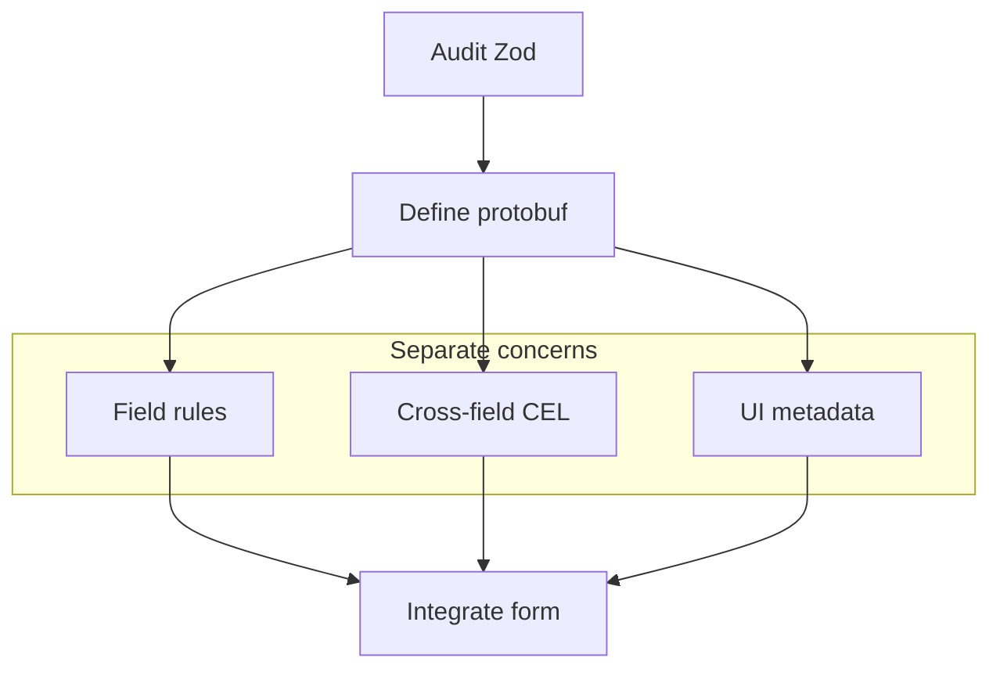

Protoform zawiera generator promptów migracyjnych, ponieważ migracje schematów są często bezpieczniejsze, gdy LLM wykonuje powtarzalne mapowanie, a człowiek weryfikuje kontrakt.

W przypadku Yup przed poproszeniem agenta o przetłumaczenie schematu przeprowadź pełny audyt transformacji, obecności, reguł warunkowych i testów asynchronicznych opisany w
[Przechodzenie z Yup](/docs/yup-migration).

## Połącz agenta

Użyj `/llms.txt`, aby uzyskać skróconą mapę dokumentacji, lub `/llms-full.txt`, aby uzyskać jej pełną treść.
Strony konkretnych przykładów również udostępniają surowy Markdown po dodaniu `.md` do ich adresu URL, w tym ten sam
kod źródłowy, który można skopiować z kart Preview i Code.

Protoform zachowuje React Hook Form jako rozwiązanie domyślne, jednocześnie wyraźnie prezentując przykłady współpracy z innymi rozwiązaniami:

```ts twoslash
type FormEngine =
  | "react-hook-form"
  | "tanstack-form"
  | "formik"
  | "final-form";

const defaultEngine = "react-hook-form" satisfies FormEngine;
//    ^?
```

## Wygeneruj prompt

```bash
bun run migrate:zod -- src/components/settings-form.tsx proto/settings.proto
```

Skrypt prosi agenta programistycznego o:

1. Zinwentaryzowanie każdego pola, komunikatu, wyrażenia regularnego, typu enum, unii, wartości domyślnej i zawężenia Zod.
2. Przeniesienie ograniczeń skalarnych do `buf.validate.field`.
3. Przeniesienie zawężeń obejmujących wiele pól do wyrażeń CEL na poziomie komunikatu.
4. Przekształcenie unii dyskryminowanych w protobuf `oneof`.
5. Zachowanie dostępności shadcn za pomocą `Field`, `FieldLabel`, `FieldDescription` i `FieldError`.
6. Zastąpienie `zodResolver` przez `useProtoForm`.
7. Mapowanie błędów walidacji backendu Connect/gRPC za pomocą `setServerErrors`.
8. Zaproponowanie adnotacji interfejsu AutoForm dla etykiet, tekstów pomocy, tekstów zastępczych, reguł widoczności i dostawców danych.

## Lista kontrolna weryfikacji przez człowieka

- Czy nazwy pól proto są wystarczająco stabilne, aby stać się nazwami w kontrakcie API?
- Czy któraś transformacja Zod ukrywa logikę biznesową, która powinna zostać przeniesiona do jawnego kodu konwersji?
- Czy identyfikatory CEL są stabilne i łatwe do wyszukania?
- Czy komunikaty o błędach są dostępne dla czytników ekranu bez polegania na kolorze?
- Czy pola opcjonalne używają właściwej semantyki obecności proto?
- Czy formularze aktualizacji wymagają masek pól Google AIP?

## Struktura migracji


