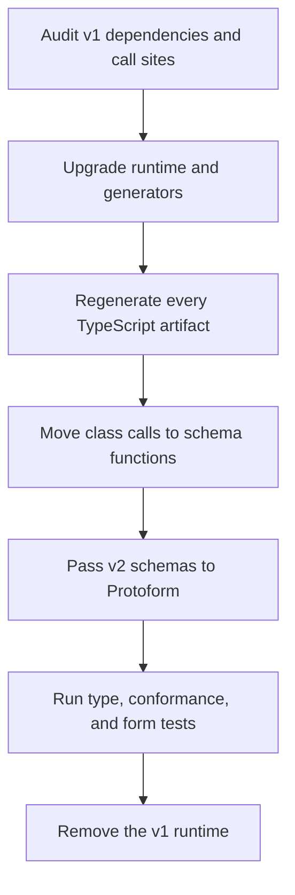

> **Zakres:** Ten przewodnik obejmuje **migrację pakietów z wersji v1 do v2** dla
> `@bufbuild/protobuf` i `@bufbuild/protoc-gen-es`. Nie jest to migracja z proto2 do proto3
> ani zmiana `version: v1` na `version: v2` w plikach konfiguracyjnych Buf.

Protobuf-ES v2 jest kanonicznym środowiskiem uruchomieniowym Protoform i jedynym, dla którego
aktywnie rozwijany jest pełny zestaw funkcji. W przypadku migracji etapowej element rejestru
`protobuf-v1-bridge` zapewnia odizolowany, tymczasowy most migracyjny. Most obsługuje klasy
wygenerowane przez Protobuf-ES v1 bez dodawania ścieżek kodu v1 do nowoczesnego providera v2.

API v2 opiera się na schematach: wygenerowany kod eksportuje typ komunikatu TypeScript oraz wartość
`Schema` dostępną w czasie wykonywania zamiast wygenerowanej klasy komunikatu.

[Oficjalna sekcja dotycząca migracji Protobuf-ES](https://github.com/bufbuild/protobuf-es/blob/main/MANUAL.md#migrating-from-version-1)
jest źródłem prawdy w zakresie zmian środowiska uruchomieniowego i generatora. Ten przewodnik
uzupełnia ją o kroki specyficzne dla Protoform oraz bezpieczną kolejność wdrażania.

## Opcjonalny most v1

Używaj mostu tylko wtedy, gdy formularz musi zostać przeniesiony, zanim pakiet będący jego
właścicielem będzie mógł ponownie wygenerować kod za pomocą Protobuf-ES v2. Most odzwierciedla klasy
komunikatów v1 wygenerowane z proto2 i proto3, renderuje pola skalarne, enum, zagnieżdżone,
powtarzalne, map, oneof, bytes i 64-bitowe, zachowuje obecność pól opcjonalnych proto2 oraz po
bezpiecznej konwersji zwraca typowany komunikat v1.

Zachowaj środowisko uruchomieniowe v1 i most w granicach starszego pakietu:

```bash
bun add @bufbuild/protobuf@^1.10.1
bunx shadcn@latest add @protoform/protobuf-v1-bridge
```

```tsx
import { createProtobufV1Provider } from "@/lib/protobuf-v1-bridge";
import { LegacyProfileRequest } from "./gen/legacy_profile_pb.js";

const legacyProfileProvider = createProtobufV1Provider(LegacyProfileRequest);

export function LegacyProfileForm() {
  return (
    <AutoForm
      schema={legacyProfileProvider}
      withSubmit
      onSubmit={async (request) => {
        await submitLegacyProfile(request);
      }}
    />
  );
}
```

Ten most celowo nie zapewnia zgodności z Protovalidate ani CEL, adnotacji interfejsu v2, obsługi
zasobów AIP, automatycznych masek aktualizacji ani schematów Connect Query v2. Kontrole `required`
proto2 i konwersji formatu danych są zabezpieczeniami mostu, a nie zamiennikiem systemu walidacji.
Podczas migracji zachowaj walidację biznesową na istniejącym serwerze i jak zwykle mapuj jego
ustrukturyzowane błędy na formularz.

Kryteria zakończenia są jednoznaczne: ponownie wygeneruj komunikat za pomocą wtyczki v2, zastąp klasę
wygenerowanym `Schema`, przenieś formularz do nowoczesnego providera, usuń zależność od mostu,
a następnie potwierdź, że starsze środowisko uruchomieniowe nie występuje w drzewie zależności tego
pakietu. Nie twórz nowych funkcji opartych na moście ani warunkowej obsługi v1/v2 w jednym providerze.

## Przebieg migracji



## 1. Przeprowadź audyt przed aktualizacją

Zacznij od poprawnie przechodzącej kompilacji i zatwierdź lub w inny sposób zachowaj bieżący
wygenerowany kod. Sporządź wykaz wszystkich pakietów, które generują lub używają komunikatów
protobuf:

```bash
bun pm ls | rg '@bufbuild|@connectrpc'

rg -n --glob '!**/*_pb.*' \
  'new [A-Z][A-Za-z0-9_]*\(|\b[A-Z][A-Za-z0-9_]*\.(fromBinary|fromJson|fromJsonString)\(|\.(toBinary|toJson|toJsonString|clone)\(' \
  src packages
```

Traktuj wyszukiwanie jako audyt, a nie dowód: może znaleźć niepowiązane klasy i pominąć wywołania
ukryte za wrapperami aplikacji. Sprawdź również niestandardowe generatory kodu, zależności
wygenerowanych SDK, dane testowe, punkty wejścia workerów oraz pakiety udostępniające wartości
protobuf w swoim publicznym API.

Przed zmianą kodu zapisz wyniki bazowe:

```bash
bun run typecheck
bun run test:conformance
bun run test:unit
bun run test:integration
```

## 2. Zaktualizuj jedną zgodną rodzinę pakietów

Zaktualizuj jednocześnie środowisko uruchomieniowe i generator. Wygenerowany plik oraz wykonujące go
środowisko uruchomieniowe muszą używać zgodnych wersji głównych.

```bash
bun add @bufbuild/protobuf@^2
bun add -d @bufbuild/protoc-gen-es@^2
```

Jeśli aplikacja korzysta z pozostałych elementów stosu Protoform, utrzymuj również zgodne, aktualne
wersje główne komponentów używających protobuf:

```bash
bun add @bufbuild/protovalidate@^1 @connectrpc/connect@^2
```

Zaktualizuj `@connectrpc/connect-web` i inne pakiety Connect do wersji v2, jeśli są używane.
Zaktualizuj `@bufbuild/protoplugin` do wersji v2, jeśli repozytorium zawiera niestandardowy generator
JavaScript lub TypeScript. W przypadku zależności od wygenerowanych SDK wybierz SDK wygenerowane
za pomocą wtyczki ES v2, zamiast utrzymywać SDK v1 obok środowiska uruchomieniowego v2.

Po migracji nie pozostawiaj `@bufbuild/protobuf` v1 jako bezpośredniej zależności. Użyj drzewa
zależności menedżera pakietów, aby znaleźć pozostałą kopię, i zaktualizuj pakiet, który ją
wprowadza.

## 3. Zaktualizuj generowanie

Zalecana konfiguracja lokalnej wtyczki wygląda następująco:

```yaml
version: v2
plugins:
  - local: protoc-gen-es
    out: src/gen
    opt:
      - target=ts
      - import_extension=js
    include_imports: true
inputs:
  - directory: proto
```

Używaj `import_extension=js` tylko wtedy, gdy konfiguracja TypeScript i ESM wymaga jawnych rozszerzeń
JavaScript w importach. Domyślnie Protobuf-ES v2 nie dodaje rozszerzenia. Opcja `ts_nocheck` również
jest domyślnie wyłączona. W miarę możliwości zachowaj ścisłe sprawdzanie wygenerowanego kodu lub
ustaw `ts_nocheck=true` wyłącznie jako tymczasowy środek zapewniający zgodność.

`include_imports: true` sprawia, że generator emituje zaimportowane definicje, takie jak deskryptory
opcji Protovalidate. Jest to potrzebne, gdy tych definicji nie dostarcza wygenerowana zależność.
Unikaj generowania tej samej zaimportowanej definicji w wielu pakietach ładowanych razem.

Jeśli zamiast tego używasz zdalnej wtyczki, przypnij wydanie v2:

```yaml
version: v2
plugins:
  - remote: buf.build/bufbuild/es:v2.13.0
    out: src/gen
    opt: target=ts
```

Następnie wygeneruj ponownie wszystkie pliki wynikowe. W tym repozytorium pełne polecenie to:

```bash
bun run proto:generate
```

Nigdy nie poprawiaj ręcznie wygenerowanych plików `_pb.ts`. Udana kompilacja TypeScript
nieaktualnego kodu v1 nie dowodzi, że środowisko uruchomieniowe i generator są zgodne. Sprawdź
również nagłówek oraz importy wygenerowanego kodu.

## 4. Zastąp klasy schematami

Protobuf-ES v2 generuje dwa odrębne eksporty dla komunikatu:

```ts
import type { User } from "./gen/user_pb.js";
import { UserSchema } from "./gen/user_pb.js";
```

`User` jest typem TypeScript. `UserSchema` jest deskryptorem dostępnym w czasie wykonywania,
przekazywanym do interfejsów API tworzenia, serializacji, refleksji, walidacji, Connect i Protoform.

### Tworzenie komunikatów

```ts
// v1
import { User } from "./gen/user_pb.js";

const user = new User({ firstName: "Ada" });
```

```ts
// v2
import { create } from "@bufbuild/protobuf";
import { UserSchema } from "./gen/user_pb.js";

const user = create(UserSchema, { firstName: "Ada" });
```

Inicjalizatory zagnieżdżonych komunikatów mogą pozostać zwykłymi literałami obiektów wewnątrz
`create()`. Zwrócony komunikat jest już zwykłym obiektem z `$typeName`. Zastąp
`PlainMessage<User>` typem `User` i usuń wywołania `toPlainMessage`.

### Przenieś serializację do samodzielnych funkcji

| Typowe wywołanie klasy v1 | Wywołanie Protobuf-ES v2 |
| --- | --- |
| `User.fromBinary(bytes)` | `fromBinary(UserSchema, bytes)` |
| `user.toBinary()` | `toBinary(UserSchema, user)` |
| `User.fromJson(value)` | `fromJson(UserSchema, value)` |
| `user.toJson()` | `toJson(UserSchema, user)` |
| `User.fromJsonString(text)` | `fromJsonString(UserSchema, text)` |
| `user.toJsonString()` | `toJsonString(UserSchema, user)` |
| `user.clone()` | `clone(UserSchema, user)` |
| `User.equals(a, b)` | `equals(UserSchema, a, b)` |

Przykład:

```ts
import {
  clone,
  equals,
  fromBinary,
  fromJson,
  type JsonValue,
  toBinary,
  toJson,
} from "@bufbuild/protobuf";
import { type User, UserSchema } from "./gen/user_pb.js";

declare const bytes: Uint8Array;
declare const json: JsonValue;

const fromWire: User = fromBinary(UserSchema, bytes);
const fromApi: User = fromJson(UserSchema, json);
const encoded = toBinary(UserSchema, fromWire);
const protoJson = toJson(UserSchema, fromWire);
const copied = clone(UserSchema, fromWire);
const unchanged = equals(UserSchema, fromWire, copied);
```

Komunikaty nie implementują już `toJSON`. Przed przekazaniem komunikatu do `JSON.stringify`
przekonwertuj go za pomocą `toJson(UserSchema, message)`. Oddzielaj konwersję ProtoJSON od zwykłej
serializacji obiektów JavaScript.

Dobrze znane typy i ich funkcje pomocnicze są teraz dostępne w `@bufbuild/protobuf/wkt`. Przenieś
na przykład importy Timestamp i Any do tej ścieżki podrzędnej oraz używaj funkcji pomocniczych v2,
takich jak `timestampFromDate()` i `anyPack()`, wraz ze schematem komunikatu.

## 5. Przenieś miejsca wywołań Protoform

Nowoczesny provider Protoform przyjmuje wygenerowaną wartość schematu v2, a nie konstruktor v1.
Opisany powyżej tymczasowy most jest jedynym wyjątkiem podczas migracji:

```tsx
import { useProtoForm } from "@/hooks/use-proto-form";
import {
  type SignupRequest,
  SignupRequestSchema,
} from "./gen/signup_pb.js";

const form = useProtoForm(SignupRequestSchema, {
  defaultValues: {
    email: "",
    displayName: "",
  },
});

const submit = form.handleSubmit(async (values) => {
  const request: SignupRequest = form.createMessage(values);
  await client.signup(request);
});
```

Zastosuj tę samą regułę do `createProtoFormSchema(SignupRequestSchema)`, wygenerowanych powiązań
formularzy i deskryptorów AutoForm. Usuń wrappery zgodności, które przyjmują konstruktor lub
sprawdzają statyczne elementy klas v1. Refleksja deskryptorów powinna w czasie wykonywania odczytywać
`SignupRequestSchema`, a nie `SignupRequest`.

## Migracja konfiguracji Buf z v1 do v2 jest osobnym procesem

Buf udostępnia polecenie migracji dla plików `buf.yaml`, `buf.work.yaml`, `buf.gen.yaml` i `buf.lock`:

```bash
buf config migrate --diff
buf config migrate
buf build
buf lint
```

Pierwsze polecenie pokazuje podgląd zmian. Drugie je zapisuje. Zobacz
[oficjalny przewodnik migracji konfiguracji Buf](https://buf.build/docs/migration-guides/migrate-v2-config-files/)
oraz [dokumentację polecenia `buf config migrate`](https://buf.build/docs/reference/cli/buf/config/migrate/).

To narzędzie migruje wyłącznie pliki konfiguracyjne Buf. Nie aktualizuje zależności npm, nie generuje
ponownie komunikatów ani nie przepisuje miejsc wywołań Protobuf-ES w TypeScript. Plik
`buf.gen.yaml` z `version: v2` nadal może uruchamiać wtyczkę v1, dlatego sama wersja konfiguracji
nie dowodzi, że aplikacja używa Protobuf-ES v2.

## Wskazówki dotyczące codemodów

Opublikowane przez Buf wytyczne dotyczące migracji Protobuf-ES nie udostępniają oficjalnego codemodu
dla miejsc wywołań. Oficjalnym narzędziem automatyzacji jest `buf config migrate`, którego zakres
ogranicza się do opisanej powyżej konfiguracji.

Ogólne przepisanie `new User()` na `create(UserSchema)` jest niebezpieczne bez informacji o projekcie
i typach. Musi odróżniać klasy protobuf od zwykłych klas, tworzyć importy bez kolizji, rozdzielać
importy typów i wartości, znajdować wygenerowane symbole z aliasami oraz aktualizować wrappery
serializacji. Preferuj następującą sekwencję opartą na kompilatorze:

1. Zaktualizuj jednocześnie środowisko uruchomieniowe i generator.
2. Wygeneruj ponownie wszystkie posiadane schematy i SDK.
3. Uruchom wyszukiwanie audytowe z pierwszej sekcji.
4. Uruchom TypeScript i migruj błędy pakiet po pakiecie.
5. Przejrzyj każdy nowy import `Schema`, zamiast akceptować automatyczne zastępowanie tekstu.
6. Uruchom testy round-trip danych binarnych i ProtoJSON przed usunięciem v1.

Jeśli repozytorium otrzyma później codemod, oprzyj go na AST TypeScript, wymagaj jawnej listy
dozwolonych wygenerowanych modułów, obsłuż tryb próbny i odrzucaj niejednoznaczne miejsca wywołań,
zamiast zgadywać.

## Etapowa migracja monorepo

Środowisko uruchomieniowe upstream może równolegle obsługiwać v1 i v2 podczas migracji etapowej.
Utrzymuj każde środowisko uruchomieniowe w wyraźnych granicach pakietu i usuwaj most z każdego
pakietu natychmiast po przeniesieniu jego wygenerowanego kodu do v2:

1. Najpierw zmigruj pakiety liściowe, które są właścicielami wygenerowanego kodu.
2. Przez tymczasową granicę v1/v2 przekazuj dane binarne lub zweryfikowany ProtoJSON, a nie instancję
   komunikatu o niejednoznacznej tożsamości środowiska uruchomieniowego.
3. Zmigruj konsumentów i natychmiast potem usuń adapter graniczny.
4. Sprawdzaj drzewo zależności, aż środowisko uruchomieniowe v1 zniknie.

Nie przekazuj klasy komunikatu v1 do interfejsu API refleksji v2, Connect, Protovalidate ani
Protoform. Nie publikuj interfejsu biblioteki, który czasami zwraca komunikaty v1, a czasami v2.

## Typowe błędy

### Nie można rozwiązać `@bufbuild/protobuf/codegenv1`

Import zawierający `codegenv1` zwykle oznacza, że kod wygenerowany w v2 korzysta ze ścieżki
generowania kodu zapewniającej zgodność, a bundler nie rozwiązuje eksportów pakietu, albo że
środowisko uruchomieniowe i wygenerowane artefakty są niezgodne. Ponownie wygeneruj kod za pomocą
właściwej wtyczki v2, potwierdź wersję główną środowiska uruchomieniowego i upewnij się, że bundler
obsługuje eksporty pakietów. Nie kopiuj wewnętrznych plików zgodności do aplikacji.

### Nie można rozwiązać wygenerowanego importu

Jeśli wygenerowany kod importuje lokalną definicję, taką jak `buf/validate/validate_pb`, która nie
istnieje, użyj odpowiedniej wygenerowanej zależności albo włącz `include_imports: true` dla
docelowego procesu generowania będącego jej właścicielem. Nie twórz pustego modułu zastępczego.

### Rozszerzenie importu ESM nie działa

Sprawdź, czy środowisko uruchomieniowe oczekuje importów bez rozszerzeń, z `.js` czy z `.ts`,
a następnie konsekwentnie ustaw opcję generatora. W projektach Node ESM kompilowanych z TypeScript
`import_extension=js` jest często właściwym wynikiem, mimo że plik źródłowy ma rozszerzenie `.ts`.

### Dane wyjściowe JSON uległy zmianie

Nie porównuj `JSON.stringify(message)` między v1 i v2. Porównaj wynik
`toJson(MessageSchema, message)` lub `toJsonString(MessageSchema, message)` i przetestuj dokładne
zachowanie ProtoJSON wymagane przez API.

## Lista kontrolna weryfikacji

- [ ] Wersje środowiska uruchomieniowego, generatora, Connect, Protovalidate i wygenerowanych SDK są zgodne.
- [ ] Wszystkie wygenerowane nagłówki wskazują wtyczkę ES v2.
- [ ] Nie pozostały żadne ręcznie edytowane wygenerowane pliki.
- [ ] Do tworzenia używane jest `create(MessageSchema, init)`.
- [ ] Operacje binarne i JSON otrzymują odpowiedni schemat.
- [ ] Funkcje pomocnicze dobrze znanych typów są importowane z `@bufbuild/protobuf/wkt`.
- [ ] Protoform, Standard Schema, AutoForm i wygenerowane powiązania otrzymują schematy v2.
- [ ] Testy round-trip danych binarnych i ProtoJSON przechodzą poprawnie.
- [ ] Testy danych zagnieżdżonych komunikatów, oneof, obecności pól opcjonalnych, map, pól
  powtarzalnych, 64-bitowych liczb całkowitych, Any i Timestamp przechodzą tam, gdzie są używane.
- [ ] Ustrukturyzowane błędy serwera nadal są mapowane na każdą oczekiwaną ścieżkę formularza.
- [ ] `bun run proto:generate`, sprawdzanie typów oraz testy zgodności, jednostkowe, integracyjne,
  przeglądarkowe i kompleksowe przechodzą poprawnie.
- [ ] Drzewo zależności pakietu nie zawiera bezpośredniego środowiska uruchomieniowego v1 używanego
  przez kod aplikacji.

[Zestaw testów zgodności](/docs/conformance) Protoform obejmuje wspólny kontrakt formularzy,
natomiast [profil gotowości produkcyjnej](/docs/production-readiness) śledzi szerszy zakres obsługi
funkcji protobuf.
