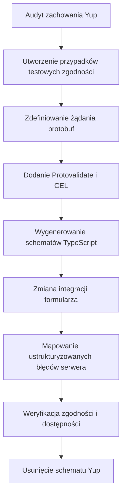

Celem nie jest tłumaczenie każdego wywołania Yup jeden do jednego. Yup łączy parsowanie, wartości domyślne,
transformacje, walidację i wnioskowanie typów TypeScript w jednym obiekcie. Formularz oparty na protobuf rozdziela
te odpowiedzialności:

- typy pól protobuf definiują kształt żądania
- adnotacje Protovalidate definiują przenośną walidację
- CEL definiuje deterministyczne reguły między polami
- `defaultValues` formularza definiują początkowy stan interfejsu
- jawny kod aplikacji odpowiada za normalizację i inne transformacje
- serwer odpowiada za asynchroniczne kontrole biznesowe i zwraca ustrukturyzowane naruszenia dotyczące pól

Zacznij od zachowania, nie od składni. Przed zmianą formularza określ, jakie dane schemat Yup akceptuje, odrzuca, rzutuje, usuwa oraz
jakie wartości domyślne stosuje.

## Przebieg migracji



## Przed i po

Reprezentatywny schemat Yup może łączyć wszystkie zagadnienia jednocześnie:

```tsx
import * as yup from "yup";

export const accountSchema = yup.object({
  displayName: yup.string().trim().min(2).max(40).required(),
  email: yup.string().email().required(),
  plan: yup.mixed<"starter" | "enterprise">()
    .oneOf(["starter", "enterprise"])
    .required(),
  seats: yup.number().integer().min(1).max(100).required(),
  website: yup.string().url().nullable().optional(),
  tags: yup.array()
    .of(yup.string().min(1).required())
    .min(1)
    .max(10)
    .required(),
}).noUnknown();
```

Przenieś kształt żądania i przenośne reguły do protobuf:

```proto
syntax = "proto3";

package account.v1;

import "buf/validate/validate.proto";

enum Plan {
  PLAN_UNSPECIFIED = 0;
  PLAN_STARTER = 1;
  PLAN_ENTERPRISE = 2;
}

message CreateAccountRequest {
  string display_name = 1 [
    (buf.validate.field).required = true,
    (buf.validate.field).string = { min_len: 2, max_len: 40 }
  ];

  string email = 2 [
    (buf.validate.field).required = true,
    (buf.validate.field).string.email = true
  ];

  Plan plan = 3 [(buf.validate.field).enum = {
    defined_only: true
    not_in: 0
  }];

  int32 seats = 4 [(buf.validate.field).int32 = {
    gte: 1
    lte: 100
  }];

  optional string website = 5 [(buf.validate.field).string.uri = true];

  repeated string tags = 6 [(buf.validate.field).repeated = {
    min_items: 1
    max_items: 10
    items: { string: { min_len: 1 } }
  }];
}
```

Typ `int32` zastępuje asercję `integer()` z Yup. Enum zastępuje zamknięty zbiór `oneOf()`.
Provider przekształca wartości w kształcie formularza w wygenerowaną wiadomość protobuf po walidacji.

## Mapowanie reguł

Użyj tej tabeli jako pomocy przy inwentaryzacji, a nie jako automatycznej reguły przepisywania:

| Yup | Protobuf i Protoform | Co sprawdzić przed migracją |
| --- | --- | --- |
| `string().required()` | `required = true`, zwykle z `min_len` | Pusty ciąg i obecność pola to odrębne kwestie |
| `string().min(n)` / `max(n)` | `string.min_len` / `string.max_len` | Protovalidate zlicza znaki Unicode |
| `string().length(n)` | `string.len` | Nie łącz `len` z regułami min/max |
| `string().matches(regex)` | `string.pattern` | Protovalidate używa RE2, a nie JavaScript RegExp |
| `string().email()` | `string.email = true` | Ponownie uruchom istniejące przypadki testowe akceptowanych i odrzucanych adresów e-mail |
| `string().url()` | `string.uri = true` | Kryteria akceptacji URI i URL mogą nie być identyczne |
| `string().uuid()` | `string.uuid = true` | Zachowaj oddzielnie wszelkie zasady dotyczące konkretnych wersji |
| `number().integer()` | Wybierz całkowitoliczbowy typ pola protobuf | Przed wyborem `int32`, `int64` lub typów bez znaku potwierdź zakres i znakowość |
| `number().min(n)` / `max(n)` | Numeryczne `gte` / `lte` | Yup domyślnie rzutuje ciągi znaków; pola protobuf nie dziedziczą tego zachowania |
| `number().moreThan(n)` / `lessThan(n)` | Numeryczne `gt` / `lt` | Zachowaj rozróżnienie między granicami domkniętymi i otwartymi |
| `mixed().oneOf(values)` | Enum z `defined_only` i regułą wartości nieokreślonej | Użyj `oneof`, gdy każda opcja ma inny kształt obiektu |
| `mixed().notOneOf(values)` | Skalarne `not_in` lub CEL | Lista powinna być stabilna i należeć do kontraktu |
| `array().min(n)` / `max(n)` | `repeated.min_items` / `max_items` | Dodaj reguły `items` do walidacji elementów |
| `array().of(schema)` | Reguły powtarzanego skalara lub zagnieżdżona wiadomość | Tablice obiektów stają się powtarzanymi wiadomościami |
| `object().shape(...)` | Zagnieżdżona wiadomość | Zdecyduj, czy brak ma znaczenie |
| `object().required()` | Pole wiadomości z `required = true` | Obecność wiadomości jest jawna; obecność skalara wymaga większej uwagi |
| `date()` | `google.protobuf.Timestamp` | Przenieś konwersję ciągu znaków lub Date na granicę formularza |
| `boolean().oneOf([true])` | `bool.const = true` | Przydatne w przypadku wymaganych potwierdzeń |

## Obecność, null i puste wartości

Metody `required()`, `defined()`, `nullable()`, `optional()` i `notRequired()` w Yup opisują różne
stany. Nie sprowadzaj ich do jednej reguły protobuf.

### Wymagane ciągi znaków

Yup `string().required()` odrzuca zarówno brakujące wartości, jak i puste ciągi znaków. W przypadku wymaganego ciągu znaków protobuf
zachowaj zarówno intencję, jak i użyteczne minimum:

```proto
message CreateAccountRequest {
  string display_name = 1 [
    (buf.validate.field).required = true,
    (buf.validate.field).string.min_len = 1
  ];
}
```

Jeśli ciągi zawierające wyłącznie białe znaki były wcześniej odrzucane przez `trim().required()`, zdecyduj, czy je
normalizować, czy odrzucać. Transformacja i reguła walidacji nie oznaczają tego samego zachowania.

### Pola opcjonalne

Użyj `optional`, gdy żądanie musi odróżniać brak od wartości zerowej skalara:

```proto
message CreateAccountRequest {
  optional string website = 2 [(buf.validate.field).string.uri = true];
}
```

Dla nieobecnego pola opcjonalnego reguła właściwa dla jego typu jest pomijana. Obecny pusty ciąg nadal jest wartością.
Przetestuj oba przypadki.

### Pola dopuszczające null

`nullable()` dopuszcza wartość JavaScript `null`. Protobuf obsługuje obecność, ale nie nadaje każdemu skalarowi
wartości null na poziomie domeny. Wybierz świadomie:

1. Normalizuj `null` do braku na granicy formularza, jeśli oznaczają to samo.
2. Użyj opcjonalnego skalara, jeśli rozróżnienie między brakiem a obecnością ma znaczenie.
3. Użyj wrappera, zagnieżdżonej wiadomości, enuma lub `oneof`, jeśli null jest rzeczywistym stanem domenowym.

Nie zamieniaj po cichu znaczącej wartości `null` na pusty ciąg znaków ani zero.

## Wartości domyślne i transformacje

Yup może rzutować dane przed walidacją. Dlatego `default()`, `transform()`, `trim()`, `lowercase()`, `ensure()`,
`strip()`, `camelCase()`, `json()` i `noUnknown()` wymagają decyzji dotyczącej zachowania, a nie
adnotacji walidacyjnej.

| Zachowanie Yup | Miejsce docelowe migracji |
| --- | --- |
| Początkowa wartość interfejsu z `default()` | API wartości początkowych wybranej biblioteki formularzy |
| Biznesowa wartość domyślna stosowana podczas obsługi żądania | Jawne ustawienie wartości domyślnej na serwerze |
| `trim()` lub normalizacja wielkości liter | Jawne przetwarzanie wstępne przed utworzeniem wiadomości albo odrzucanie niekanonicznych danych wejściowych za pomocą CEL |
| Rzutowanie ciągu znaków przez `number()` | Kontrolka danych liczbowych oraz jawna konwersja formularza do protobuf |
| Rzutowanie `date()` | Jawna konwersja do `google.protobuf.Timestamp` |
| `strip()` / `stripUnknown()` | Konstruowanie wyłącznie zadeklarowanych pól protobuf; osobny audyt założeń dotyczących bezpieczeństwa |
| `noUnknown()` / `exact()` | Walidacja granicy zaufania JSON lub HTTP, gdy wymagane jest odrzucanie nieznanych kluczy |

Domyślne wartości skalarów protobuf są zachowaniem formatu przesyłania danych, a nie zamiennikiem domyślnych wartości interfejsu Yup. Zachowaj
widoczne wartości domyślne w formularzu, aby użytkownik mógł sprawdzić, co zostanie przesłane.

Jeśli normalizacja zmienia przechowywane lub podpisywane dane, nie umieszczaj jej w ukrytej transformacji po stronie klienta. Zdefiniuj ją
jawnie, przetestuj niezależnie i zastosuj tę samą regułę na serwerze.

## Reguły warunkowe i między polami

Przenieś deterministyczne warunki `when()` i porównania sąsiednich pól za pomocą `ref()` do CEL na poziomie wiadomości.
Na przykład:

```tsx
const schema = yup.object({
  plan: yup.number().required(),
  seats: yup.number().when("plan", {
    is: 2,
    then: (current) => current.min(5),
    otherwise: (current) => current.min(1),
  }),
});
```

staje się:

```proto
message CreateAccountRequest {
  option (buf.validate.message).cel = {
    id: "create_account.enterprise_seats"
    message: "Enterprise accounts require at least 5 seats."
    expression: "this.plan != 2 || this.seats >= 5"
  };

  Plan plan = 1;
  int32 seats = 2 [(buf.validate.field).int32.gte = 1];
}
```

Nadaj każdej regule CEL stabilny, możliwy do wyszukania identyfikator i komunikat przeznaczony dla użytkownika. Warunki dotyczące wyłącznie
prezentacji przechowuj w metadanych interfejsu zamiast przekształcać je w walidację API.

## Testy niestandardowe i asynchroniczne

Przed przeniesieniem sklasyfikuj każdy `test()` Yup:

| Zachowanie testu | Miejsce docelowe |
| --- | --- |
| Czysta kontrola jednej wartości | Wbudowana reguła Protovalidate lub CEL pola |
| Czyste porównanie pól żądania | CEL wiadomości |
| Wyszukiwanie, kontrola unikalności, autoryzacja, limit lub inne operacje wejścia/wyjścia | Procedura obsługi serwera lub warstwa usług |
| Ostrzeżenie dotyczące wyłącznie interfejsu | Stan interfejsu formularza, nie kontrakt protobuf |

Niestandardowe testy Yup mogą być asynchroniczne, a ich kolejność wykonania nie jest gwarantowana. Nie kopiuj
testu korzystającego z sieci do walidacji po stronie klienta. Prześlij typowane żądanie, zwróć kanoniczny błąd Connect
ze szczegółami `BadRequest.FieldViolation` i wywołaj `setServerErrors(error)`, aby każde naruszenie
było widoczne przy polu, do którego należy. Własne integracje formularzy powinny stosować ustrukturyzowane mapowanie opisane w
[przewodniku po TanStack Form](/docs/tanstack-form) albo
przewodniku po [Formik](/docs/formik) lub [Final Form](/docs/final-form).

Jeśli zachowasz sprawdzanie dostępności podczas wpisywania przez użytkownika, potraktuj je jako oddzielne zapytanie z mechanizmem debounce i
anulowaniem żądań. Ścieżka przesyłania nadal musi egzekwować regułę na serwerze.

## Obiekty, tablice i unie

- Zagnieżdżony obiekt Yup staje się zagnieżdżoną wiadomością protobuf.
- Tablica staje się polem powtarzanym; reguły elementów umieść w `items` lub zagnieżdżonej wiadomości.
- Rekord z kluczami tekstowymi zwykle staje się mapą protobuf; waliduj klucze i wartości oddzielnie.
- Zamknięty wybór wartości skalarnych staje się enumem z wartością zerową `UNSPECIFIED`.
- Unia dyskryminowana obiektów staje się `oneof` protobuf, gdy poprawna może być dokładnie jedna gałąź.
- Pole służące wyłącznie do potwierdzenia, takie jak `passwordConfirmation`, nie musi należeć do żądania API.
  Pozostaw je lokalne, jeśli serwer go nie potrzebuje.

Zmiana gałęzi `oneof` musi wyczyścić wartość poprzedniej gałęzi, aby nieaktualne dane nie mogły dotrzeć do
serwera. Zobacz [Przypadki brzegowe oneof](/docs/oneof-edge-cases).

## Zmiana integracji formularza

W przypadku React Hook Form zastąp `yupResolver(schema)` hookiem obsługującym protobuf:

```tsx
const form = useProtoForm(CreateAccountRequestSchema, {
  defaultValues: {
    displayName: "",
    email: "",
    plan: 0,
    seats: 1,
    website: undefined,
    tags: [],
  },
});

const submit = form.handleSubmit(async (values) => {
  try {
    await client.createAccount(form.createMessage(values));
  } catch (error) {
    if (!form.setServerErrors(error)) {
      throw error;
    }
  }
});
```

Podczas pierwszej migracji zachowaj istniejące pola shadcn. Jednoczesna zmiana kontraktu schematu i
wyglądu formularza utrudnia diagnozowanie problemów ze zgodnością. AutoForm można wdrożyć w
późniejszej zmianie, gdy kontrakt będzie już stabilny.

TanStack Form może używać `createProtoFormSchema` przez Standard Schema bez adaptera Yup.
Informacje o typowanych danych wyjściowych i obsłudze błędów serwera znajdziesz w sekcji [TanStack Form](/docs/tanstack-form).
Użytkownicy Formik mogą zastąpić `validationSchema` przez `validate={createFormikValidator(schema)}`; aplikacje
Final Form korzystają z odpowiedniego adaptera opisanego w sekcji [Final Form](/docs/final-form).

## Zgodność błędów

Yup często działa z `abortEarly: true`; wiele resolverów formularzy nadpisuje to ustawienie, aby użytkownicy widzieli więcej niż jeden
błąd. Protoform mapuje pełną listę problemów Protovalidate. Zachowaj to zachowanie jawnie:

- wyświetlaj wszystkie błędy pola, a nie tylko pierwszy
- zachowaj widoczność błędów CEL na poziomie głównym
- ustaw `aria-invalid` i połącz każde pole wejściowe z opisem jego błędu
- po przesłaniu ustaw fokus na pierwszym nieprawidłowym polu
- zachowaj wszystkie wprowadzone wartości po błędzie klienta lub serwera
- nigdy nie twórz rozgałęzień na podstawie tekstu komunikatu błędu przeznaczonego dla użytkownika

Niestandardowe komunikaty Yup mogą nie odpowiadać słowo w słowo komunikatom generowanym przez Protovalidate. Zachowuj dokładne
brzmienie tylko wtedy, gdy zależy od niego zachowanie produktu; w przeciwnym razie sprawdzaj identyfikatory reguł, ścieżki pól i zrozumiałą
intencję.

## Wdrażanie etapowe

1. **Inwentaryzacja:** Zapisz każde pole Yup, wartość domyślną, transformację, gałąź warunkową, test niestandardowy i
   opcję resolvera.
2. **Utrwalenie:** Dodaj przypadki testowe zgodności obejmujące dane akceptowane, odrzucane, nieobecne, null, puste, graniczne i
   przekształcone.
3. **Modelowanie:** Zdefiniuj typy protobuf, obecność, enumy, zagnieżdżone wiadomości, pola powtarzane, mapy i
   gałęzie `oneof`.
4. **Walidacja:** Najpierw dodaj wbudowane reguły, a następnie minimalny zestaw CEL potrzebny do zachowania reguł między polami.
5. **Generowanie:** Uruchom generowanie kodu i sprawdź wygenerowane typy przed zmianą formularza.
6. **Integracja:** Zastąp resolver Yup, zachowując bieżące pola i UX.
7. **Porównanie:** Uruchom te same przypadki testowe zgodności dla Yup i `createProtoFormSchema`; sprawdź każdą
   zamierzoną różnicę.
8. **Egzekwowanie:** Waliduj żądanie na serwerze i mapuj ustrukturyzowane błędy z powrotem do formularza.
9. **Usunięcie:** Usuń schemat Yup, `yupResolver`, transformacje zgodności i zależność Yup,
   gdy nie pozostaną już żadne użycia.

Nie pozostawiaj obu schematów jako źródeł prawdy. Krótka faza porównawcza jest przydatna; trwała podwójna
walidacja ponownie powoduje rozbieżność kontraktu, którą ta migracja ma usunąć.

## Lista kontrolna weryfikacji

- `buf lint` akceptuje każdą adnotację i regułę CEL.
- `buf breaking` nie zgłasza niezweryfikowanych zmian zgodności formatu przesyłania danych ani JSON.
- Generowanie kodu tworzy oczekiwane typy pól, enumów, zagnieżdżonych wiadomości i `oneof`.
- Stare i nowe przypadki testowe zgodności są zgodne dla zamierzonych prawidłowych i nieprawidłowych danych wejściowych.
- Wyrażenia regularne JavaScript zostały sprawdzone pod kątem niezgodności z RE2, takich jak lookaround i
  odwołania wsteczne.
- Brakujące, puste, null i zerowe wartości mają jawnie określone oczekiwania.
- Transformacje i wartości domyślne Yup mają określone miejsca docelowe poza walidacją.
- Zarówno klient, jak i serwer wykonują kontrakt walidacji protobuf.
- Wszystkie błędy pól, błędy główne i ustrukturyzowane błędy serwera pozostają widoczne i dostępne.
- Po zakończeniu migracji końcowy pakiet i graf zależności nie zawierają już Yup.

Oficjalna dokumentacja Yup rozróżnia transformacje od testów walidacyjnych oraz opisuje
zachowanie `when()`, `test()`, `nullable()`, wartości domyślnych, rzutowania i obsługi nieznanych kluczy. Podczas
audytu pierwotnego schematu korzystaj z
[dokumentacji Yup](https://github.com/jquense/yup). Wbudowane adnotacje i reguły CEL Protovalidate są weryfikowane przez
[regułę lint PROTOVALIDATE](https://buf.build/docs/lint/rules/#protovalidate) Buf.
