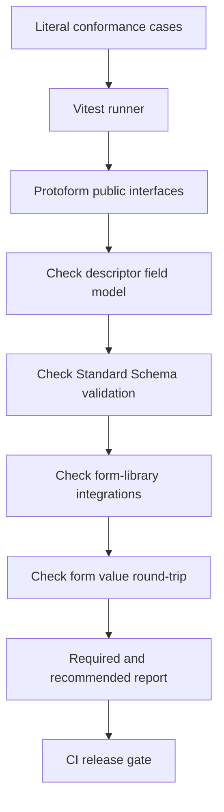

Protoform udostępnia niezależny zestaw testów zgodności dla podstawowych zachowań i obsługi protobuf, na których
opierają się adaptery formularzy, a także dla obsługiwanych integracji z TanStack Form, Formik i Final Form. Uruchom go
bezpośrednio:

```bash
bun run test:conformance
```

Projekt wykorzystuje praktyczny podział znany z
[zestawu testów zgodności Protocol Buffers](https://github.com/protocolbuffers/protobuf/tree/main/conformance):
runner zarządza przypadkami i oczekiwanymi wynikami, a implementacja jest testowana przez
niewielki publiczny interfejs. Protoform obecnie wykonuje ten model w ramach procesu za pomocą Vitest, ponieważ
obsługiwana implementacja jest napisana w TypeScript. Protokół komunikacji z podprocesem zwiększałby koszty bez kolejnego
adaptera językowego do przetestowania.

[Panel gotowości produkcyjnej](/docs/production-readiness) umieszcza te przechodzące przypadki w
większym, wersjonowanym zbiorze. Zgodność określa, czy zaimplementowane kontrakty przechodzą testy; gotowość zachowuje
rozróżnienie między możliwościami zweryfikowanymi, odroczonymi, nieobsługiwanymi i zależnymi od podmiotów zewnętrznych.



## Poziomy kontraktów

| Poziom | Kontrakt | Przykłady |
| --- | --- | --- |
| **wymagany** | Zachowanie, które musi zachować każde obsługiwane wydanie Protoform | Metadane Standard Schema v1, skalarne i złożone rodzaje pól, typowane dane wyjściowe, pola wymagane, oneof oraz ścieżki zgodne ze strukturą formularza |
| **zalecany** | Rozbudowane zachowanie oczekiwane od kompletnego dostawcy protobuf i obsługiwanych integracji | Błędy główne CEL, reguły formatów, wszystkie naruszenia map, przesyłanie formularzy i błędy serwera w bibliotekach formularzy oraz zachowanie typów wrapper i well-known podczas konwersji w obie strony |

Oba poziomy są domyślnie uruchamiane i oba blokują CI. Nazwy opisują minimalny poziom przenośności, a nie
listę dozwolonych przypadków: nie ma oczekiwanych niepowodzeń, pomijanych po cichu testów ani przypadków, które przechodzą wyłącznie lokalnie.

## Zakres zestawu testów

### Od deskryptora do modelu pól

Zestaw parsuje deskryptor zawierający ciągi znaków, 64-bitowe liczby całkowite, enumy, wiadomości, pola repeated,
mapy, oneof, znaczniki czasu, okresy oraz typy well-known oparte na JSON. Weryfikuje stabilny,
niezależny od schematu model pól używany przez AutoForm, w tym stan wymagania i wskazówki dotyczące kontrolek.

### Od wartości formularza do protobuf

Pełny, prawidłowy fixture przechodzi przez `createProtoFormSchema`. Przypadek sprawdza, czy Standard Schema
zwraca typowaną wiadomość protobuf i zachowuje bajty, 64-bitowe liczby całkowite, mapy oraz aktywną
gałąź oneof.

Macierz skalarów sprawdza również granice 32- i 64-bitowych liczb ze znakiem i bez znaku, specjalne
wartości float i double oraz jawną i niejawną obecność. Nieprawidłowa wejściowa liczba całkowita jest odrzucana w swojej ścieżce
formularza, zanim może stać się wartością protobuf spoza zakresu.

### Ścieżki walidacji

Nieprawidłowe fixture obejmują wymagane skalary, zagnieżdżone wiadomości, elementy repeated, zagnieżdżone wartości map, brakujące
i nieprawidłowe oneof, ograniczenia formatów, reguły CEL oraz wiele naruszeń z jednego wpisu mapy.
Oczekiwane ścieżki są literalnymi ścieżkami zgodnymi ze strukturą formularza, takimi jak:

```text
shippingAddress.city
luckyNumbers.0
officeLocations.0.value.city
preferredContact.value
```

Błędy konwersji i błędy CEL na poziomie wiadomości muszą zwracać widoczne problemy główne, zamiast
zgłaszać wyjątek lub znikać.

### Konwersja z protobuf do formularza i z powrotem

Przypadek konwersji w obie strony waliduje wartości formularza, otrzymuje wiadomość protobuf i konwertuje ją z powrotem za pomocą
`protoToFormValues`. Weryfikuje pola opcjonalne, typy wrapper, wartości JSON, mapy, bajty, maski pól,
okresy, wartości 64-bitowe i oneof w reprezentacji bezpiecznej dla formularza.

Dedykowane przypadki macierzowe rozszerzają ten kontrakt na każdy dozwolony typ klucza mapy, rodziny skalarów repeated i
enumów, każdy skalarny typ wrapper oraz pakowanie i rozpakowywanie danych `Any`. Nieprawidłowy base64 i
zduplikowane wyrenderowane klucze map pozostają widoczne jako błędy pól.

### Macierze reguł Protovalidate

Przypadki oparte na tabelach obejmują stałe logiczne; wartości ciągów znaków, długości w znakach Unicode i bajtach, wzorce,
afiksy, zawieranie i przynależność; UUID i przycięte postacie UUID; stałe enum, aliasy, zdefiniowane
wartości oraz listy dozwolonych i zabronionych wartości; liczność repeated i map; unikalność; a także listy adresów URL typów `Any`.

Dodatkowe tabele obejmują float/double i każdą rodzinę liczb całkowitych; ciągi sieciowe i identyfikatory; bajty;
Duration, FieldMask i Timestamp; semantykę ignorowania; niestandardowe reguły predefiniowane; oraz niewalidujące
standardowe przykłady prezentowane jako wskazówki formularza. Przypadki CEL dla pól i wiadomości zachowują identyfikatory reguł, dynamiczne
komunikaty, ścieżki zagnieżdżone/repeated, każde naruszenie oraz bezpieczne problemy główne dla nieprawidłowych wyrażeń.

Kontrakt email jest testowany przez publiczny interfejs Standard Schema i obsługiwane adaptery formularzy,
dzięki czemu konfiguracja adaptera nie może po cichu osłabić walidacji deskryptora.

### Macierze Resource API i środowiska uruchomieniowego

Przypadki zasobów weryfikują metadane zasobów AIP, rozdzielenie nazwy/ID/nazwy wyświetlanej, pola standardowe, każde zachowanie
pola, standardowe struktury Create/Get/List/Update/Delete, struktury singleton, minimalne maski aktualizacji, wszystkie
kanoniczne kody stanu inne niż OK, ustrukturyzowane szczegóły błędów oraz zachowanie nieznanych typów szczegółów.

Przypadki środowiska uruchomieniowego dodają rekurencyjne limity deskryptorów, obsługę nieprawidłowych i wrogich danych wejściowych, budżety
modelu renderowania i konwersji dla 50/200/500 pól, budżety pakietów, profile zgodności pakietów, odzyskiwanie kroków
wyłącznie za pomocą klawiatury, skanowanie dostępności, zakres obsługiwanych przeglądarek i testy hydracji.

### Integracja z TanStack Form

Zestaw uruchamia również działający przykład TanStack Form. Weryfikuje, czy problemy Standard Schema z Protoform
są przypisywane do właściwych pól, prawidłowe wartości stają się typowaną wiadomością protobuf przed przesłaniem,
a ustrukturyzowane naruszenia serwera wracają do właściwego pola TanStack.

Zestaw integracyjny rejestru sprawdza osobno natywny hook TanStack i wygenerowany AutoForm.
Obejmuje zachowanie natywnego API, pola skalarne i repeated, czyszczenie gałęzi oneof, każdy widoczny
problem dostawcy, zachowanie cyklu życia walidacji oraz maski aktualizacji wyprowadzane z metadanych pól TanStack.

### Integracje z Formik i Final Form

Zestaw uruchamia działające przykłady Formik i Final Form z wygenerowanym deskryptorem żądania oraz lokalnym
API TypeScript. Weryfikuje problemy po stronie klienta, przesyłanie typowanych wiadomości protobuf, ustrukturyzowane błędy serwera oraz
dostępny stan pól. Czyste przypadki adapterów weryfikują również zagnieżdżone ścieżki, indeksy repeated, wiele
problemów oraz odporność na prototype pollution.

## Uruchamianie i izolowanie przypadków

Uruchom cały zestaw:

```bash
bun run test:conformance
```

Podczas tworzenia pojedynczego kontraktu użyj filtra nazw Vitest:

```bash
bun run test:conformance -- -t "nested map value"
```

Główne polecenie `quality:gate` i CI uruchamiają cały zestaw. Zmiana dotycząca parsowania deskryptorów,
normalizacji walidacji, danych wyjściowych Standard Schema, konwersji protobuf lub obsługi oneof powinna przed wydaniem
dodać lub zaktualizować odpowiedni literalny przypadek.

## Dodawanie pokrycia

1. Dodaj najmniejszą funkcję deskryptora do
   `conformance/proto/protoform/conformance/v1/conformance.proto`, jeśli istniejące macierze jej nie
   obejmują.
2. Ponownie wygeneruj zapisane w repozytorium bindingi za pomocą `bun run proto:generate`.
3. Dodaj jedne literalne dane wejściowe i oczekiwany wynik do odpowiedniego pliku w katalogu `conformance/`.
4. Przed zmianą kodu implementacji potwierdź, że przypadek nie przechodzi z powodu zamierzonego brakującego zachowania.
5. Uruchom wybrany przypadek, a następnie `bun run test:conformance` i `bun run quality:gate`.

Oczekiwane wartości powinny być niezależne od implementacji. Nie obliczaj oczekiwanych ścieżek ani rodzajów pól
za pomocą tego samego testowanego helpera; fixture stanowi źródło prawdy.
