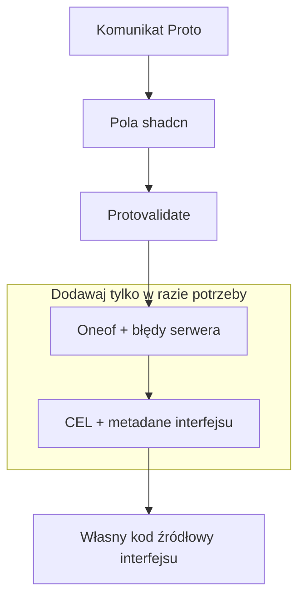

## 1. Dodaj rejestr

W pliku `components.json` skieruj przestrzeń nazw na niezmienną migawkę stabilnego rejestru:

```json
{
  "registries": {
    "@protoform": "https://raw.githubusercontent.com/malinskibeniamin/protoform/v1.0.0/public/r/{name}.json"
  }
}
```

Przypnij tag Git, aby późniejsze zmiany w upstreamie nie mogły wpłynąć na istniejącą instalację. Zachowaj ścieżkę
`/r/{name}.json`, aby shadcn mógł rozpoznać każdy element `@protoform`.

Następnie zainstaluj:

```bash
bunx shadcn@latest add @protoform/protoform
```

Rejestr kopiuje hook, provider protobuf, współdzielony model pól oraz komponenty interfejsu do Twojej
aplikacji. Możesz przeglądać, dostosowywać stylistycznie i wersjonować cały ten kod źródłowy razem z aplikacją.

## 2. Skonfiguruj publiczny rejestr Buf

Buf publikuje wygenerowane moduły Google API w swoim publicznym rejestrze npm. Dodaj jego zakres do pliku
`.npmrc` aplikacji:

```ini title=".npmrc"
@buf:registry=https://buf.build/gen/npm/v1/
```

Token nie jest wymagany. Element rejestru deklaruje ten moduł oraz wszystkie pozostałe publiczne zależności
zewnętrzne, dlatego `shadcn add` instaluje je wraz ze skopiowanym kodem źródłowym. Protoform nie udostępnia
własnych pakietów npm.

## 3. Utwórz komunikat protobuf

```proto
syntax = "proto3";

package example.v1;

import "buf/validate/validate.proto";

message SignupRequest {
  string email = 1 [(buf.validate.field).string.email = true];
  string display_name = 2 [(buf.validate.field).string = {
    min_len: 2
    max_len: 40
  }];
}
```

Wygeneruj TypeScript za pomocą Buf, a następnie przekaż wygenerowany schemat do `useProtoForm`.

Zainstaluj generator kodu źródłowego, jeśli repozytorium aplikacji będzie ponownie generować powiązania formularzy:

```bash
bunx shadcn@latest add @protoform/protoc-gen-protoform
```

```yaml
# buf.gen.yaml
version: v2
plugins:
  - local: ["bun", "run", "scripts/protoc-gen-protoform/run.ts"]
    out: src/gen
    opt: target=ts,import_extension=js
```

Protoform obsługuje wyłącznie schematy Protobuf-ES v2. Jeśli aplikacja nadal generuje klasy komunikatów
v1, przed integracją środowiska uruchomieniowego formularzy wykonaj instrukcje z sekcji [Migracja do Protobuf-ES v2](/docs/protobuf-v2-migration).

## 4. Zacznij od prostych funkcji, a potem dodawaj kolejne możliwości



Aby skorzystać z kompletnego przewodnika po pięciu RPC, zainstaluj element bookstore:

```bash
bunx shadcn@latest add @protoform/bookstore
```

Zawiera wygenerowane powiązania, przepływy tworzenia i edycji oparte na React Hook Form, usuwanie za pomocą AutoForm oraz
ograniczoną przykładową usługę działającą w pamięci.
