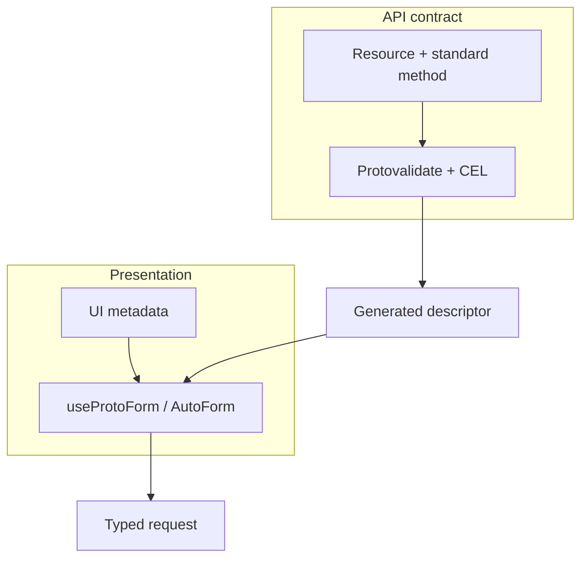

Protoform najlepiej współpracuje z interfejsami API protobuf zorientowanymi na zasoby. Zachowuje warstwy zasobów, walidacji
i prezentacji, zamiast zastępować je obiektem DTO przeznaczonym wyłącznie dla frontendu.

Protoform nie zapewnia automatycznie zgodności dowolnego API ze standardami AIP. Właściciele API nadal definiują i egzekwują
nazwy zasobów, standardowe metody, stronicowanie, maski aktualizacji, współbieżność oraz semantykę operacji
długotrwałych. Protoform odwzorowuje następnie ten kontrakt w formularz z typami.

[Panel gotowości produkcyjnej](/docs/production-readiness) mierzy obsługę AIP istotną dla formularzy
oddzielnie od semantyki dotyczącej wyłącznie backendu. Każdy odpowiedni przepływ pracy klienta ma wykonywalne potwierdzenie,
a obowiązki związane z backendem i zarządzaniem pozostają widoczne jako wyłączenia zewnętrzne.

## Pełne śledzenie ogólnego katalogu AIP

Oficjalny [ogólny katalog AIP](https://google.aip.dev/general) stanowi kompletny punkt odniesienia
dla ogólnych AIP. Każda pozycja katalogu ma własny, stabilny wiersz w rejestrze gotowości. Wiersz ma jawny
status gotowości:

- **Wykonywalna zgodność** dla zachowań, za które odpowiada Protoform, takich jak odwzorowanie deskryptorów, zachowanie
  pól, maski aktualizacji, żądania z typami, błędy strukturalne i redagowanie danych.
- **Statyczna kontrola schematu**, gdy deklaracja protobuf może potwierdzić widoczną w formularzu część reguły,
  na przykład powiązania zasobów, identyfikatory żądań, `validate_only`, rewizje zasobów, miękkie usuwanie,
  stany, wygaśnięcie i metody wsadowe.
- **Odroczone** lub **nieobsługiwane** dla odpowiednich zachowań klienta, które nie mają obecnie potwierdzenia. Te wiersze
  obniżają gotowość i wskazują następny wykonywalny test.
- **Zewnętrzne** dla egzekwowania po stronie backendu, zarządzania lub własności repozytorium, których Protoform nie może
  zaimplementować. Te wiersze pozostają widoczne, ale są wyłączone z mianownika.

**Sama dokumentacja nie jest uznawana** za potwierdzenie gotowości. Przewodnik może objaśniać AIP, ale tylko
wykonywalny test lub statyczna asercja schematu może oznaczyć odpowiedni wiersz jako zweryfikowany. AIP-192 jest zweryfikowany,
ponieważ test generatora potwierdza, że publiczne komentarze wiadomości i pól są rejestrowane jako pomoc formularza.

| Rodzina katalogu | Śledzone pozycje | Obecna odpowiedzialność |
| --- | --- | --- |
| Metadane i proces | [AIP-1](https://google.aip.dev/1), [AIP-2](https://google.aip.dev/2), [AIP-3](https://google.aip.dev/3), [AIP-8](https://google.aip.dev/8), [AIP-9](https://google.aip.dev/9), [AIP-100](https://google.aip.dev/100), [AIP-200](https://google.aip.dev/200), [AIP-205](https://google.aip.dev/205) | Zewnętrzne zarządzanie propozycjami i przeglądami API |
| Koncepcje API | [AIP-111](https://google.aip.dev/111) | Zewnętrzne granice płaszczyzn backendu |
| Projektowanie zasobów | [AIP-121](https://google.aip.dev/121), [AIP-122](https://google.aip.dev/122), [AIP-123](https://google.aip.dev/123), [AIP-124](https://google.aip.dev/124), [AIP-126](https://google.aip.dev/126), [AIP-128](https://google.aip.dev/128), [AIP-129](https://google.aip.dev/129), [AIP-156](https://google.aip.dev/156) | Wykonywalne lub statyczne kontrole zasobów, powiązań, typów wyliczeniowych, sterowania deklaratywnego, wartości domyślnych serwera i singletonów |
| Operacje | [AIP-130](https://google.aip.dev/130), [AIP-131](https://google.aip.dev/131), [AIP-132](https://google.aip.dev/132), [AIP-133](https://google.aip.dev/133), [AIP-134](https://google.aip.dev/134), [AIP-135](https://google.aip.dev/135), [AIP-136](https://google.aip.dev/136), [AIP-151](https://google.aip.dev/151), [AIP-231](https://google.aip.dev/231), [AIP-233](https://google.aip.dev/233), [AIP-234](https://google.aip.dev/234), [AIP-235](https://google.aip.dev/235) | Metody standardowe, wsadowe, niestandardowe, strumieniowe i długotrwałe są sklasyfikowane; postęp operacji, odpytywanie, anulowanie i błędy końcowe są zweryfikowane |
| Pola | [AIP-140](https://google.aip.dev/140), [AIP-141](https://google.aip.dev/141), [AIP-142](https://google.aip.dev/142), [AIP-143](https://google.aip.dev/143), [AIP-144](https://google.aip.dev/144), [AIP-145](https://google.aip.dev/145), [AIP-146](https://google.aip.dev/146), [AIP-147](https://google.aip.dev/147), [AIP-148](https://google.aip.dev/148), [AIP-149](https://google.aip.dev/149), [AIP-202](https://google.aip.dev/202), [AIP-203](https://google.aip.dev/203), [AIP-216](https://google.aip.dev/216) | Jednostki wielkości, ustandaryzowane kody tekstowe, przedziały półotwarte, pola poufne i podstawowe zachowania pól są zweryfikowane |
| Wzorce projektowe | [AIP-152](https://google.aip.dev/152), [AIP-153](https://google.aip.dev/153), [AIP-154](https://google.aip.dev/154), [AIP-155](https://google.aip.dev/155), [AIP-157](https://google.aip.dev/157), [AIP-158](https://google.aip.dev/158), [AIP-159](https://google.aip.dev/159), [AIP-160](https://google.aip.dev/160), [AIP-161](https://google.aip.dev/161), [AIP-162](https://google.aip.dev/162), [AIP-163](https://google.aip.dev/163), [AIP-164](https://google.aip.dev/164), [AIP-165](https://google.aip.dev/165), [AIP-210](https://google.aip.dev/210), [AIP-211](https://google.aip.dev/211), [AIP-214](https://google.aip.dev/214), [AIP-217](https://google.aip.dev/217), [AIP-236](https://google.aip.dev/236) | Zadania, import/eksport, operacje między kolekcjami, usuwanie według kryteriów, odpowiedzi częściowe, nieosiągalne zasoby, podgląd zasad i pozostałe wzorce należące do klienta są zweryfikowane; egzekwowanie autoryzacji jest zewnętrzne |
| Zgodność i wersjonowanie | [AIP-180](https://google.aip.dev/180), [AIP-181](https://google.aip.dev/181), [AIP-182](https://google.aip.dev/182), [AIP-185](https://google.aip.dev/185) | Prezentacja zgodności, zależności, wersji pakietów, wersji zapoznawczych i wycofywania jest zweryfikowana |
| Dopracowanie | [AIP-190](https://google.aip.dev/190), [AIP-191](https://google.aip.dev/191), [AIP-192](https://google.aip.dev/192), [AIP-193](https://google.aip.dev/193), [AIP-194](https://google.aip.dev/194) | Nazewnictwo, układ, pomoc z wygenerowanego źródła, kanoniczne błędy i odzyskiwanie przez ponawianie z uwzględnieniem idempotencji są zweryfikowane |
| Bufory protokołu | [AIP-127](https://google.aip.dev/127), [AIP-213](https://google.aip.dev/213), [AIP-215](https://google.aip.dev/215) | Powszechnie znane komponenty oraz role ścieżki HTTP, zapytania i treści są zweryfikowane; własność proto specyficznych dla API jest zewnętrzna |

Importuj pomocnicze funkcje deskryptorów i przepływów pracy klienta z ich opcjonalnych podścieżek. Dzięki temu metadane operacji
długotrwałych nie trafiają do aplikacji, które używają wyłącznie podstawowego dostawcy formularzy.

```ts
import {
  getProtoPartialResult,
  getProtoRetryDecision,
  runProtoOperation,
} from "@/lib/protobuf-provider/aip-client-workflow";
import { getProtoMethodWorkflow } from "@/lib/protobuf-provider/method-workflow";
```

Zweryfikowany zakres jest celowo wąski. AIP-154 oznacza, że Protoform zachowuje `etag`, a nie że
egzekwuje współbieżność. AIP-158 oznacza, że pola stron zachowują typy, a tokeny pozostają nieprzezroczyste, a nie że
klient potwierdza stabilność kursora serwera. AIP-160 oznacza, że żądanie zawiera `filter` i `order_by`, a nie
że kod interfejsu użytkownika autoryzuje lub ocenia filtr. AIP-194 oznacza, że Protoform ponawia tylko jawnie
idempotentne unarne wywołania `UNAVAILABLE`; właściciele usług nadal konfigurują bazową politykę ponawiania.



## Kanoniczna struktura zasobu

Zasób jest zgodny z [AIP-121](https://google.aip.dev/121),
[AIP-122](https://google.aip.dev/122) i [AIP-123](https://google.aip.dev/123):

```proto
import "buf/validate/validate.proto";
import "google/api/field_behavior.proto";
import "google/api/resource.proto";

message Connector {
  option (google.api.resource) = {
    type: "example.googleapis.com/Connector"
    pattern: "projects/{project}/locations/{location}/connectors/{connector}"
    singular: "connector"
    plural: "connectors"
  };

  string name = 1 [(google.api.field_behavior) = IDENTIFIER];
  string display_name = 2 [
    (google.api.field_behavior) = REQUIRED,
    (buf.validate.field).string.min_len = 1
  ];
  ConnectorState state = 3 [(google.api.field_behavior) = OUTPUT_ONLY];
  string etag = 4 [(google.api.field_behavior) = OUTPUT_ONLY];
}

enum ConnectorState {
  CONNECTOR_STATE_UNSPECIFIED = 0;
  CONNECTOR_STATE_ACTIVE = 1;
  CONNECTOR_STATE_FAILED = 2;
}
```

Ta struktura jest zamierzona:

- `name` jest polem 1, zawiera pełną względną nazwę zasobu i ma wyłącznie `IDENTIFIER`.
- Tekst wyświetlany ma własne pole `display_name`; sam identyfikator nigdy nie podszywa się pod `name`.
- `(google.api.resource)` deklaruje `type`, `pattern`, `singular` i `plural`.
- `field_behavior` dokumentuje obowiązki klienta; `buf.validate` i CEL egzekwują wartości.
- Wartości zerowe typów wyliczeniowych kończą się na `_UNSPECIFIED`.
- Pola `state` i `etag`, którymi zarządza serwer, są tylko do odczytu w formularzach edycji.

## Żądania standardowych metod

Używaj standardowych struktur żądań zamiast niestandardowych obwiedni operacji:

```proto
import "google/protobuf/field_mask.proto";

message GetConnectorRequest {
  string name = 1 [
    (google.api.field_behavior) = REQUIRED,
    (google.api.resource_reference).type = "example.googleapis.com/Connector"
  ];
}

message ListConnectorsRequest {
  string parent = 1 [
    (google.api.field_behavior) = REQUIRED,
    (google.api.resource_reference).child_type = "example.googleapis.com/Connector"
  ];
  int32 page_size = 2;
  string page_token = 3;
  string filter = 4;
  string order_by = 5;
}

message ListConnectorsResponse {
  repeated Connector connectors = 1;
  string next_page_token = 2;
}

message CreateConnectorRequest {
  string parent = 1 [
    (google.api.field_behavior) = REQUIRED,
    (google.api.resource_reference).child_type = "example.googleapis.com/Connector"
  ];
  Connector connector = 2 [(google.api.field_behavior) = REQUIRED];
  string connector_id = 3 [
    (google.api.field_behavior) = REQUIRED,
    (buf.validate.field).string.pattern = "^[a-z][a-z0-9-]{2,62}$"
  ];
}

message UpdateConnectorRequest {
  Connector connector = 1 [(google.api.field_behavior) = REQUIRED];
  google.protobuf.FieldMask update_mask = 2
    [(google.api.field_behavior) = REQUIRED];
}

message DeleteConnectorRequest {
  string name = 1 [
    (google.api.field_behavior) = REQUIRED,
    (google.api.resource_reference).type = "example.googleapis.com/Connector"
  ];
  string etag = 2;
}
```

| Metoda | Kontrakt AIP | Odpowiedzialność formularza |
| --- | --- | --- |
| Get / Delete | Wysyłaj pełną nazwę zasobu `name`; Delete może wysłać `etag` | Utrzymuj tożsamość oddzielnie od edytowalnych pól wyświetlania |
| List | Wysyłaj `parent`, `page_size`, nieprzezroczysty `page_token`, tekstowy `filter` i `order_by` | Traktuj tokeny jako nieprzezroczyste i utrzymuj filtry bez zmian podczas stronicowania |
| Create | Wysyłaj `parent`, `connector` i `connector_id`; ignoruj `connector.name` | Waliduj format identyfikatora poza treścią zasobu |
| Update | Wysyłaj zasób wraz z wymaganym `update_mask` | Twórz maskę na podstawie zmian w edytowalnych polach, nigdy na podstawie pól zarządzanych przez serwer |

## Automatyczne minimalne maski aktualizacji

Przy każdym przesłaniu AutoForm oblicza maskę zgodną z AIP na podstawie natywnego stanu zmodyfikowanych pól React Hook Form lub
TanStack Form. Trzeci
argument funkcji przesyłania udostępnia ją jako `context.updateMask`:

```tsx
<AutoForm
  defaultValues={profile}
  schema={MaskableProfileSchema}
  withSubmit
  onSubmit={async (nextProfile, _form, context) => {
    if (!context.updateMask?.paths.length) return;

    await updateProfile(create(UpdateMaskableProfileRequestSchema, {
      profile: nextProfile,
      updateMask: context.updateMask,
    }));
  }}
/>
```

Hook niższego poziomu udostępnia to samo zachowanie przez `createUpdateMask()`:

```tsx
const form = useProtoForm(MaskableProfileSchema, { defaultValues: profile });

const onSubmit = form.handleSubmit(async (values) => {
  const updateMask = form.createUpdateMask();
  if (!updateMask.paths.length) return;

  await updateProfile(create(UpdateMaskableProfileRequestSchema, {
    profile: form.createMessage(values),
    updateMask,
  }));
});
```

Wygenerowana maska używa ścieżek protobuf w zapisie snake_case i kolejności deskryptora. Zagnieżdżone pojedyncze wiadomości zachowują
najwęższy zmodyfikowany liść. Mapy i pola powtarzane są zwijane do pola właściciela, ponieważ maski pól protobuf
nie mogą adresować indeksu kolekcji. Nazwy grup oneof nigdy nie trafiają do maski; Protoform używa
wybranej gałęzi albo gałęzi początkowej, gdy użytkownik ją wyczyści. Pola `IDENTIFIER`, `IMMUTABLE` i
`OUTPUT_ONLY` są pomijane, nawet jeśli kod aplikacji oznaczy je jako zmodyfikowane. Wywołanie `reset()` ustanawia
nowy punkt odniesienia dla zmodyfikowanych pól.

Maski odczytu są jawne, ponieważ dotknięte pola nie wskazują, którą projekcję ekran chce pobrać.
Użyj `createFieldMask()`, aby zweryfikować, znormalizować, zdeduplikować i zminimalizować żądane ścieżki:

```ts
const readMask = createFieldMask(MaskableProfileSchema, [
  "displayName",
  "biography",
]);
// readMask.paths: ["display_name", "biography"]
```

Maski aktualizacji generowane przez klienta nigdy nie zawierają `name`, pól niezmiennych, pól tylko do odczytu, pól nieznanych, symboli wieloznacznych ani samych
ścieżek oneof. Serwer nadal waliduje każdą maskę, stosuje wyłącznie objęte nią pola i waliduje
scalony zasób, a nie tylko poprawkę. Niezgodność `etag` powinna zwrócić `ABORTED`. Tokeny list
powinny kodować stabilny kursor i odrzucać niezgodności filtra lub kolejności. Użyj
`google.longrunning.Operation`, gdy metoda nie może natychmiast zwrócić zasobu w stanie ustalonym.

Pełne reguły standardowych metod opisują [AIP-132](https://google.aip.dev/132), [AIP-133](https://google.aip.dev/133),
[AIP-134](https://google.aip.dev/134), [AIP-135](https://google.aip.dev/135),
[AIP-158](https://google.aip.dev/158), [AIP-160](https://google.aip.dev/160) i
[AIP-161](https://google.aip.dev/161).

## Przykłady przepływów pracy a standardowe metody

RPC `SubmitBasicForm` i `SubmitComplexForm` w repozytorium celowo demonstrują
najmniejszy kompletny transport formularza. Są to przykłady przepływów pracy, a nie standardowe metody
zorientowane na zasoby. Nie kopiuj ich niestandardowej struktury `Submit*` do API, które tworzy lub aktualizuje zasób.

W formularzu tworzenia zachowaj `parent`, `{resource}_id` i wiadomość zasobu w standardowym żądaniu Create.
W formularzu aktualizacji zachowaj zasób, `update_mask` oraz semantykę `etag`. Kreator krokowy jest tylko
warstwą prezentacji: może grupować te pola żądania bez zmiany ich znaczenia w AIP ani tworzenia
obiektu DTO wyłącznie dla frontendu.

Przykłady [błędu serwera](/docs/server-error-form) i [formularza złożonego](/docs/complex-example) przedstawiają transport,
walidację i odzyskiwanie po błędach. Powyższe standardowe struktury żądań pozostają przewodnikiem dla produkcyjnego API.

## Jak Protoform zachowuje zgodność

| Zasada | Zachowanie Protoform |
| --- | --- |
| Protobuf pozostaje kontraktem API | Wygenerowane deskryptory sterują typami, ścieżkami walidacji, gałęziami oneof i danymi wyjściowymi formularza |
| Walidacja jest egzekwowalna, a nie dekoracyjna | Protovalidate i CEL wykonują reguły kontraktu; adnotacje interfejsu użytkownika sterują wyłącznie prezentacją |
| Tożsamość zasobu pozostaje odrębna | `name`, `{resource}_id` i `parent` zachowują swoje znaczenie w AIP, zamiast stawać się etykietami |
| Pola zarządzane przez serwer pozostają własnością serwera | Metadane `IDENTIFIER`, `OUTPUT_ONLY` i `IMMUTABLE` można ukryć lub wyświetlić tylko do odczytu |
| Aktualizacje są jawne | Formularze aktualizacji mogą wyprowadzić maskę pól ze zmodyfikowanych pól edytowalnych; API nadal ją waliduje |
| Błędy zachowują ścieżki pól | Naruszenia pól Connect/gRPC odwzorowują ścieżki protobuf z powrotem na natywne pola React Hook Form lub TanStack Form |
| Współdziałanie jest przenośne | Dostawca protobuf udostępnia walidację przez Standard Schema v1 |

Są to wykonywalne zachowania, a nie zalecenia istniejące wyłącznie w dokumentacji. Zestaw testowy zgodności z AIP
weryfikuje `type`, `pattern`, `singular` i `plural` zasobu; rozróżnia `name`,
`display_name` i `{resource}_id`; oraz odmiennie odwzorowuje `REQUIRED`, `OPTIONAL`, `IDENTIFIER`, `OUTPUT_ONLY`,
`IMMUTABLE` i `INPUT_ONLY` w kontekstach żądań Create i Update. Standardowe
struktury żądań Create/Get/List/Update/Delete i singletonów są testowane niezależnie.

Cykl obsługi błędów po stronie klienta jest zgodny z [AIP-193](https://google.aip.dev/193): kanoniczne kody i
strukturalne szczegóły `google.rpc.*` sterują informacjami zwrotnymi dotyczącymi pól, odzyskiwaniem i kontekstem pomocy technicznej. Pełne
mapowanie i wskazówki dotyczące ponawiania zawiera strona [Błędy serwera](/docs/server-errors).

## Metadane prezentacji AutoForm

Oddzielaj kwestie prezentacji od kontraktu zasobu:

```proto
import "protoform/ui/auto_form.proto";

message NotificationConfig {
  oneof delivery {
    WebhookDelivery webhook = 1 [(protoform.ui.oneof).label = "Webhook"];
    QueueDelivery queue = 2 [(protoform.ui.oneof).label = "Queue"];
  }
}
```

Powiązania AutoForm mogą zawierać etykiety, opisy, odnośniki do dokumentacji, przykłady, sekcje i niestandardowe
kontrolki bez zmiany tożsamości zasobu ani semantyki standardowych metod.
