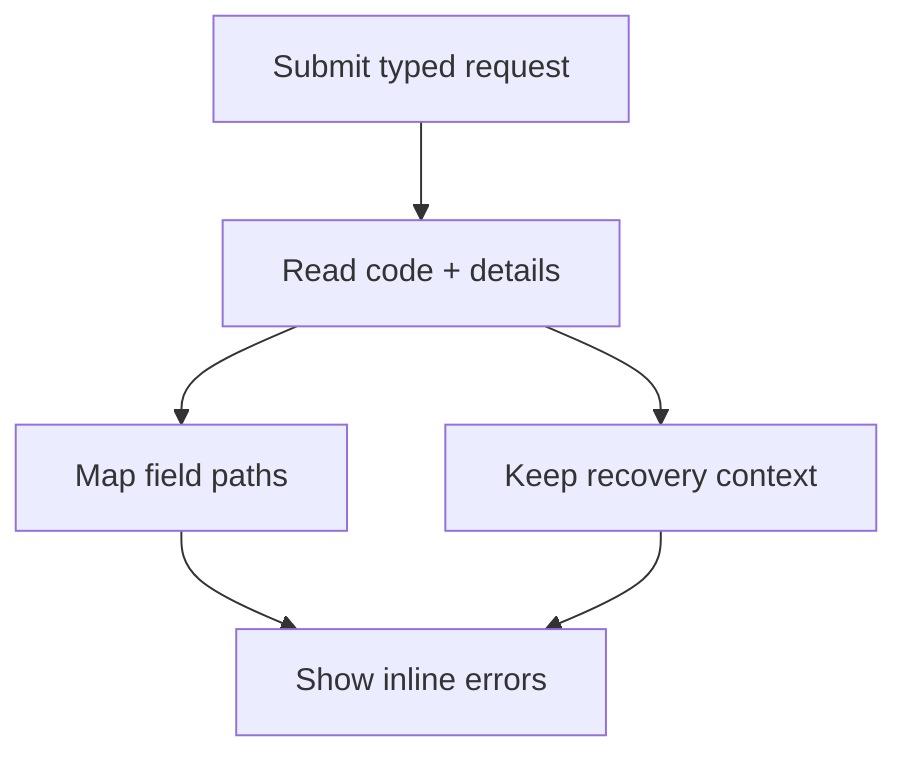

Walidacja po stronie klienta poprawia jakość komunikatów zwrotnych, ale to serwer pozostaje źródłem prawdy w kwestiach autoryzacji,
współbieżności, unikalności, limitów i kontroli bieżącego stanu. Protoform mapuje ustrukturyzowane błędy Connect i gRPC
do 3 miejsc: błędów pól, podsumowania błędów oraz kontekstu diagnostycznego.

Jest to zgodne z [AIP-193](https://google.aip.dev/193): używaj kanonicznych kodów stanu i standardowych
szczegółów `google.rpc.*` zamiast analizować tekst komunikatów. Connect udostępnia te szczegóły przez
[`ConnectError.findDetails()`](https://connectrpc.com/docs/web/errors/#error-details).



## Cykl przesyłania

Wywołaj `clearServerErrorContext()` przed nowym żądaniem, a następnie przekaż każdą przechwyconą wartość do
`setServerErrors()`. Zachowaj zwrócone naruszenia `unmapped` w stanie komponentu, aby żaden błąd zaplecza nie
został utracony, gdy ścieżki nie można przypisać do pola.

```tsx
import type { FieldViolation } from "@/lib/protobuf-provider";
import { Button } from "@/components/ui/button";
import { useState } from "react";
import { toast } from "sonner";

const [unmapped, setUnmapped] = useState<FieldViolation[]>([]);

const onSubmit = form.handleSubmit(async (values) => {
  form.clearServerErrorContext();
  setUnmapped([]);

  try {
    await saveConnector(form.createMessage(values));
  } catch (error) {
    const result = form.setServerErrors(error);
    setUnmapped(result.unmapped);

    if (!result.handled && !result.context.message) {
      toast.error("Connector not saved. Check your connection and try again.");
    }
  }
});

return (
  <form onSubmit={onSubmit}>
    <ServerErrorSummary
      context={form.serverErrorContext}
      unmapped={unmapped}
    />
    {/* Registered fields */}
    <Button disabled={form.formState.isSubmitting} type="submit">
      Save connector
    </Button>
  </form>
);
```

`setServerErrors()` zwraca:

| Wartość | Znaczenie |
| --- | --- |
| `handled` | `true`, gdy co najmniej 1 `BadRequest.FieldViolation` został przypisany do pola formularza |
| `unmapped` | Każde naruszenie pola, którego ścieżki nie udało się zmapować; wyświetl je wszystkie |
| `context` | Stan i ustrukturyzowane szczegóły niezwiązane z polami, wyodrębnione z tego samego błędu |

Ten sam `context` staje się wartością `form.serverErrorContext`. Błąd inny niż Connect tworzy `handled: false`,
pustą tablicę `unmapped` oraz pusty kontekst. W takim przypadku zachowaj widoczny ogólny komunikat zastępczy. Nie
resetuj formularza po nieudanym żądaniu, ponieważ użytkownik potrzebuje przesłanych wartości, aby naprawić problem.

## Mapowanie ścieżek pól

Ustaw `serverPathPrefix`, gdy schemat hooka reprezentuje zagnieżdżone pole żądania, ale zaplecze zgłasza
ścieżki od głównego poziomu żądania RPC:

```tsx
const form = useProtoForm(NotificationSchema, {
  serverPathPrefix: "notification",
});
```

| Ścieżka pola zaplecza | Ścieżka formularza |
| --- | --- |
| `notification.display_name` | `displayName` |
| `notification.shipping_address.postal_code` | `shippingAddress.postalCode` |
| `notification.delivery.webhook.signing_secret_ref` | `delivery.value.signingSecretRef` |
| `notification.delivery` | `delivery` |

Protoform usuwa dokładnie wskazany prefiks, przechodzi przez deskryptor protobuf, konwertuje nazwy protobuf w formacie `snake_case`
na format TypeScript `camelCase` i spłaszcza warianty oneof pod `{oneofLocalName}.value`. Ustawia fokus na
pierwszym zmapowanym polu i dodaje każde zmapowane naruszenie z typem błędu React Hook Form `server`. Ogólne
opisy Protovalidate używają tych samych praktycznych komunikatów co walidacja po stronie klienta, natomiast pusty
opis jest zastępowany przez `Review this value and try again.`

Nieznane pola pozostają w `unmapped`. Ścieżki powtarzanych pól i map z indeksami w nawiasach, takie jak
`contacts[0].email`, również obecnie nie są mapowane, ponieważ mechanizm mapowania rozpoznaje segmenty pól deskryptora,
a nie indeksy kolekcji. Wyświetlaj te naruszenia w podsumowaniu zamiast je pomijać.

## Ustrukturyzowany kontekst błędu

`serverErrorContext` oddziela komunikaty dla użytkownika od danych przeznaczonych do przetwarzania maszynowego:

| Szczegół | Wyodrębniona wartość | Zalecane zastosowanie |
| --- | --- | --- |
| Kod stanu | `code` | Wybór ogólnej ścieżki naprawy; rejestrowanie w logach |
| `LocalizedMessage` | `message`, `messageLocale` | Tekst podsumowania przeznaczony dla klienta |
| `ErrorInfo` | `reason`, `domain`, `metadata` | Stabilne rozgałęzianie logiki, telemetria i kontekst wsparcia |
| `RequestInfo` | `requestId` | Identyfikator dla wsparcia i korelacja logów |
| `Help` | `helpLinks` | Odpowiednie działania naprawcze po zweryfikowaniu adresu URL |
| `RetryInfo` | `retryAfterSeconds` | Odliczanie do ponowienia lub dostępność akcji ponowienia |
| `PreconditionFailure` | `preconditionViolations` | Wyjaśnienie stanu, który musi się zmienić przed ponowieniem |
| `QuotaFailure` | `quotaViolations` | Wyjaśnienie wyczerpanego limitu i następnego działania |
| `ResourceInfo` | `resource` | Identyfikacja zasobu, którego dotyczy błąd, gdy jego ujawnienie jest bezpieczne |
| `DebugInfo` | `debug` | Wyłącznie logi programistyczne; nigdy nie wyświetlaj klientom wpisów stosu |
| Nieznany typ szczegółu | `unmappedDetails` | Zachowanie nazwy typu dla zastępczego interfejsu i telemetrii zamiast pomijania szczegółu |

`RequestInfo.request_id` ma pierwszeństwo przed identyfikatorem żądania skopiowanym do `ErrorInfo.metadata`.
`LocalizedMessage` ma pierwszeństwo przed nieprzetworzonym komunikatem Connect. Bez zlokalizowanego szczegółu
`context.message` przyjmuje komunikat dla programistów `rawMessage`, dlatego wyświetlaj go tylko wtedy, gdy kontrakt API
gwarantuje, że jest to bezpieczny komunikat dla klienta.

Nigdy nie uzależniaj logiki od tekstu komunikatu błędu. Używaj kanonicznego kodu stanu albo stabilnej pary
`ErrorInfo.reason` i `ErrorInfo.domain`. Traktuj metadane jako niezaufane dane, stosuj listę dozwolonych pól wysyłanych
do telemetrii oraz nie zapisuj w logach sekretów ani wrażliwych wartości przesłanych przez użytkownika.

## Dostępne podsumowanie błędów

Błędy wyświetlane przy polach są konieczne, ale niewystarczające. Podsumowanie musi również zawierać każde niezmapowane
naruszenie oraz każde naruszenie warunku wstępnego i limitu. Nie umieszczaj w DOM wartości diagnostycznych takich jak `DebugInfo`.

```tsx
import type {
  ConnectErrorContext,
  FieldViolation,
} from "@/lib/protobuf-provider";
import { Alert, AlertDescription, AlertTitle } from "@/components/ui/alert";

function getSafeHelpUrl(value: string): string | undefined {
  if (!URL.canParse(value)) {
    return;
  }
  const url = new URL(value);
  return url.protocol === "https:" ? url.href : undefined;
}

function ServerErrorSummary({
  context,
  unmapped,
}: {
  context: ConnectErrorContext | undefined;
  unmapped: FieldViolation[];
}) {
  if (!context) {
    return null;
  }

  const helpLinks = context.helpLinks.flatMap((link) => {
    const href = getSafeHelpUrl(link.url);
    return href ? [{ ...link, href }] : [];
  });
  const localizedMessage = context.messageLocale ? context.message : undefined;
  const hasSummary = Boolean(
    context.message ||
      context.requestId ||
      helpLinks.length ||
      unmapped.length ||
      context.preconditionViolations.length ||
      context.quotaViolations.length
  );

  if (!hasSummary) {
    return null;
  }

  return (
    <Alert aria-live="polite" variant="destructive">
      <AlertTitle>Connector not saved</AlertTitle>
      <AlertDescription>
        <p>
          {localizedMessage ??
            "Check the highlighted fields and the details below, then try again."}
        </p>

        {unmapped.length > 0 && (
          <ul>
            {unmapped.map((violation) => (
              <li key={`${violation.field}:${violation.description}`}>
                {violation.description || `Check ${violation.field}.`}
              </li>
            ))}
          </ul>
        )}

        {context.preconditionViolations.length > 0 && (
          <ul>
            {context.preconditionViolations.map((violation) => (
              <li key={`${violation.type}:${violation.subject}`}>
                {violation.description}
              </li>
            ))}
          </ul>
        )}

        {context.quotaViolations.length > 0 && (
          <ul>
            {context.quotaViolations.map((violation) => (
              <li key={`${violation.subject}:${violation.description}`}>
                {violation.description}
              </li>
            ))}
          </ul>
        )}

        {helpLinks.map((link) => (
          <p key={link.href}>
            <a href={link.href} rel="noreferrer" target="_blank">
              {link.description}
            </a>
          </p>
        ))}

        {context.requestId && <p>Support reference: {context.requestId}</p>}
      </AlertDescription>
    </Alert>
  );
}
```

Używaj `aria-invalid` dla pól zawierających błędy, połącz każdy błąd z odpowiednim polem za pomocą `aria-describedby` i
wyświetlaj wszystkie komunikaty, a nie tylko pierwszy. `setServerErrors()` żąda ustawienia fokusu na pierwszym zmapowanym
polu. Podsumowanie używa `aria-live="polite"`, dzięki czemu niezmapowane błędy są odczytywane bez przerywania
bieżącej interakcji z polem.

### Naprawianie błędów w formularzu krokowym

Gdy AutoForm używa `stepper`, asynchroniczne przesłanie może zgłosić pole, które nie jest zamontowane w
bieżącym kroku. Po zakończeniu procedury obsługi AutoForm sprawdza stan przesłanego formularza, otwiera krok
zawierający pierwszy błąd, wyświetla wszystkie błędy pól, a następnie ustawia fokus na pierwszej nieprawidłowej kontrolce.
Wartości ze wszystkich kroków pozostają nienaruszone. Błędy główne i niezmapowane pozostają w alercie formularza, ponieważ
nie można ich bezpiecznie przypisać do konkretnego pola.

Wymaga to stabilnych metadanych własności kroków najwyższego poziomu. Zobacz [Formularze krokowe](/docs/steppers), dedykowany
[formularz błędów serwera](/docs/server-error-form) oraz połączony
[złożony przykład kompleksowy](/docs/complex-example).

## Decyzje o ponowieniu

`RetryInfo` jest wskazówką serwera, a nie zezwoleniem na ponowne wykonanie każdej mutacji. Postępuj zgodnie z
[AIP-194](https://google.aip.dev/194): automatyczne ponowienia są przeznaczone dla jednoargumentowych, nietransakcyjnych operacji,
których wielokrotne wykonanie nie może spowodować niezamierzonych zmian stanu.

| Kod | Naprawa formularza |
| --- | --- |
| `invalid_argument` | Wyświetl błędy pól i podsumowania; ponów dopiero po zmianie wartości |
| `failed_precondition` | Wyświetl wszystkie warunki wstępne; ponów po wymaganej zmianie stanu |
| `already_exists` / `not_found` | Wyjaśnij konflikt lub brak zasobu; nie wykonuj ponowień w pętli |
| `unauthenticated` | Przywróć uwierzytelnienie przed ponowieniem |
| `permission_denied` | Wyjaśnij dozwolone następne działanie bez ujawniania ukrytych zasobów |
| `aborted` | Ponownie pobierz bieżący stan i pozwól użytkownikowi sprawdzić zmiany przed ponowieniem transakcji |
| `resource_exhausted` | Wyświetl szczegóły limitu; zasadniczo nie ponawiaj automatycznie |
| `unavailable` | Ponawiaj tylko idempotentne żądanie jednoargumentowe, używając ograniczonego opóźnienia wykładniczego z losowym odchyleniem |
| `deadline_exceeded` | Poinformuj o przekroczeniu limitu czasu, ponieważ operacja mogła zostać ukończona |
| `internal` / `unknown` / `data_loss` | Wyświetl stabilny komunikat zastępczy i identyfikator żądania; zgłoś błąd |
| `canceled` | Zakończ bez komunikatu, gdy anulowanie zostało zainicjowane przez użytkownika |

Operacje tworzenia i aktualizacji nie są automatycznie idempotentne. Jeśli API obsługuje bezpieczne ponowne wykonanie, dodaj
opcjonalne `request_id` do żądania i przestrzegaj gwarancji idempotencji opisanych w
[AIP-155](https://google.aip.dev/155). Zachowaj ten sam identyfikator żądania we wszystkich ponowieniach tej samej logicznej
operacji.

## Kontrakt serwera

Aby zapewnić przewidywalne działanie klienta, API powinno:

- zwracać kanoniczne wartości `google.rpc.Code` oraz krótki angielski komunikat stanu przeznaczony dla programistów
- dołączać jeden `ErrorInfo` ze stabilną przyczyną w formacie UPPER_SNAKE_CASE, globalnie unikalną domeną i metadanymi
- używać `BadRequest.FieldViolation` dla każdego nieprawidłowego pola żądania i uzupełniać `description`, ponieważ
  obecny mechanizm mapowania Protoform wyświetla tę wartość przy polu
- używać ścieżek żądania protobuf, w tym prefiksu opakowania żądania, gdy ma zastosowanie
- dołączać `LocalizedMessage` z bezpiecznym komunikatem dla klienta oraz `Help` z odpowiednimi wskazówkami HTTPS
- dołączać `RequestInfo`, aby zespół wsparcia mógł skorelować błąd bez ujawniania wewnętrznych danych diagnostycznych
- dołączać `RetryInfo`, `PreconditionFailure`, `QuotaFailure` i `ResourceInfo` tylko wtedy, gdy ich semantyka
  odpowiada danemu błędowi
- ograniczać `DebugInfo` do zaufanych systemów programistycznych i obserwowalności
- sprawdzać uprawnienie przed istnieniem zasobu, aby `permission_denied` nie ujawniał ukrytego zasobu

Protoform zachowuje te szczegóły, ale nie tworzy brakującej semantyki serwera. Jeśli zaplecze zwraca
wyłącznie nieustrukturyzowany ciąg znaków, formularz może wyświetlić ogólny komunikat zastępczy, ale nie może niezawodnie mapować pól,
wybrać działania naprawczego ani skorelować zgłoszenia do wsparcia.

## Macierz weryfikacji

Testuj ścieżkę błędu jako część kontraktu formularza:

- naruszenia pól skalarnych, zagnieżdżonych, grup oneof i wariantów oneof są mapowane do oczekiwanego pola
- prefiksy opakowania żądania są usuwane tylko po skonfigurowaniu
- nieznane ścieżki i ścieżki z indeksami w nawiasach pojawiają się w podsumowaniu
- każde zmapowane i niezmapowane naruszenie pozostaje widoczne
- brakujące opisy używają komunikatu zastępczego wyświetlanego przy polu
- zlokalizowane komunikaty, identyfikatory żądań, odnośniki pomocy oraz szczegóły limitów i warunków wstępnych są wyświetlane prawidłowo
- niebezpieczne lub względne adresy URL pomocy nie są wyświetlane jako odnośniki
- szczegóły diagnostyczne i niezatwierdzone metadane nigdy nie trafiają do DOM ani telemetrii klienta
- błędy inne niż Connect powodują wyświetlenie widocznego ogólnego komunikatu zastępczego
- kontrolki ponawiania uwzględniają kod, idempotencję, identyfikator żądania i `RetryInfo`
- nowa próba przesłania usuwa nieaktualny `serverErrorContext`
