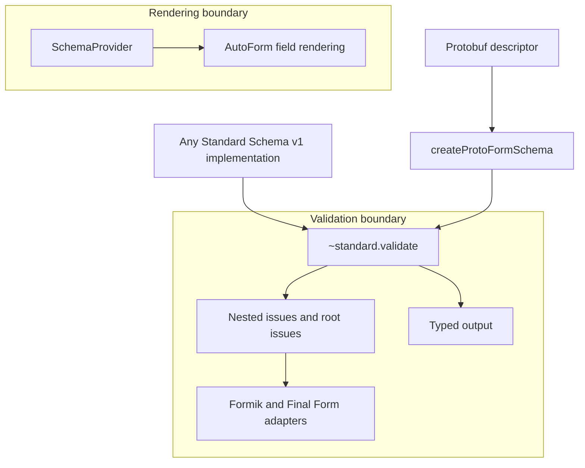

Protoform traktuje [Standard Schema v1](https://standardschema.dev/schema) jako granicę walidacji.
Skopiowany rdzeń Protoform zależy od standardu, a nie od Zod, Valibot, ArkType ani innego
dostawcy schematów. Dzięki temu zgodna implementacja może korzystać z tych samych adapterów bibliotek formularzy bez
pakietu ani ścieżki kodu specyficznej dla dostawcy.

Ta strona opisuje obsługiwany kontrakt. Biblioteki wymienione w tabeli zgodności stanowią dowody
testowe, a nie listę dozwolonych rozwiązań.

## Macierz możliwości

| Możliwość | Obsługa i działanie |
| --- | --- |
| Implementacje obiektowe | **Obsługiwane.** Akceptuje obiekt ze zgodną właściwością `~standard` |
| Implementacje wywoływalne | **Obsługiwane.** Akceptuje funkcję, która udostępnia również zgodną właściwość `~standard` |
| Walidacja synchroniczna | **Obsługiwana.** Zwraca błędy formularza bez wymuszania obietnicy |
| Walidacja asynchroniczna | **Obsługiwana.** Formik i Final Form oczekują na jej zakończenie |
| Zagnieżdżone problemy | **Obsługiwane.** Zachowuje segmenty ścieżki typu string, number i `{ key }` w zagnieżdżonym drzewie błędów |
| Problemy na poziomie głównym | **Obsługiwane.** Mapuje problemy bez ścieżki na kanał błędów głównych biblioteki formularzy |
| Wiele problemów | **Obsługiwane.** Zachowuje każdy problem i łączy komunikaty dla tego samego pola znakami nowego wiersza |
| Typowane dane wyjściowe | **Obsługiwane.** Dostępne z `~standard.validate` po pomyślnej walidacji |
| `libraryOptions` | **Obsługiwane.** Przekazuje opcje dostawcy bez zmian do `~standard.validate` |
| Automatyczne renderowanie pól | **Wymaga providera.** AutoForm potrzebuje `SchemaProvider` do obsługi pól, wartości domyślnych i metadanych interfejsu |

## Granica architektury



Standard Schema opisuje dane wejściowe walidacji, typowane dane wyjściowe i problemy. Nie standaryzuje wykrywania
pól, wartości domyślnych, widżetów, układu ani adnotacji interfejsu. Te kwestie związane z renderowaniem pozostają za
`SchemaProvider`, więc dodanie kolejnej biblioteki schematów nie zmienia podstawowej architektury Protoform.

## Zod 4

Zod 4 implementuje Standard Schema bezpośrednio. Przekaż schemat Zod do adaptera Protoform bez adaptera
Zod ani etapu konwersji:

```tsx
import { createFormikValidator } from "@/lib/core"
import * as z from "zod"

const profileSchema = z.object({
  profile: z.object({
    displayName: z.string().min(2),
  }),
})

const validate = createFormikValidator(profileSchema)
```

Zod jest zależnością zgodności używaną wyłącznie do testowania. Nie jest importowany przez
rdzeń Protoform.

## Zod Mini

[Zod Mini](https://zod.dev/packages/mini) udostępnia ten sam kontrakt Standard Schema za pomocą swojego
funkcyjnego interfejsu API obsługującego tree-shaking:

```tsx
import { createFormikValidator } from "@/lib/core"
import { minLength, object, string } from "zod/mini"

const profileSchema = object({
  profile: object({
    displayName: string().check(minLength(2)),
  }),
})

const validate = createFormikValidator(profileSchema)
```

Protoform nie analizuje klas ani metod Zod. Zod 4 i Zod Mini korzystają z tego samego punktu
integracji `~standard.validate` co każda inna zgodna implementacja.

## Przepisy na adaptery

Adaptery przekształcają problemy Standard Schema do zagnieżdżonej struktury błędów każdej biblioteki formularzy. Nie
odpowiadają za renderowanie pól ani przesyłanie formularza.

### Formik

Formik obsługuje synchroniczną lub asynchroniczną walidację na poziomie formularza:

```tsx
import { createFormikValidator } from "@/lib/core"

const validate = createFormikValidator(profileSchema)
```

Problemy bez ścieżki używają `_form`. Zobacz pełną [integrację z Formik](/docs/formik).

### Final Form

Przekaż symbol `FORM_ERROR` z Final Form jako klucz problemu na poziomie głównym:

```tsx
import { createFinalFormValidator } from "@/lib/core"
import { FORM_ERROR } from "final-form"

const validate = createFinalFormValidator(profileSchema, {
  rootErrorKey: FORM_ERROR,
})
```

Zobacz pełną [integrację z Final Form](/docs/final-form).

TanStack Form natywnie obsługuje Standard Schema. Opcjonalna natywna fasada Protoform dodaje komunikaty
protobuf, maski aktualizacji, narzędzia pomocnicze oneof i mapowanie błędów serwera bez zastępowania interfejsu API TanStack.
Zobacz [integrację z TanStack Form](/docs/tanstack-form). React Hook Form może korzystać z ogólnego
`standardSchemaResolver`; aplikacje protobuf powinny zwykle preferować jego natywną fasadę `useProtoForm`
ze względu na mapowanie problemów i zachowanie walidacji specyficzne dla protobuf.

## Typowane dane wyjściowe i transformacje

Funkcje zwrotne walidacji bibliotek formularzy zwracają błędy, a nie pomyślną wartość schematu. Przeprowadź walidację w
procedurze obsługi przesyłania, gdy schemat przekształca dane wejściowe lub generuje inny typ wyjściowy:

```tsx
import type { StandardSchemaV1 } from "@/lib/core"

type ProfileValues = StandardSchemaV1.InferInput<typeof profileSchema>

async function submit(values: ProfileValues) {
  const result = await profileSchema["~standard"].validate(values)
  if (result.issues) return

  await saveProfile(result.value)
}
```

`result.value` zachowuje typ wyjściowy zadeklarowany przez schemat. W przypadku schematu protobuf Protoform jest to
wygenerowany komunikat oczekiwany przez klienta API.

## Opcje biblioteki dostawcy

Jeśli implementacja obsługuje dodatkowe opcje walidacji, przekaż je przez adapter:

```tsx
const validate = createFormikValidator(profileSchema, {
  libraryOptions: {
    locale: "en-GB",
  },
})
```

Protoform przekazuje `libraryOptions` bez zmian i nie interpretuje kluczy dostawcy. Implementacja
schematu pozostaje odpowiedzialna za ich znaczenie i obsługę.

## Dowody zgodności

| Implementacja | Co weryfikuje zestaw testów |
| --- | --- |
| Schemat protobuf Protoform | Metadane Standard Schema, problemy walidacji i typowane dane wyjściowe komunikatu |
| Wywoływalna implementacja testowa | Wykrywanie w czasie wykonywania i przekazywanie `libraryOptions` |
| Zod 4 | Bezpośrednią akceptację oraz mapowanie zagnieżdżonych problemów przez każdy adapter |
| Zod Mini | Bezpośrednią akceptację oraz mapowanie zagnieżdżonych problemów przez każdy adapter |

Uruchom publicznie dostępne testy za pomocą:

```bash
bun run test:conformance -- -t "Standard Schema"
```

Każda biblioteka implementująca Standard Schema v1 powinna korzystać z tego samego punktu integracji. Dodaj implementację testową zgodności,
zanim ogłosisz konkretną bibliotekę jako zweryfikowaną.
