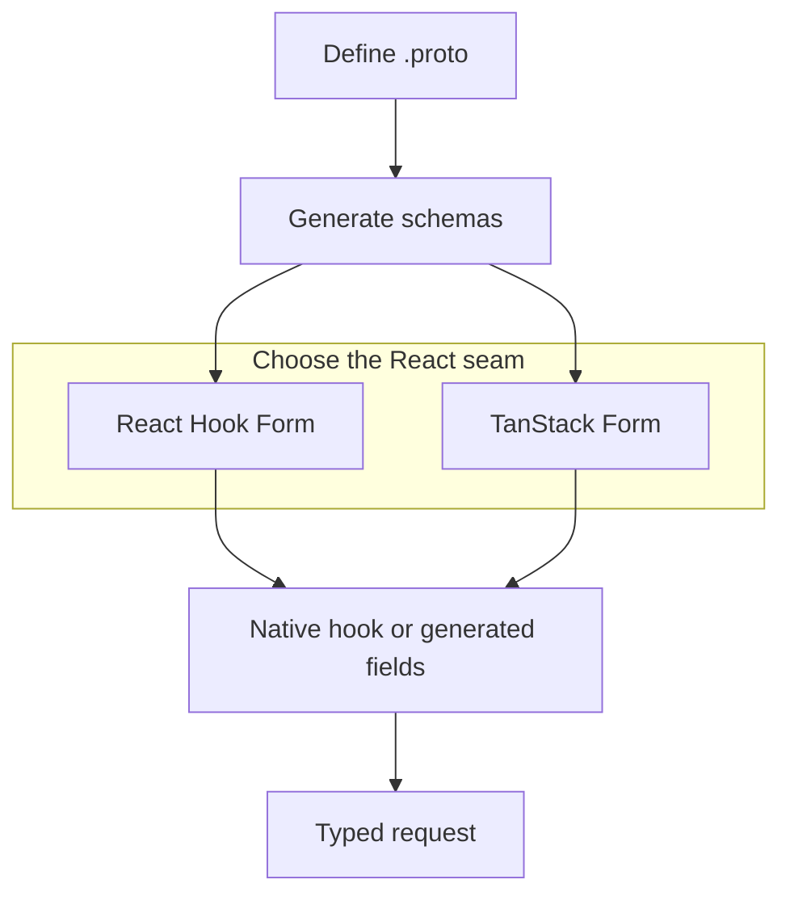

Protoform to rejestr formularzy w stylu shadcn, w którym protobuf jest źródłem prawdy.
Łączy:

- **Protovalidate** do definiowania reguł walidacji działających po stronie klienta i serwera.
- **React Hook Form** jako domyślny silnik generowanego AutoForm, a także natywny hook i generowany
  AutoForm dla **TanStack Form**.
- Adaptery walidacji **Formik** i **Final Form** dla aplikacji, które zachowują te interfejsy API stanu.
- **Wyrażenia CEL** do definiowania warunkowych reguł biznesowych.
- **Adnotacje AutoForm** do generowania interfejsu użytkownika z deskryptorów protobuf.
- **Mapowanie błędów Connect/gRPC** na naruszenia dotyczące pól po stronie serwera.
- **[Standard Schema](/docs/standard-schema)** jako przenośny interfejs walidacji dla innych bibliotek
  formularzy.
- **Zestaw testów zgodności** obejmujący analizę deskryptorów, walidację, ścieżki formularzy i konwersję wartości.
- **Profil gotowości produkcyjnej**, który mierzy zweryfikowane pokrycie i wskazuje każdy pozostały test.
- **Pięć wyspecjalizowanych centrów interaktywnych wersji demonstracyjnych** dotyczących [Protobuf](/docs/protobuf-examples),
  [Protovalidate](/docs/protovalidate-examples), [CEL](/docs/cel-examples),
  [zachowania produkcyjnego](/docs/production-examples) i AIP.
- **[Jeden interaktywny formularz dla każdego odpowiedniego AIP](/docs/aip-example-catalog)** w jednym centrum, ze
  stabilnymi bezpośrednimi linkami powiązanymi z wykonywalnymi dowodami zgodności.

## Dlaczego powstał

Większość stosów formularzy zaczyna od schematu TypeScript, a następnie stopniowo odbiega od kontraktu API.
Protoform zaczyna natomiast od kontraktu protobuf: deskryptor komunikatu zapewnia typy,
walidację, metadane interfejsu użytkownika, strukturę oneof, ścieżki błędów serwera oraz mechanizmy przyszłego generowania kodu.

```bash
bunx shadcn@latest add @protoform/protoform
```

## Jak to działa

1. Zachowaj interfejs API React Hook Form lub TanStack Form używany już przez aplikację.
2. Zastąp import natywnego hooka odpowiednim `useProtoForm(schema, options)`.
3. Używaj adnotacji Protovalidate zamiast powielać walidację we frontendzie.
4. Dodaj CEL do obsługi logiki obejmującej wiele pól.
5. Dodaj adnotacje do plików proto, aby automatycznie generować formularze.
6. Mapuj błędy backendu `BadRequest.FieldViolation` na konkretne pola.
7. Migruj schematy Zod stopniowo za pomocą promptu migracyjnego dla LLM.
8. Utrwal publiczne zachowanie za pomocą `bun run test:conformance`.
9. Monitoruj pozostałe prace produkcyjne za pomocą `bun run readiness:report`.

Istniejące aplikacje korzystające z Protobuf-ES v1 powinny zacząć od
[przewodnika migracji do v2](/docs/protobuf-v2-migration); Protoform obsługuje wyłącznie schematy wygenerowane w wersji v2.

Aktualne wyniki według obszarów Protobuf, Protovalidate, CEL, Google AIP i środowiska uruchomieniowego znajdziesz w interaktywnym
[panelu gotowości produkcyjnej](/docs/production-readiness).


