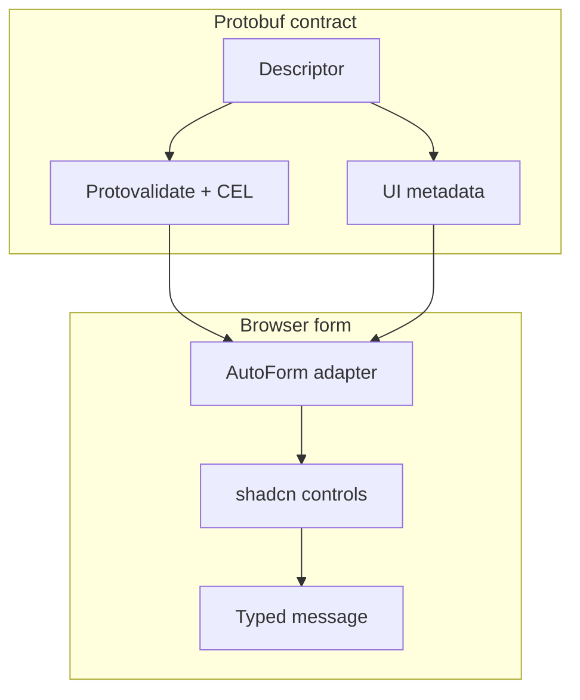

AutoForm 會讀取 protobuf descriptor 與選用的 UI 註解來產生欄位。
適用於管理介面、設定流程、connector 設定，以及需要隨 proto schema 演進的表單。

預設的 `protoform-react` registry 項目使用 React Hook Form。安裝 `auto-form-tanstack` 並從
`@/components/auto-form-tanstack` 匯入，即可讓 TanStack Form 管理狀態。兩者使用相同的
renderer、欄位、驗證生命週期、stepper，以及 protobuf 提交契約。

```tsx
import { AutoForm } from "@/components/auto-form";
import { CreateConnectorRequestSchema } from "@/gen/example/v1/connector_pb";

export function ConnectorForm() {
  return (
    <AutoForm
      schema={CreateConnectorRequestSchema}
      onSubmit={(message) => console.log(message)}
      modes={["simple", "advanced", "json"]}
    />
  );
}
```

對於 protobuf schema，`onSubmit` 的第三個引數會收到自動產生的 dirty-field update mask 與 `AbortSignal`。
建構 AIP 更新要求時請使用此 mask；空的 `paths` 陣列代表沒有任何變更。將 signal 傳給可中止的 transport，
讓元件卸載或較新的嘗試能停止過期的工作：

```tsx
<AutoForm
  defaultValues={connector}
  schema={ConnectorSchema}
  withSubmit
  onSubmit={(nextConnector, _form, { signal, updateMask }) =>
    updateConnector(create(UpdateConnectorRequestSchema, {
      connector: nextConnector,
      updateMask,
    }), { signal })
  }
/>
```

自訂的 `SchemaProvider.validateSchema(values, context)` 會收到相同的 signal。AutoForm 會中止
已被取代的步驟驗證，在元件卸載時中止進行中的驗證與提交，並忽略取消後才完成的結果。

## UI 中繼資料範例

Protoform 支援下列註解：

- 標籤與說明
- 說明文字與文件連結
- 欄位順序與緊湊列
- 線性多步驟表單的穩定步驟歸屬
- 簡易／進階可見性
- 由 CEL 驅動的可見與停用狀態
- 選取選項與選項群組
- 自訂驗證訊息
- regex 範例
- 停用或條件式可見性規則

```proto
message ConnectorConfig {
  string bootstrap_servers = 1 [
    (protoform.ui.field).label = "Bootstrap servers",
    (protoform.ui.field).help = "Comma-separated host:port list",
    (protoform.ui.field).step = "connection"
  ];
}
```

透過 `stepper={{ steps }}` 傳入已排序的步驟定義。AutoForm 在「繼續」時只驗證目前步驟，
在「提交」時驗證完整要求，並將結構化欄位錯誤傳回其所屬步驟。請參閱[步驟表單](/docs/steppers)。

## Oneof 支援

Oneof 會展平供表單使用，同時仍會建立有效的 protobuf message：

```tsx
form.setOneofValue("auth", "sasl", { username: "", password: "" });
```

## 自訂欄位 renderer

當 host 需要套件未內建的 control 時，可擴充型別化 registry。自訂名稱會通過
`fieldConfig`、registry、巢狀欄位、分類與兩種表單 adapter，全程不需要型別轉換。
若設定指定的 renderer 沒有對應 component，AutoForm 會顯示欄位層級的設定錯誤，而不會當機。

```tsx
import {
  AutoForm,
  defaultRegistry,
  type AutoFormFieldProps,
} from "@/components/auto-form";
import { Textarea as CodeEditor } from "@/components/ui/textarea";

function CodeField({ id, inputProps }: AutoFormFieldProps) {
  const { onValueChange, testId, value, ...controlProps } = inputProps;
  return (
    <CodeEditor
      {...controlProps}
      data-testid={testId}
      id={id}
      value={String(value ?? "")}
      onChange={(event) => onValueChange(event.target.value)}
    />
  );
}

const registry = defaultRegistry.clone().register({
  name: "code",
  priority: 100,
  match: (field) => field.key === "source",
  component: CodeField,
});

<AutoForm
  schema={schema}
  fieldRegistry={registry}
  formComponents={{ code: CodeField }}
  fieldConfig={{ "settings.source": { fieldType: "code" } }}
/>;
```

## 重複字串

預設情況下，protobuf 轉換會捨棄 repeated string 欄位中的空白與僅含空白字元的項目。
其他 repeated scalar、enum、bytes 與 message 欄位則不受影響。使用 descriptor path
可保留特定欄位的空白列：

```tsx
<AutoForm
  schema={RequestSchema}
  fieldConfig={{ aliases: { emptyRepeatedStringPolicy: "preserve" } }}
/>;

useProtoForm(RequestSchema, {
  emptyRepeatedStringPolicies: { "settings.aliases": "preserve" },
});
```

巢狀 message 與 oneof-message path 使用點號表示法。

## Dirty-state 生命週期

`onDirtyChange` 會回報初始的 `false` 狀態及每次不同的狀態轉換。它涵蓋 scalar、
巢狀、array、map 與 oneof 變更。還原至乾淨基準線後，會再次回報 `false`。
成功儲存後，請先將已提交的值設為新的基準線，再進行導覽：

```tsx
<AutoForm
  schema={RequestSchema}
  onDirtyChange={setHasUnsavedChanges}
  onSubmit={async (message, _nativeForm, { form }) => {
    await save(message);
    form.markClean();
    navigate({ to: "/resources" });
  }}
/>;
```

`markClean()` 會同步更新 callback，因此 route blocker 可在同一個提交 callback 中觀察到乾淨狀態。

## 根標頭與已棄用欄位

預設會顯示 schema 提供的根標題與說明。使用 `rootHeader="hidden"` 可將其省略，
或使用 `renderRootHeader={(metadata) => ...}` 在 host 管理的 shell 中顯示。

protobuf descriptor 標示為 deprecated 的欄位預設仍會顯示。設定
`deprecatedFields="disable"` 可禁止編輯，或設定 `deprecatedFields="hide"` 將其省略，
包括巢狀欄位與 oneof 選項。隱藏與停用的值仍會保留在表單 payload 中，因此編輯較新的欄位時，
不會默默刪除現有資料。

## Server 欄位錯誤

兩種 protobuf 表單 hook 都會將 server field path 對應至其 control、將一般化的 constraint
說明改寫為易讀文字、在 adapter 支援時聚焦第一個已對應欄位，並保留未對應的 violation，
供摘要或 toast 處理。空白的 server 說明會使用可採取行動的備援訊息「請檢查此值後再試一次。」
錯誤詳細資訊的 context 仍可透過 `serverErrorContext` 取得。


## shadcn 原生 control 涵蓋範圍

AutoForm 會將 protobuf 註解與欄位設定解析為原始碼由應用程式擁有的 UI component。
預設 registry 項目會將其 runtime 與下列 render target 複製到你的應用程式中：

| 註解／設定 | shadcn 風格 control |
| --- | --- |
| `CONTROL_TYPE_TEXT`, `email`, `url`, `password` | `Input` |
| `CONTROL_TYPE_TEXTAREA` | `Textarea` |
| `CONTROL_TYPE_CHECKBOX`, `SWITCH`, `TOGGLE` | `Checkbox`, `Switch`, `Toggle` |
| `CONTROL_TYPE_RADIO_GROUP`, `SELECT`, `COMBOBOX`, `MULTI_SELECT` | `RadioGroup`, `Select`, `Command`, `Popover`, `Badge` |
| `CONTROL_TYPE_DATE`, `TIMESTAMP` | `Calendar`, `Popover`, `InputGroup` |
| `CONTROL_TYPE_JSON`, `KEY_VALUE`, `SLIDER` | 專為特定用途打造的 shadcn 風格欄位 component |



涵蓋範圍 manifest 現在會追蹤每個內建的 shadcn Base UI component。資料輸入 primitive 會直接依據 proto 註解顯示；display 與 shell primitive 則可用於 AutoForm 組合、摘要、slot、說明、載入與模式 UI，且不依賴 Radix。

### 完整的內建 component 涵蓋範圍

| Component 角色 | Component |
| --- | --- |
| 直接欄位 control | `Input`, `Textarea`, `Checkbox`, `Switch`, `Toggle`, `RadioGroup`, `Select`, `Combobox`, `MultiSelect`, `Calendar`, `Slider`, `JsonField`, `KeyValueField`, `Tags`, `ToggleGroup`, `Choicebox` |
| 欄位組合 | `Button`, `Badge`, `InputGroup`, `Popover`, `Command`, `Collapsible`, `Dialog` |
| 表單 shell 與狀態 | `Field`, `Group`, `Label`, `Tooltip`, `Tabs`, `Spinner`, `Typography`, `Alert` |
| 僅供顯示／示範的 primitive | `Card`, `Separator`, `CopyButton` |

此 manifest 位於 `shadcn-controls.ts` 且經過測試，因此新增內建 shadcn component 時，必須判定其屬於可由 proto 顯示的欄位、欄位組合、表單 shell，或僅供顯示的 primitive。
