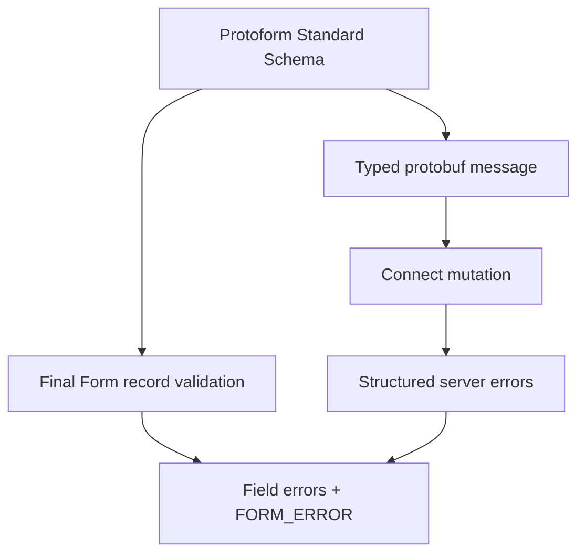

Protoform 將 protobuf 驗證公開為 Standard Schema，並將其問題調整為 Final Form 的整筆記錄驗證契約。表單仍以手動方式建立，而驗證與具型別的提交則繼續來自產生的 protobuf 描述元。

```bash
bun add final-form react-final-form
bunx shadcn@latest add @protoform/protoform-core @protoform/protobuf-provider
```

## 即時範例

此表單使用產生的請求描述元、本機 TypeScript API、用戶端驗證、具型別的 protobuf 提交，以及結構化伺服器錯誤。以空白表單提交，即可查看描述元驗證。使用 `ada@blocked.example`，即可查看伺服器違規訊息回傳至電子郵件欄位。

<div className="my-8 rounded-2xl border p-6">
  <FinalFormExample />
</div>

## 建立共用結構描述

```tsx
import { createProtoFormSchema } from "@/lib/protobuf-provider"

interface ProfileValues {
  displayName: string
  email: string
}

const schema = createProtoFormSchema<
  ProfileValues,
  typeof SubmitProfileRequestSchema
>(SubmitProfileRequestSchema)
```

## 使用 Final Form 驗證

React Final Form 接受會傳回錯誤物件或 Promise 的記錄驗證。傳入其 `FORM_ERROR` 鍵，讓根層級問題使用框架的表單層級錯誤管道。

```tsx
import { createFinalFormValidator } from "@/lib/core"
import { FORM_ERROR } from "final-form"
import { Form } from "react-final-form"

const validate = createFinalFormValidator(schema, {
  rootErrorKey: FORM_ERROR,
})

<Form
  initialValues={{ displayName: "", email: "" }}
  validate={validate}
  onSubmit={async (values) => {
    const result = await schema["~standard"].validate(values)
    if (result.issues) return { [FORM_ERROR]: "Review the form." }

    try {
      await client.submitProfile(result.value)
    } catch (error) {
      return mapStructuredServerErrors(error, FORM_ERROR)
    }
  }}
>
  {({ handleSubmit }) => <form onSubmit={handleSubmit}>{/* fields */}</form>}
</Form>
```

在提交處理常式中驗證，以取得產生且具型別的 protobuf 訊息。驗證轉接器本身會傳回 Final Form 預期的巢狀錯誤。

## 提交錯誤

Final Form 預期可預期的提交失敗會解析為錯誤物件。僅將 Promise 拒絕用於傳輸或程式設計錯誤。從 `onSubmit` 傳回對應後的結構化伺服器錯誤、呈現 `submitError`，並將焦點移至第一個具有伺服器違規訊息的欄位。

呈現所有根層級與欄位訊息、保留已輸入的值，並在無效輸入欄位上設定 `aria-invalid`。Protobuf 路徑應使用 `extractFieldViolations` 和 `protoPathToFormPath` 轉換；未對應的失敗仍會顯示於表單層級。



請參閱 [React Final Form `Form` 契約](https://final-form.org/docs/react-final-form/types/FormProps)，了解記錄驗證與提交語意。產生的 AutoForm 轉接器目前以 React Hook Form 和 TanStack Form 為目標。現有手動建立的 Final Form 請使用此轉接器。
