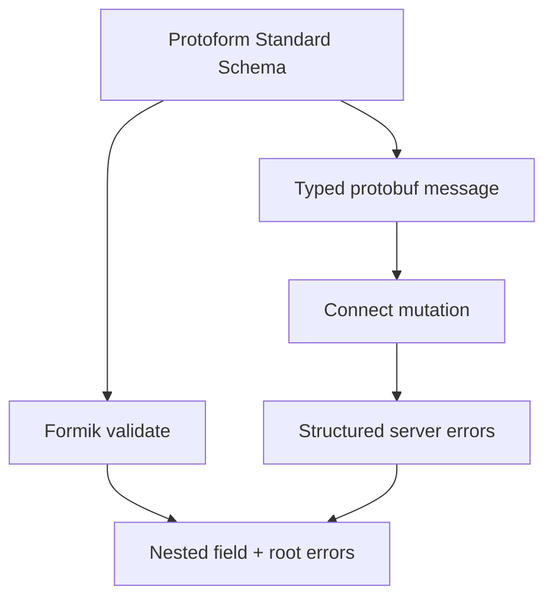

Protoform 將 Formik 連接至所有其他整合共用的 Standard Schema。此轉接器會將每個驗證問題對應至 Formik 的巢狀錯誤物件，而 protobuf 仍是驗證與提交的契約。

```bash
bun add formik
bunx shadcn@latest add @protoform/protoform-core @protoform/protobuf-provider
```

## 即時範例

此表單使用產生的請求描述元、本機 TypeScript API、用戶端驗證、具型別的 protobuf 提交，以及結構化伺服器錯誤。以空白表單提交即可查看描述元驗證。使用 `ada@blocked.example` 可查看伺服器違規錯誤回傳至電子郵件欄位。

<div className="my-8 rounded-2xl border p-6">
  <FormikExample />
</div>

## 建立共用結構描述

```tsx
import { createProtoFormSchema } from "@/lib/protobuf-provider"

interface ProfileValues {
  displayName: string
  email: string
}

const schema = createProtoFormSchema<
  ProfileValues,
  typeof SubmitProfileRequestSchema
>(SubmitProfileRequestSchema)
```

## 使用 Formik 驗證

Formik 接受同步或非同步的表單層級 `validate` 函式。請將 `createFormikValidator(schema)` 傳給 `validate`，而非 `validationSchema`；後者需要特定函式庫的結構描述介面。

```tsx
import { createFormikValidator } from "@/lib/core"
import { Formik } from "formik"

const validate = createFormikValidator(schema)

<Formik
  initialValues={{ displayName: "", email: "" }}
  validate={validate}
  onSubmit={async (values, helpers) => {
    const result = await schema["~standard"].validate(values)
    if (result.issues) return

    try {
      await client.submitProfile(result.value)
    } catch (error) {
      helpers.setErrors(mapStructuredServerErrors(error))
    }
  }}
>
  {({ handleSubmit }) => <form onSubmit={handleSubmit}>{/* fields */}</form>}
</Formik>
```

驗證轉接器只會回傳符合表單結構的錯誤。請在提交處理函式中進行驗證，以取得結構描述轉換後的輸出，包括產生的具型別 protobuf 訊息。

## 根層級與伺服器錯誤

根層級驗證問題預設使用 `_form`。請在可見的警示中呈現每則根層級訊息。使用 `extractFieldViolations` 和 `protoPathToFormPath` 從 protobuf 路徑對應結構化伺服器錯誤，呼叫 `setErrors`，並將焦點移至第一個已對應的欄位。未對應的傳輸與伺服器失敗應保留在表單層級警示中，不可無聲忽略。

同一欄位的多個問題會以換行字元分隔。呈現時請將其分割，讓每個失敗都清楚可見，並在所屬輸入欄位上設定 `aria-invalid`。



如需了解 Formik 的驗證生命週期，請參閱 [Formik 驗證指南](https://formik.org/docs/guides/validation)。產生的 AutoForm 轉接器目前以 React Hook Form 和 TanStack Form 為目標。現有的手動建置 Formik 表單請使用此轉接器。
