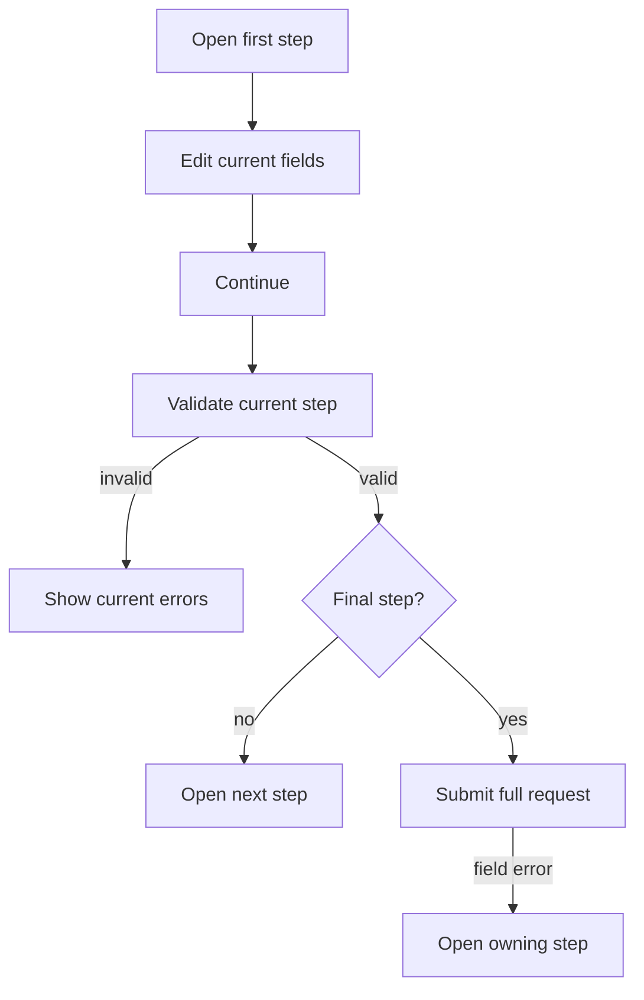

Protoform 的步驟導覽是選用的 AutoForm 呈現模式。它在具語意的導覽地標與有序清單周圍，使用由原始碼自行維護的 shadcn `Button`
與排版基礎元件。shadcn 並未在其[元件目錄](https://ui.shadcn.com/docs/components)
中提供原生 Stepper 元件，因此此實作遵循既有的多頁表單與步驟指示器指南，而非
挪用 Tabs。

Tabs 可依任意順序切換同層級面板。表單步驟導覽則是線性任務，包含目前步驟驗證、
返回與繼續動作，以及最後的提交。此差異符合
[W3C 多頁表單模式](https://www.w3.org/WAI/tutorials/forms/multi-page/)與
[USWDS 步驟指示器指南](https://designsystem.digital.gov/components/step-indicator/)。

## 建議：自行維護組合方式

保留現有的 registry 實作。請勿加入步驟導覽狀態函式庫或通用 Stepper
相依套件。表單已經管理值、驗證、提交與伺服器錯誤；加入另一個
狀態機只會增加同步工作，卻無法改善 UI。

使用 shadcn 基礎元件組合此模式：

- 使用 `Button` 處理返回、繼續與提交。
- 使用排版 token 呈現步驟名稱與說明。
- 使用原生 `<nav>` 與 `<ol>` 提供進度語意。
- 採用響應式水平標籤：先將標籤移至數字下方，再於有序清單
  即將需要換行前隱藏。
- 較長的步驟名稱可選用垂直導軌。
- 在表單既有位置使用 `Separator`、`Field` 與 `Alert`；這些元件皆不管理導覽狀態。

由原始碼自行維護的最小指示器只是一般的 React 與 HTML：

```tsx
<nav aria-label="Form progress">
  <ol>
    {steps.map((step, index) => (
      <li
        aria-current={index === currentStepIndex ? "step" : undefined}
        key={step.id}
      >
        <span>{index + 1}</span>
        <span>{step.title}</span>
      </li>
    ))}
  </ol>
</nav>
```

請勿改用 Tabs、Breadcrumb、Carousel 或一排可點擊的按鈕。Tabs 是同層級檢視、
Breadcrumb 描述位置、Carousel 用於瀏覽內容，而直接使用步驟按鈕會讓使用者略過
表單的驗證契約。如果產品日後允許非線性導覽，請將其設為明確且具測試的
AutoForm 政策，而非變更指示器的語意。

## 設定步驟

```tsx
const steps = [
  { id: "basics", title: "Basics", description: "Name the resource." },
  { id: "runtime", title: "Runtime", description: "Choose capacity." },
  { id: "review", title: "Review", description: "Confirm and submit." },
];

<AutoForm
  schema={CreateEnvironmentRequestSchema}
  stepper={{ steps, defaultStep: "basics" }}
  withSubmit
/>
```

預設採水平配置。它會維持單列並配合可用寬度調整：狹窄的
容器只顯示數字，中等寬度的容器將標籤置於數字下方，而較寬的
容器則將標籤排列於同一行。

步驟名稱需要更多空間時，請使用垂直導軌：

```tsx
<AutoForm
  schema={CreateEnvironmentRequestSchema}
  stepper={{ steps, orientation: "vertical" }}
  withSubmit
/>
```

在較寬的螢幕上，垂直導軌位於作用中面板旁；在狹窄的
螢幕上則移至面板上方。兩種方向皆維持相同的有序清單語意與線性驗證行為。

`stepper` 至少需要 2 個步驟，且 ID 必須非空白並互不重複。ID 是
有序 React 設定與 protobuf UI 中繼資料之間的契約：

```proto
message CreateEnvironmentRequest {
  string display_name = 1 [
    (protoform.v1.field_ui).step = "basics"
  ];

  oneof credentials {
    option (protoform.v1.oneof_ui).step = "runtime";
    ApiKeyCredentials api_key = 2;
    ServiceAccountCredentials service_account = 3;
  }
}
```

未標註的欄位與未知的步驟 ID 會回退至第一個步驟，避免結構描述演進時隱藏
新的請求資料。目前，步驟歸屬適用於頂層欄位與 oneof。

搭配步驟導覽啟用 `showSummary` 時，Protoform 會將摘要隱藏至最後一個
步驟。這可維持專注的流程，同時仍讓使用者在提交前完整檢閱。

## 互動契約



| 動作 | 行為 |
| --- | --- |
| 返回 | 取消待處理的步驟驗證、返回上一步並保留值 |
| 繼續 | 驗證目前步驟；執行非同步驗證時停用 |
| 提交 | 驗證完整請求；執行 mutation 時停用 |
| 伺服器欄位錯誤 | 開啟欄位所屬步驟、顯示錯誤並聚焦其欄位 |
| 根層級或未對應的錯誤 | 停留在目前步驟並顯示表單層級警示 |

由 resolver 支援的表單會驗證完整請求，使根層級不變條件能阻擋繼續，
接著只保留根層級與目前步驟的問題。由 provider 支援的表單僅驗證一次，並套用相同的
目前步驟篩選條件。protobuf resolver 仍與 Standard Schema v1 相容，同時保留
protobuf 專用路徑、oneof 正規化與具型別的訊息輸出。

## 無障礙

- 進度指示器為 `<nav aria-label="Form progress"><ol>…</ol></nav>`。
- 目前的清單項目具有 `aria-current="step"`；已完成狀態包含供螢幕閱讀器使用的文字。
- `Step X of Y` 使用禮貌型 live region。
- 每個面板皆為具有標籤的區段，並遵循 DOM 順序。
- 動作使用真正的按鈕，具備清楚可見的焦點樣式，且至少符合 registry 的標準目標尺寸。
- 發生錯誤的欄位使用 `aria-invalid` 與 `aria-describedby`；提交錯誤會將焦點移回第一個
  需要處理的欄位。
- 進度不會只透過顏色傳達。

步驟標題應保持簡短；只有在任務具備穩定的高層級階段時，才使用 3 個以上的步驟；使用者填寫表單期間，
請勿變更步驟的有序清單。條件式欄位應置於穩定的步驟內。若是簡短表單，請改為呈現一般的單頁 AutoForm。

請從[兩步驟表單](/docs/two-step-form)開始，再參考
[複雜的端對端範例](/docs/complex-example)了解組合式工作流程，並參考
[完整展示範例](/docs/kitchen-sink)了解範圍最廣的五步驟契約。
