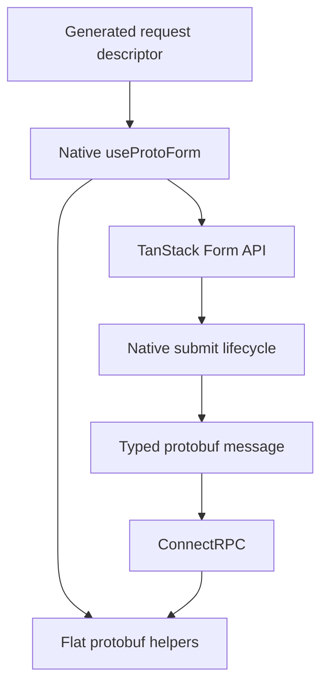

Protoform 仍以 TanStack Form 管理表單狀態。原生的 `Field`、`Subscribe`、store、
validators、listeners 與提交 API 皆可繼續使用。Protoform 會在同一個表單物件上加入 protobuf 轉換、
更新遮罩、oneof 更新，以及 Connect/gRPC 欄位錯誤。

## 安裝原生 hook

```bash
bunx shadcn@latest add @protoform/use-proto-form-tanstack
```

遷移只需先變更 import：

```diff
- import { useForm } from "@tanstack/react-form";
+ import { useProtoForm } from "@/hooks/use-proto-form-tanstack";
```

將 protobuf descriptor 放在既有的 TanStack options 之前傳入：

```tsx
import { Button } from "@/components/ui/button";
import { Field, FieldError, FieldLabel } from "@/components/ui/field";
import { Input } from "@/components/ui/input";
import { useProtoForm } from "@/hooks/use-proto-form-tanstack";
import { SignupRequestSchema } from "@/gen/example/v1/signup_pb";

export function SignupForm() {
  const form = useProtoForm(SignupRequestSchema, {
    defaultValues: { email: "", displayName: "" },
    validators: {
      onChange: ({ value }) =>
        value.email.endsWith("@example.com")
          ? undefined
          : { fields: { email: "Use your example.com address." } },
    },
    onSubmit: async ({ value }) => {
      await client.signup(form.createMessage(value));
    },
  });

  return (
    <form
      onSubmit={(event) => {
        event.preventDefault();
        event.stopPropagation();
        form.handleSubmit().catch(reportSubmissionError);
      }}
    >
      <form.Field name="email">
        {(field) => (
          <Field data-invalid={!field.state.meta.isValid}>
            <FieldLabel htmlFor={field.name}>Email</FieldLabel>
            <Input
              aria-invalid={!field.state.meta.isValid}
              id={field.name}
              name={field.name}
              onBlur={field.handleBlur}
              onChange={(event) => field.handleChange(event.target.value)}
              type="email"
              value={field.state.value}
            />
            {!field.state.meta.isValid ? (
              <FieldError>{field.state.meta.errors.join("\n")}</FieldError>
            ) : null}
          </Field>
        )}
      </form.Field>
      <Button type="submit">Create account</Button>
    </form>
  );
}
```

此 hook 會將 protobuf 驗證與現有的同步及非同步提交 validators 組合，
而非取代它們。

<div className="my-8 border-y border-border/60 py-8">
  <TanStackFormExample />
</div>

提交空白表單，即可在原生 TanStack 欄位 meta 中查看 protobuf 問題。使用
`ada@blocked.example`，可查看 `setServerErrors` 如何將結構化伺服器違規資訊對應回 email
欄位。



## 扁平的 Protoform 輔助函式

回傳值包含完整的 TanStack form API，並新增以下功能：

- `createMessage(values?)` 將表單值轉換為 protobuf message。
- `createUpdateMask()` 回傳已變更且可寫入的 protobuf 路徑。
- `setOneofValue(path, case, value)` 變更 oneof，且不保留先前的分支。
- `setServerErrors(error)` 將結構化 Connect/gRPC 欄位違規資訊對應至 TanStack 欄位 meta。
- `getNestedErrors(path)` 讀取巢狀物件下的欄位錯誤。
- `serverErrorContext` 與 `clearServerErrorContext()` 提供未對應的伺服器錯誤詳細資料。

## 產生表單

若要由 descriptor 呈現欄位，請安裝 TanStack AutoForm：

```bash
bunx shadcn@latest add @protoform/auto-form-tanstack
```

```tsx
import { AutoForm } from "@/components/auto-form-tanstack";
import { SignupRequestSchema } from "@/gen/example/v1/signup_pb";

export function SignupForm() {
  return (
    <AutoForm
      schema={SignupRequestSchema}
      validationMode="blur"
      revalidationMode="change"
      formOptions={{
        listeners: {
          onChange: ({ fieldApi }) => console.log(fieldApi.name),
        },
      }}
      onFormInit={(form) => {
        // Native TanStack API, including Field, Subscribe, and store.
        console.log(form.state.values);
      }}
      onSubmit={async (message, form, { updateMask, signal }) => {
        await client.signup(message, { signal });
        console.log(form.state.isSubmitted, updateMask?.paths);
      }}
      withSubmit
    />
  );
}
```

`formOptions` 會傳入 TanStack Form。`onFormInit`、`onFieldChange` 與 `onSubmit` 會收到
原生 TanStack form instance，因此罕見的原生使用情境不需要 Protoform 替代
API。

## 共用的 AutoForm 生命週期

兩種 AutoForm 引擎都接受相同的生命週期 props：

| Prop | 值 | 預設值 |
| --- | --- | --- |
| `validationMode` | `"submit"`、`"blur"`、`"change"` | `"submit"` |
| `revalidationMode` | `"blur"`、`"change"` | `"change"` |

產生的欄位、array、map、object、oneof、stepper、無障礙功能及 protobuf 提交
契約，都與預設的 React Hook Form AutoForm 共用。表單狀態與原生擴充
機制仍由 TanStack Form 管理。

## 選擇使用方式

| 起點 | 使用 |
| --- | --- |
| 現有 TanStack 欄位與狀態 | `use-proto-form-tanstack` |
| 由 descriptor 驅動的產生欄位 | `auto-form-tanstack` |
| React 以外的驗證 | `createProtoFormSchema` |
| 現有 React Hook Form 程式碼 | 預設的 [`useProtoForm` 與 `auto-form`](/docs/react-hook-form) |

Formik 與 Final Form 仍使用較精簡的驗證 adapters。Protoform 不會包裝其狀態
API，也不宣稱它們與產生式 AutoForm 功能對等。
