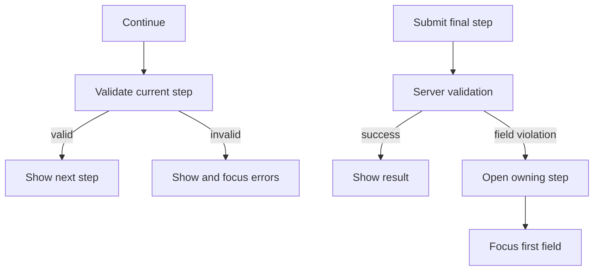

這個複雜範例使用與伺服器錯誤表單相同的 TypeScript 伺服器。此請求加入 4 個穩定步驟、credentials oneof、隱去敏感資訊的檢視摘要，以及一項商業規則，讓使用者返回需要處理的欄位。

```bash
bun run examples:generate
bun run examples:dev
```

<div className="my-8 border-y border-border/60 py-8">
  <ComplexFormExample />
</div>

## 穩定的步驟中繼資料

頂層欄位與 oneof 透過呈現中繼資料選擇加入步驟：

```proto
message SubmitComplexFormRequest {
  string project_id = 1 [
    (buf.validate.field).required = true,
    (protoform.v1.field_ui).step = "project"
  ];

  oneof credentials {
    option (buf.validate.oneof).required = true;
    option (protoform.v1.oneof_ui).step = "access";

    ApiKeyCredentials api_key = 6;
    ServiceAccountCredentials service_account = 7;
  }
}
```

元件提供依序排列的標籤與說明：

```tsx
const steps = [
  { id: "project", title: "Project" },
  { id: "runtime", title: "Runtime" },
  { id: "access", title: "Access" },
  { id: "review", title: "Review" },
];

<AutoForm
  schema={SubmitComplexFormRequestSchema}
  stepper={{ steps }}
  showSummary
  renderSummary={renderRedactedSummary}
  withSubmit
/>
```

## 驗證與復原



- **返回**絕不驗證或捨棄值。
- **繼續**只驗證目前步驟所屬的欄位。
- **提交**會驗證完整請求，並停用重複提交。
- 結構化欄位違規會開啟其所屬步驟、保留所有值、呈現 `aria-invalid`，並將焦點移至第一個無效欄位。
- 網路錯誤與非結構化失敗會持續顯示在表單根層級。

## Oneof 狀態

切換憑證時會使用 protobuf oneof 結構，因此只有目前啟用的分支能送達伺服器。系統會清除先前的分支，避免它成為幽靈資料。檢視摘要刻意只在最後一步顯示，並隱去示範用 API key；正式環境的摘要必須對每個敏感欄位套用相同規則。

## API 設計界線

`SubmitComplexForm` 示範的是工作流程請求，而不是以資源為導向的標準方法。對於資源 API，請在其標準 protobuf 請求結構中保留 `parent`、`{resource}_id`、資源訊息、更新遮罩、etag、分頁、篩選條件及長時間執行作業語意。表單仍可使用步驟，而不必變更該 API 合約。

可參閱[步驟導覽](/docs/steppers)、[伺服器錯誤](/docs/server-errors)及 [Google AIP 與 protobuf 設計](/docs/aip-protobuf)，了解可重複使用的規則。
