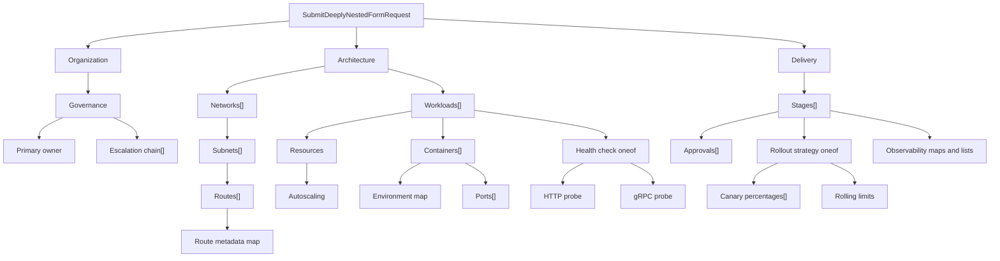

**第 3 級，共 8 級**

**先決條件：**[兩步驟表單](/docs/two-step-form)

此範例刻意設計成難以使用手動建置的表單呈現器處理。請求包含六層
訊息巢狀結構、重複訊息中的重複訊息、多個深度的映射、兩個巢狀
oneof、有界數值欄位、電子郵件與 URI 控制項，以及最後一個動態 `Struct` 葉節點。

即時 UI 仍由單一 AutoForm 產生：

```tsx
export function DeeplyNestedFormExample() {
  return (
    <AutoForm<SubmitDeeplyNestedFormRequest>
      defaultValues={defaultValues}
      schema={SubmitDeeplyNestedFormRequestSchema}
    />
  );
}
```

`defaultValues` 很長，因為它包含貼近實務的藍圖；表單定義則不長。範例元件中
沒有元件切換、遞迴呈現器設定、集合控制器、oneof 狀態機，
也沒有手動組合的驗證路徑。

<div className="my-8 border-y border-border/60 py-8">
  <DeeplyNestedFormExample />
</div>

## 本級新增內容

- 六層巢狀訊息。
- 多個深度的重複訊息與映射。
- 具有索引驗證路徑的巢狀 oneof。

不同於後續的 kitchen sink，本級著重描述器深度，而非跨欄位政策。

## 描述器樹



最長的已呈現集合路徑是
`architecture.networks[0].subnets[0].routes[0].metadata`。Protoform 從
描述器推導此路徑，並在新增／移除操作、驗證、表單狀態及 protobuf
轉換期間保留該路徑。

## Protoform 負責的部分

| 困難事項 | 描述器驅動的行為 |
| --- | --- |
| 巢狀區段 | 訊息描述器會轉為具語意的標題層級與區段 |
| 訊息集合 | 重複欄位會取得穩定的資料列、新增／移除操作、預設值及索引路徑 |
| 資料列深處的映射 | 映射項目會轉為鍵／值控制項，並轉換回 protobuf 映射 |
| 巢狀 oneof | 選擇器管理目前作用中的分支，並在切換時清除先前的分支 |
| 約束 | Protovalidate 的必填條件、模式、範圍、映射限制及重複欄位限制會轉為表單錯誤 |
| 型別化輸出 | 提交時會產生 `SubmitDeeplyNestedFormRequest`，而非臨時拼湊的 JSON 近似結構 |

重要邊界是 protobuf 合約。將欄位移至更深層、加入另一個重複
訊息，或新增 oneof 分支，都只會變更描述器與重新產生的型別；React
呼叫端維持不變。

## 無須新增欄位程式碼即可加入提交功能

此呈現範例僅在本機運作。實際應用程式可在既有表單
邊界加入 mutation，無須重寫巢狀 UI：

```tsx
<AutoForm<SubmitDeeplyNestedFormRequest>
  defaultValues={defaultValues}
  onSubmit={saveBlueprint}
  schema={SubmitDeeplyNestedFormRequestSchema}
  withSubmit
/>
```

當頂層群組代表穩定的使用者工作流程時，請使用[步驟器](/docs/steppers)。若專業
使用者需要掃視並比較整個階層，則維持單一頁面。請參閱
[kitchen sink](/docs/kitchen-sink)，了解如何將相同的描述器優先方法套用至最大範圍的 CEL。

**下一步：**[CEL 與 RE2 表單](/docs/cel-re2-form)
