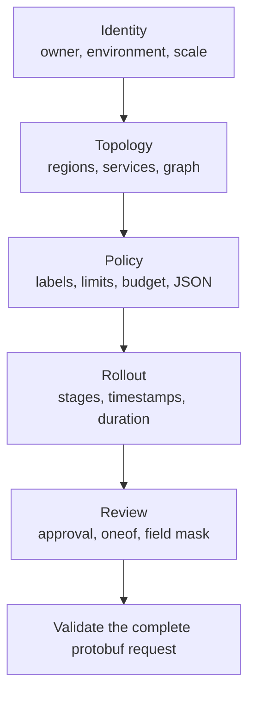

**第 8 級，共 8 級**

**先決條件：**[AIP 資源表單](/docs/aip-resource-form)

此範例刻意結合通常分屬不同表單的功能。這是一個可執行的
壓力測試案例，並非建議將所有業務規則放進單一請求。同一個 protobuf v2
描述元會驅動欄位、瀏覽器驗證、型別化酬載、條件式 UI、檢閱摘要，以及
五步驟流程。

<div className="my-8 border-y border-border/60 py-8">
  <KitchenSinkExample />
</div>

## 新增內容

這裡不應作為任何內容的起點。此總整範例結合先前各階段，用以證明其
契約在單一大型請求下仍可協同運作。

## 此請求演練的內容

| 領域 | 功能 |
| --- | --- |
| Protobuf v2 | 純量、`uint64`、列舉、選用欄位存在性、重複訊息、映射、oneof、`Timestamp`、`Duration`、`Struct` 與 `FieldMask` |
| Protovalidate | 必填值、範圍、唯一性、映射鍵值規則、URI 與電子郵件規則，以及訊息 CEL |
| CEL | 巢狀推導式、成員資格、映射索引、存在性、規則運算式、時間戳記算術、持續時間比較、數值轉換、條件式，以及動態錯誤文字 |
| UI | 選項按鈕群組、開關、核取方塊、URL、貨幣、JSON、條件式顯示、檢閱摘要，以及由來源擁有的步驟 |
| 表單行為 | 無損 64 位元值、目前步驟驗證、保留值、完整請求提交，以及可見的根層級錯誤 |

即時表單以已知有效的正式環境部署作為起點。變更服務名稱、區域、
相依項目、預算、推出階段或通知路由，即可讓契約在其公開
驗證邊界失敗。



## 跨集合圖形完整性

`kitchen_sink.graph.integrity` 將重複訊息與映射視為單一部署圖形。它會驗證
服務名稱具有唯一性、每個區域都有使用、相依項目存在、服務不會相依於
自身、不存在兩個服務間的直接循環、速率限制鍵指向實際服務，以及每個公開
服務都有足夠容量。

```js CEL
this.services.size() >= 2 &&
this.services.all(service,
  this.regions.exists(region,
    region == service.primary_region
  ) &&
  this.services.filter(candidate,
    candidate.name == service.name
  ).size() == 1 &&
  (!service.public_endpoint || service.health_path.startsWith('/')) &&
  service.dependencies.all(dependency,
    dependency != service.name &&
    this.services.exists(candidate,
      candidate.name == dependency
    )
  )
) &&
!this.services.exists(service,
  service.dependencies.exists(dependency,
    this.services.exists(candidate,
      candidate.name == dependency &&
      candidate.dependencies.exists(back,
        back == service.name
      )
    )
  )
) &&
this.regions.all(region,
  this.services.exists(service,
    service.primary_region == region
  )
) &&
this.rate_limits.all(name,
  this.services.exists(service,
    service.name == name
  )
) &&
this.services.filter(service,
  service.public_endpoint
).all(service,
  service.name in this.rate_limits &&
  this.rate_limits[service.name] >= 100
)
```

CEL 不是圖形資料庫：此規則刻意只偵測直接循環。若任意深度的
循環偵測成為需求，請在有界的後端演算法中強制執行，並回傳
結構化欄位違規，而非嘗試讓 CEL 遞迴。

## 跨欄位、映射與存在性的正式環境政策

`kitchen_sink.production.policy` 僅套用於正式環境列舉值。它結合透過 `has(`
判斷的選用欄位存在性、重複訊息述詞、映射成員資格與索引、規則
運算式，以及受限的分類詞彙。

```js CEL
this.environment != 3 || (
  this.regions.size() >= 2 &&
  this.acknowledge_risk &&
  has(this.approval_ticket) &&
  this.approval_ticket.matches('^CHG-[0-9]{6}$') &&
  this.services.all(service,
    service.replicas >= 3
  ) &&
  'owner' in this.labels &&
  this.labels['owner'].matches('^[a-z][a-z0-9-]+$') &&
  (
    !('data-classification' in this.labels) ||
    this.labels['data-classification'] in [
      'public',
      'internal',
      'restricted'
    ]
  )
)
```

## 數值與時間範圍

預算規則先使用 `double()` 轉換整數副本數，再將每個服務與
浮點數預算的平均配額比較：

```js CEL
this.services.size() == 0 ||
this.services.all(service,
  double(service.replicas) * service.monthly_cost_per_replica <=
  this.monthly_budget / double(this.services.size())
)
```

變更時段規則要求成對的時間戳記存在性、向前排序、時間戳記相減，
以及與 `duration(` 比較：

```js CEL
has(this.window_start) == has(this.window_end) &&
(
  !has(this.window_start) ||
  (
    this.window_end > this.window_start &&
    this.window_end - this.window_start <= duration('14400s')
  )
)
```

## 動態推出錯誤

`kitchen_sink.rollout.sequence` 是回傳字串的規則。空字串代表通過；第一個
非空分支會成為違規文字。巢狀條件式會指出推出流程是否
太短、起始不正確、結束不正確，或包含不支援或重複的階段。

```js CEL
this.dry_run ? '' :
this.rollout_percentages.size() < 2 ?
  'Use at least two rollout stages.' :
this.rollout_percentages[0] != 5 ?
  'The rollout must begin at 5%.' :
this.rollout_percentages[
  this.rollout_percentages.size() - 1
] != 100 ?
  'The rollout must finish at 100%.' :
!this.rollout_percentages.all(percent,
  percent in [5, 25, 50, 100] &&
  this.rollout_percentages.filter(candidate,
    candidate == percent
  ).size() == 1
) ?
  'Use unique rollout stages from 5%, 25%, 50%, and 100%.' :
''
```

布林規則需要非空的註解訊息。回傳字串的規則則會將註解
訊息保持為空，因為運算式會自行產生文字。每個規則都有穩定且唯一的 ID，
而且此範例會由 `buf lint` 編譯，並由表單使用的同一個 TypeScript 驗證器執行。
請參閱官方的 [Protovalidate CEL lint 規則](https://buf.build/docs/lint/rules/)和
[CEL 語言規格](https://github.com/google/cel-spec)，以了解底層契約。

## 步驟器決策

廚房水槽範例使用登錄檔中既有的 Protoform 步驟器：由來源擁有的 shadcn
組合，不依賴外部步驟器。進度是一個包含有序清單的導覽地標，
目前項目具有 `aria-current="step"`，而 `Button` 負責返回、繼續與提交。
這會將值與驗證保留在表單整合中，避免引入第二個狀態
機器。請參閱[步驟器](/docs/steppers)了解此模式，並參閱 [CEL 運算式](/docs/cel-expressions)
以取得讓強大規則保持可維護性的指引。
