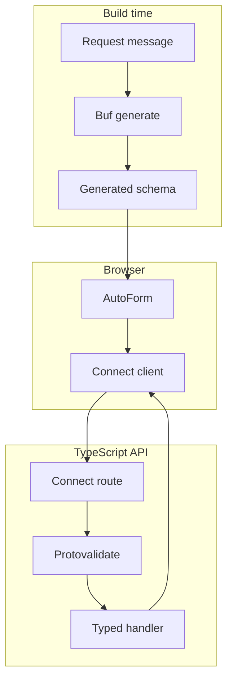

**第 6 級，共 8 級**

**先備條件：** [Oneof 表單](/docs/oneof-form)

這是學習路徑中第一個需要伺服器的範例。表單維持精簡，讓新概念清楚易懂：
具型別的 ConnectRPC 錯誤會回到其所屬欄位。

## 本節新增內容

- 產生式 Connect Query mutation。
- 伺服器端 Protovalidate 強制驗證。
- 將 `google.rpc.BadRequest.FieldViolation` 對應回單一輸入欄位。
- 清楚顯示待處理、成功及錯誤狀態。

同時啟動範例 API 與文件應用程式：

```bash
bun run examples:generate
bun run examples:dev
```

<div className="my-8 border-y border-border/60 py-8">
  <ServerErrorFormExample />
</div>

即時表單會提交至 `http://127.0.0.1:55012`。使用以
`@blocked.example` 結尾的地址，即可查看結構化伺服器錯誤如何對應回 email 欄位。

## 請求路徑



瀏覽器直接傳送 resolver 具型別的 `SubmitBasicFormRequest`，不需要手寫的
表單 DTO 或轉換層。

## 合約

protobuf message 負責資料規則及選用的呈現提示：

```proto
message SubmitBasicFormRequest {
  string display_name = 1 [
    (buf.validate.field).required = true,
    (buf.validate.field).string = { min_len: 2, max_len: 40 },
    (protoform.v1.field_ui).placeholder = "Ada Lovelace"
  ];

  string email = 2 [
    (buf.validate.field).required = true,
    (buf.validate.field).string.email = true,
    (protoform.v1.field_ui).control = CONTROL_TYPE_EMAIL
  ];
}
```

## Connect Query provider

```tsx
import { TransportProvider } from "@connectrpc/connect-query"
import { createConnectTransport } from "@connectrpc/connect-web"
import { QueryClient, QueryClientProvider } from "@tanstack/react-query"

const queryClient = new QueryClient()
const transport = createConnectTransport({
  baseUrl: "http://127.0.0.1:55012",
})

<TransportProvider transport={transport}>
  <QueryClientProvider client={queryClient}>
    <ServerErrorMutationForm />
  </QueryClientProvider>
</TransportProvider>
```

`TransportProvider` 提供具型別的 Connect transport。`QueryClientProvider` 管理 mutation 狀態、
重試及生命週期 callback。

## 標準 mutation

使用 Connect Query 產生的 unary method descriptor，無須手寫請求函式或 query key：

```tsx
import { useMutation } from "@connectrpc/connect-query"

function ServerErrorMutationForm() {
  const mutation = useMutation(
    FormExamplesService.method.submitBasicForm
  )

  async function onSubmit(values, form) {
    try {
      const response = await mutation.mutateAsync(values)
      showCreatedProfile(response.profileId)
    } catch (error) {
      if (!applyServerFieldErrors(error, SubmitBasicFormRequestSchema, form)) {
        throw error
      }
    }
  }

  return (
    <div aria-busy={mutation.isPending}>
      <AutoForm
        schema={SubmitBasicFormRequestSchema}
        onSubmit={onSubmit}
        withSubmit
      />
    </div>
  )
}
```

`mutateAsync` 讓表單提交 promise 維持待處理狀態，因此 AutoForm 會停用提交按鈕並顯示
載入標籤。`mutation.isPending` 也會將 mutation 狀態提供給周邊 UI。成功的
回應會呈現傳回的 profile 名稱。結構化 Connect 錯誤會對應回欄位；未知的
transport 或程式錯誤則會重新拋出，而不會無聲消失。

## 伺服器

```ts
export const formExamplesService = {
  submitBasicForm(request) {
    return {
      displayName: request.displayName,
      profileId: `profiles/${slugify(request.displayName)}`,
    }
  },
} satisfies ServiceImpl<typeof FormExamplesService>

const routes = (router: ConnectRouter) => {
  router.service(FormExamplesService, formExamplesService)
}

const handler = connectNodeAdapter({
  interceptors: [createValidateInterceptor()],
  routes,
})

createServer(handler).listen(55012, "127.0.0.1")
```

interceptor 會在伺服器上強制執行相同的 Protovalidate annotation。商業規則會傳回
包含 `google.rpc.BadRequest.FieldViolation` 詳細資料的標準 `invalid_argument` 錯誤，而不是
需要瀏覽器解析的訊息字串。

## 較低階的 client 替代方案

在 React 之外，或應用程式碼刻意不使用 TanStack Query 時，可透過 Connect client
呼叫相同的產生式 unary method：

```ts
const client = createClient(
  FormExamplesService,
  createConnectTransport({ baseUrl: "http://127.0.0.1:55012" })
)

const response = await client.submitBasicForm(values)
```

請求與回應合約完全相同。當 React 應用程式需要待處理、成功及錯誤的生命週期狀態時，
應優先使用 mutation hook。

## Standard Schema 接合點

Protoform 將 protobuf 驗證合約公開為 Standard Schema v1。AutoForm 使用
支援 protobuf 的 resolver 來處理具型別 message 及表單路徑對應；其他 Standard Schema
consumer 則可使用相同的產生式 descriptor，而不必依賴 React Hook Form。

原始碼位於 [`examples/basic`](https://github.com/malinskibeniamin/protoform/tree/main/examples/basic)
及 [`examples/server`](https://github.com/malinskibeniamin/protoform/tree/main/examples/server)。
