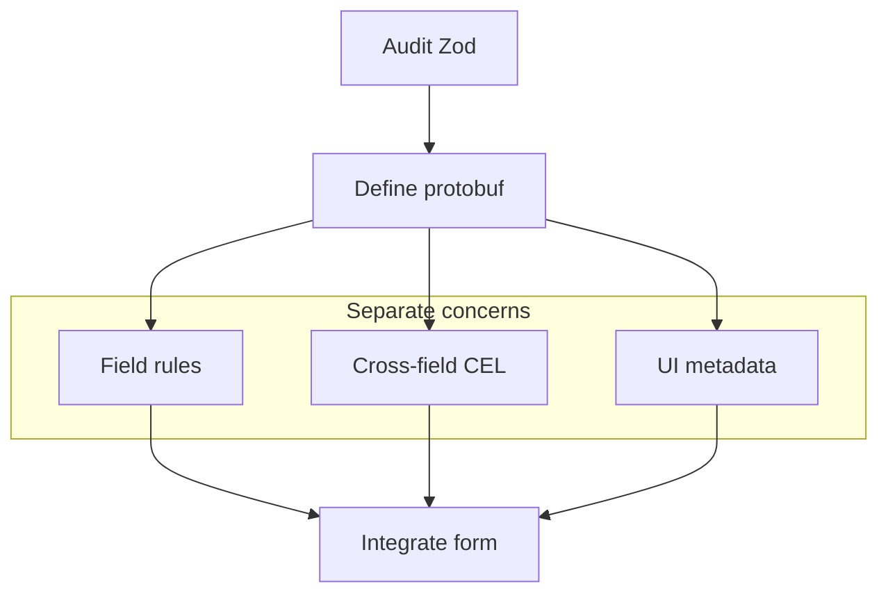

Protoform 提供遷移提示詞產生器，因為讓 LLM 處理重複的對應工作，再由人工審查契約，通常能讓結構描述遷移更安全。

針對 Yup，請先依照
[從 Yup 遷移](/docs/yup-migration)完成轉換、存在性、條件規則和非同步測試稽核，再要求代理轉譯結構描述。

## 連接代理

使用 `/llms.txt` 取得精簡文件索引，或使用 `/llms-full.txt` 取得完整內容。
聚焦的示範頁面也可在 URL 後加上 `.md` 來提供原始 Markdown，其中包含與 Preview 和 Code 分頁相同的
可複製原始碼。

Protoform 預設使用 React Hook Form，同時明確提供互通性範例：

```ts twoslash
type FormEngine =
  | "react-hook-form"
  | "tanstack-form"
  | "formik"
  | "final-form";

const defaultEngine = "react-hook-form" satisfies FormEngine;
//    ^?
```

## 產生提示詞

```bash
bun run migrate:zod -- src/components/settings-form.tsx proto/settings.proto
```

此指令碼會要求程式設計代理：

1. 盤點每個 Zod 欄位、訊息、regex、enum、union、預設值和 refinement。
2. 將純量限制移至 `buf.validate.field`。
3. 將跨欄位 refinement 移至訊息層級的 CEL 運算式。
4. 將 discriminated union 轉換為 protobuf `oneof`。
5. 使用 `Field`、`FieldLabel`、`FieldDescription` 和 `FieldError` 保留 shadcn 的無障礙功能。
6. 以 `useProtoForm` 取代 `zodResolver`。
7. 使用 `setServerErrors` 對應 Connect/gRPC 後端驗證錯誤。
8. 為標籤、說明、預留位置、顯示規則和資料提供者提出 AutoForm UI 註解。

## 人工審查檢查清單

- proto 欄位名稱是否足夠穩定，可作為 API 契約名稱？
- 是否有任何 Zod transform 隱藏了應改為明確轉換程式碼的商業邏輯？
- CEL id 是否穩定且可供搜尋？
- 錯誤訊息是否無須依賴顏色，也能供螢幕閱讀器使用？
- 選填欄位是否以正確的 proto 存在性語意表示？
- 更新表單是否需要 Google AIP 欄位遮罩？

## 遷移結構


