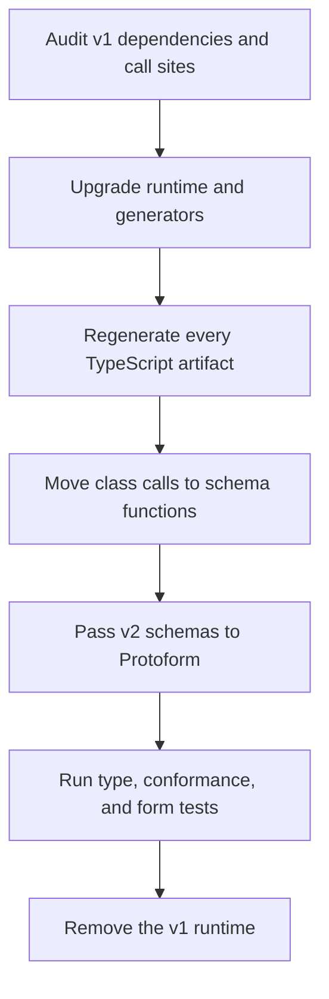

> **範圍：** 本指南涵蓋 `@bufbuild/protobuf` 與 `@bufbuild/protoc-gen-es`
> **從 v1 遷移至 v2 套件**。這不是從 proto2 遷移至 proto3，也不同於
> 在 Buf 設定檔中將 `version: v1` 改為 `version: v2`。

Protobuf-ES v2 是 Protoform 的標準 runtime，也是唯一獲得完整功能開發支援的 runtime。
對於分階段升級，`protobuf-v1-bridge` registry 項目提供隔離的暫時性遷移橋接器。
此橋接器接受 Protobuf-ES v1 產生的類別，且不會在現代化的 v2 provider 中
加入 v1 程式碼路徑。

v2 API 採用 schema-first 設計：產生的程式碼會匯出 TypeScript 訊息型別與 runtime `Schema`
值，而非產生的訊息類別。

[Protobuf-ES 官方遷移章節](https://github.com/bufbuild/protobuf-es/blob/main/MANUAL.md#migrating-from-version-1)
是 runtime 與 generator 變更的權威來源。本指南補充 Protoform 專用步驟與安全的發布順序。

## 選用的 v1 橋接器

僅當表單必須在其所屬套件能以 Protobuf-ES v2 重新產生程式碼之前遷移時，才使用此橋接器。
它會反射由 proto2 和 proto3 產生的 v1 訊息類別、呈現 scalar、enum、nested、repeated、
map、oneof、bytes 與 64-bit 欄位、保留 proto2 optional presence，並在安全轉換後傳回
具型別的 v1 訊息。

將 v1 runtime 與橋接器保留在舊版套件邊界內：

```bash
bun add @bufbuild/protobuf@^1.10.1
bunx shadcn@latest add @protoform/protobuf-v1-bridge
```

```tsx
import { createProtobufV1Provider } from "@/lib/protobuf-v1-bridge";
import { LegacyProfileRequest } from "./gen/legacy_profile_pb.js";

const legacyProfileProvider = createProtobufV1Provider(LegacyProfileRequest);

export function LegacyProfileForm() {
  return (
    <AutoForm
      schema={legacyProfileProvider}
      withSubmit
      onSubmit={async (request) => {
        await submitLegacyProfile(request);
      }}
    />
  );
}
```

此橋接器刻意不提供 Protovalidate 或 CEL 的對等功能、v2 UI annotations、AIP
resource 行為、自動 update masks 或 v2 Connect Query schemas。Proto2 `required` 與
wire-shape 轉換檢查是橋接器的防護措施，不能取代驗證系統。遷移期間請將商業邏輯驗證
保留在現有伺服器上，並照常將其結構化錯誤對應至表單。

退出條件必須明確：以 v2 plugin 重新產生訊息、以產生的 `Schema` 取代類別、
將表單移至現代化 provider、移除橋接器依賴項，然後證明該套件的依賴關係樹中已不存在
舊版 runtime。請勿在橋接器上開發新功能，也不要在單一 provider 內依條件切換 v1/v2 行為。

## 遷移流程



## 1. 升級前稽核

從能通過的 build 開始，並提交或以其他方式保留目前產生的輸出。盤點所有產生或使用
protobuf 訊息的套件：

```bash
bun pm ls | rg '@bufbuild|@connectrpc'

rg -n --glob '!**/*_pb.*' \
  'new [A-Z][A-Za-z0-9_]*\(|\b[A-Z][A-Za-z0-9_]*\.(fromBinary|fromJson|fromJsonString)\(|\.(toBinary|toJson|toJsonString|clone)\(' \
  src packages
```

將搜尋結果視為稽核線索，而非證明：它可能找到不相關的類別，也可能遺漏隱藏在應用程式
wrapper 後方的呼叫。也請檢查自訂 code generator、產生的 SDK 依賴項、測試 fixture、
worker 進入點，以及在公用 API 中發布 protobuf 值的套件。

變更程式碼前先記錄基準：

```bash
bun run typecheck
bun run test:conformance
bun run test:unit
bun run test:integration
```

## 2. 升級一組相容的套件

同時升級 runtime 與 generator。產生的檔案及執行該檔案的 runtime 必須使用相容的
major version。

```bash
bun add @bufbuild/protobuf@^2
bun add -d @bufbuild/protoc-gen-es@^2
```

如果應用程式使用 Protoform stack 的其他部分，也請讓其 protobuf consumer 維持在
相容的目前 major version：

```bash
bun add @bufbuild/protovalidate@^1 @connectrpc/connect@^2
```

若有使用 `@connectrpc/connect-web` 與其他 Connect 套件，請將其升級至 v2。
如果 repository 擁有自訂 JavaScript 或 TypeScript generator，請將
`@bufbuild/protoplugin` 升級至 v2。對於產生的 SDK 依賴項，請選用以 v2 ES plugin
產生的 SDK，而不是讓 v1 SDK 與 v2 runtime 並存。

遷移後，不要透過直接依賴項保留 `@bufbuild/protobuf` v1。使用套件管理工具的依賴關係樹
找出殘留版本，並升級擁有該版本的套件。

## 3. 更新產生設定

建議的本機 plugin 設定如下：

```yaml
version: v2
plugins:
  - local: protoc-gen-es
    out: src/gen
    opt:
      - target=ts
      - import_extension=js
    include_imports: true
inputs:
  - directory: proto
```

僅當 TypeScript 與 ESM 設定需要明確的 JavaScript import 副檔名時，才使用
`import_extension=js`。Protobuf-ES v2 預設不使用副檔名。`ts_nocheck` 選項預設也是關閉；
請盡可能保留嚴格的產生程式碼檢查，或僅將 `ts_nocheck=true` 作為暫時性相容措施。

`include_imports: true` 會讓 generator 輸出匯入的定義，例如 Protovalidate option
descriptor。當這些定義不是由產生的依賴項提供時，就需要此設定。請避免將相同的匯入定義
產生至多個會一同載入的套件中。

若改用遠端 plugin，請固定於 v2 release：

```yaml
version: v2
plugins:
  - remote: buf.build/bufbuild/es:v2.13.0
    out: src/gen
    opt: target=ts
```

接著重新產生所有輸出。在此 repository 中，完整指令為：

```bash
bun run proto:generate
```

切勿手動修改產生的 `_pb.ts` 檔案。過期 v1 輸出能成功通過 TypeScript build，
並不能證明 runtime 與 generator 相符；也請檢查產生的 preamble 與 import。

## 4. 以 schema 取代類別

Protobuf-ES v2 會為訊息產生兩種不同的 export：

```ts
import type { User } from "./gen/user_pb.js";
import { UserSchema } from "./gen/user_pb.js";
```

`User` 是 TypeScript 型別。`UserSchema` 是傳給建構、序列化、反射、驗證、Connect
與 Protoform API 的 runtime descriptor。

### 建構訊息

```ts
// v1
import { User } from "./gen/user_pb.js";

const user = new User({ firstName: "Ada" });
```

```ts
// v2
import { create } from "@bufbuild/protobuf";
import { UserSchema } from "./gen/user_pb.js";

const user = create(UserSchema, { firstName: "Ada" });
```

巢狀訊息 initializer 在 `create()` 內仍可使用一般 object literal。傳回的訊息已是帶有
`$typeName` 的一般物件；請以 `User` 取代 `PlainMessage<User>`，並移除
`toPlainMessage` 呼叫。

### 將序列化移至獨立函式

| 常見 v1 類別呼叫 | Protobuf-ES v2 呼叫 |
| --- | --- |
| `User.fromBinary(bytes)` | `fromBinary(UserSchema, bytes)` |
| `user.toBinary()` | `toBinary(UserSchema, user)` |
| `User.fromJson(value)` | `fromJson(UserSchema, value)` |
| `user.toJson()` | `toJson(UserSchema, user)` |
| `User.fromJsonString(text)` | `fromJsonString(UserSchema, text)` |
| `user.toJsonString()` | `toJsonString(UserSchema, user)` |
| `user.clone()` | `clone(UserSchema, user)` |
| `User.equals(a, b)` | `equals(UserSchema, a, b)` |

例如：

```ts
import {
  clone,
  equals,
  fromBinary,
  fromJson,
  type JsonValue,
  toBinary,
  toJson,
} from "@bufbuild/protobuf";
import { type User, UserSchema } from "./gen/user_pb.js";

declare const bytes: Uint8Array;
declare const json: JsonValue;

const fromWire: User = fromBinary(UserSchema, bytes);
const fromApi: User = fromJson(UserSchema, json);
const encoded = toBinary(UserSchema, fromWire);
const protoJson = toJson(UserSchema, fromWire);
const copied = clone(UserSchema, fromWire);
const unchanged = equals(UserSchema, fromWire, copied);
```

訊息不再實作 `toJSON`。將訊息傳給 `JSON.stringify` 前，先以
`toJson(UserSchema, message)` 進行轉換。請明確區分 ProtoJSON 轉換與一般 JavaScript
物件序列化。

Well-known types 及其 helper 現在從 `@bufbuild/protobuf/wkt` 匯入。例如，將 Timestamp
與 Any 的 import 遷移至該子路徑，並搭配訊息 schema 使用 `timestampFromDate()` 和
`anyPack()` 等 v2 helper。

## 5. 遷移 Protoform 呼叫位置

現代化的 Protoform provider 接受產生的 v2 schema 值，而非 v1 constructor。
上述暫時性橋接器是唯一的遷移例外：

```tsx
import { useProtoForm } from "@/hooks/use-proto-form";
import {
  type SignupRequest,
  SignupRequestSchema,
} from "./gen/signup_pb.js";

const form = useProtoForm(SignupRequestSchema, {
  defaultValues: {
    email: "",
    displayName: "",
  },
});

const submit = form.handleSubmit(async (values) => {
  const request: SignupRequest = form.createMessage(values);
  await client.signup(request);
});
```

將相同規則套用至 `createProtoFormSchema(SignupRequestSchema)`、產生的 form binding
及 AutoForm descriptor。刪除接受 constructor 或檢查 v1 類別 static 成員的相容性
wrapper。Descriptor reflection 應在 runtime 讀取 `SignupRequestSchema`，而非
`SignupRequest`。

## Buf 設定從 v1 遷移至 v2 是另一項遷移

Buf 為 `buf.yaml`、`buf.work.yaml`、`buf.gen.yaml` 與 `buf.lock` 提供遷移指令：

```bash
buf config migrate --diff
buf config migrate
buf build
buf lint
```

第一個指令會預覽改寫內容，第二個指令則會寫入變更。請參閱
[Buf 官方設定遷移指南](https://buf.build/docs/migration-guides/migrate-v2-config-files/)
與 [`buf config migrate` CLI 參考資料](https://buf.build/docs/reference/cli/buf/config/migrate/)。

此工具只會遷移 Buf 設定檔。它不會升級 npm 依賴項、重新產生訊息，或改寫
Protobuf-ES TypeScript 呼叫位置。`version: v2` 的 `buf.gen.yaml` 仍可執行 v1 plugin，
因此僅憑設定版本無法證明應用程式使用 Protobuf-ES v2。

## Codemod 指引

Buf 發布的 Protobuf-ES 遷移指引並未提供官方的呼叫位置 codemod。官方自動化工具是
`buf config migrate`，其範圍僅限於上述設定遷移。

若沒有專案與型別資訊，將 `new User()` 全面改寫為 `create(UserSchema)` 並不安全。
它必須區分 protobuf 類別與一般類別、建立不衝突的 import、分離 type 與 value import、
找出使用別名的產生符號，並更新序列化 wrapper。建議採用以下由 compiler 驅動的順序：

1. 同時升級 runtime 與 generator。
2. 重新產生所有自行維護的 schema 與 SDK。
3. 執行第一節中的稽核搜尋。
4. 執行 TypeScript，並逐一遷移各套件的錯誤。
5. 審查每個新增的 `Schema` import，不要接受盲目的文字改寫。
6. 移除 v1 前，執行 binary 與 ProtoJSON round-trip fixture。

如果 repository 日後加入 codemod，請以 TypeScript AST 為基礎、要求明確的產生模組
allowlist、支援 dry run，並拒絕有歧義的呼叫位置，而非自行猜測。

## Monorepo 的分階段遷移

上游 runtime 可在分階段遷移期間同時執行 v1 與 v2。請將各 runtime 保留在明確的
套件邊界內，並讓每個套件在其產生程式碼遷移至 v2 後立即離開橋接器：

1. 優先遷移擁有產生程式碼的 leaf package。
2. 在暫時性的 v1/v2 邊界間公開 binary bytes 或經驗證的 ProtoJSON，而非 runtime
   身分不明確的訊息 instance。
3. 遷移 consumer，並立即刪除邊界 adapter。
4. 持續檢查依賴關係樹，直到 v1 runtime 完全移除。

不要將 v1 訊息類別傳入 v2 reflection、Connect、Protovalidate 或 Protoform API。
不要發布有時傳回 v1、有時傳回 v2 訊息的 library surface。

## 常見失敗情況

### 無法解析 `@bufbuild/protobuf/codegenv1`

包含 `codegenv1` 的 import 通常表示 v2 產生的程式碼正在使用相容性 code-generation
路徑，但 bundler 無法解析 package export；也可能是 runtime 與產生的 artifact
不相符。請使用預期的 v2 plugin 重新產生程式碼、確認 runtime major version，
並確保 bundler 支援 package export。不要將內部相容性檔案複製至應用程式。

### 無法解析產生的 import

如果產生的程式碼匯入不存在的本機定義，例如 `buf/validate/validate_pb`，請使用相符的
產生依賴項，或為所屬的 generation target 啟用 `include_imports: true`。
不要建立空的 placeholder module。

### ESM import 副檔名失敗

確認 runtime 預期不含副檔名的 import、`.js` 或 `.ts`，再一致地設定 generator 選項。
對於從 TypeScript 編譯的 Node ESM 專案，即使原始檔以 `.ts` 結尾，
`import_extension=js` 通常仍是正確的輸出。

### JSON 輸出已變更

不要比較 v1 與 v2 的 `JSON.stringify(message)`。請比較
`toJson(MessageSchema, message)` 或 `toJsonString(MessageSchema, message)` 的結果，
並測試 API 所需的確切 ProtoJSON 行為。

## 驗證檢查清單

- [ ] Runtime、generator、Connect、Protovalidate 與產生的 SDK 版本彼此相容。
- [ ] 所有產生的 preamble 都標示 v2 ES plugin。
- [ ] 不存在任何手動編輯的產生檔案。
- [ ] 建構使用 `create(MessageSchema, init)`。
- [ ] Binary 與 JSON 操作會傳入相符的 schema。
- [ ] Well-known type helper 從 `@bufbuild/protobuf/wkt` 匯入。
- [ ] Protoform、Standard Schema、AutoForm 與產生的 binding 接收 v2 schema。
- [ ] Binary 與 ProtoJSON round-trip fixture 通過。
- [ ] 使用到的 nested message、oneof、optional presence、map、repeated field、64-bit integer、
  Any 與 Timestamp fixture 均通過。
- [ ] 結構化伺服器錯誤仍會對應至所有預期的表單路徑。
- [ ] `bun run proto:generate`、型別檢查、conformance、unit、integration、browser 與
  end-to-end 測試均通過。
- [ ] 套件依賴關係樹不含應用程式碼直接使用的 v1 runtime。

Protoform 的 [conformance suite](/docs/conformance) 涵蓋共用表單契約，而
[production-readiness profile](/docs/production-readiness) 則追蹤更廣泛的 protobuf 功能涵蓋範圍。
