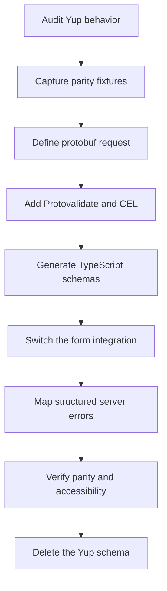

目標不是逐一對照轉換每個 Yup 呼叫。Yup 將解析、預設值、轉換、驗證與 TypeScript 型別推斷整合在同一個物件中。以 protobuf 為優先的表單則會分離這些責任：

- protobuf 欄位型別定義請求結構
- Protovalidate 註解定義可攜式驗證
- CEL 定義具確定性的跨欄位規則
- 表單 `defaultValues` 定義初始 UI 狀態
- 明確的應用程式程式碼負責正規化與其他轉換
- 伺服器負責非同步業務檢查，並回傳結構化欄位違規資訊

從行為而非語法著手。在變更表單前，先記錄 Yup schema 接受、拒絕、轉換、移除及設定預設值的內容。

## 遷移流程



## 遷移前後

具代表性的 Yup schema 可能會同時混合所有關注事項：

```tsx
import * as yup from "yup";

export const accountSchema = yup.object({
  displayName: yup.string().trim().min(2).max(40).required(),
  email: yup.string().email().required(),
  plan: yup.mixed<"starter" | "enterprise">()
    .oneOf(["starter", "enterprise"])
    .required(),
  seats: yup.number().integer().min(1).max(100).required(),
  website: yup.string().url().nullable().optional(),
  tags: yup.array()
    .of(yup.string().min(1).required())
    .min(1)
    .max(10)
    .required(),
}).noUnknown();
```

將請求結構與可攜式規則移至 protobuf：

```proto
syntax = "proto3";

package account.v1;

import "buf/validate/validate.proto";

enum Plan {
  PLAN_UNSPECIFIED = 0;
  PLAN_STARTER = 1;
  PLAN_ENTERPRISE = 2;
}

message CreateAccountRequest {
  string display_name = 1 [
    (buf.validate.field).required = true,
    (buf.validate.field).string = { min_len: 2, max_len: 40 }
  ];

  string email = 2 [
    (buf.validate.field).required = true,
    (buf.validate.field).string.email = true
  ];

  Plan plan = 3 [(buf.validate.field).enum = {
    defined_only: true
    not_in: 0
  }];

  int32 seats = 4 [(buf.validate.field).int32 = {
    gte: 1
    lte: 100
  }];

  optional string website = 5 [(buf.validate.field).string.uri = true];

  repeated string tags = 6 [(buf.validate.field).repeated = {
    min_items: 1
    max_items: 10
    items: { string: { min_len: 1 } }
  }];
}
```

`int32` 型別取代 Yup 的 `integer()` 斷言。enum 取代封閉的 `oneOf()` 集合。provider 會在驗證後，將表單結構的值轉換為產生的 protobuf message。

## 規則對應

將此表格作為盤點輔助，而不是自動改寫規則：

| Yup | Protobuf 與 Protoform | 遷移前的檢查事項 |
| --- | --- | --- |
| `string().required()` | `required = true`，通常搭配 `min_len` | 空字串與欄位是否存在是不同的考量 |
| `string().min(n)` / `max(n)` | `string.min_len` / `string.max_len` | Protovalidate 會計算 Unicode 字元數 |
| `string().length(n)` | `string.len` | 不要將 `len` 與最小值或最大值規則併用 |
| `string().matches(regex)` | `string.pattern` | Protovalidate 使用 RE2，而非 JavaScript RegExp |
| `string().email()` | `string.email = true` | 重新執行現有的電子郵件接受與拒絕測試案例 |
| `string().url()` | `string.uri = true` | URI 與 URL 的接受範圍可能不完全相同 |
| `string().uuid()` | `string.uuid = true` | 另行保留任何版本特定政策 |
| `number().integer()` | 選擇整數 protobuf 欄位型別 | 選擇 `int32`、`int64` 或無號型別前，確認範圍與正負號需求 |
| `number().min(n)` / `max(n)` | 數值 `gte` / `lte` | Yup 預設會轉換字串；protobuf 欄位不會繼承此行為 |
| `number().moreThan(n)` / `lessThan(n)` | 數值 `gt` / `lt` | 保留包含或不包含邊界的差異 |
| `mixed().oneOf(values)` | 搭配 `defined_only` 與未指定值規則的 enum | 每個選項具有不同物件結構時，使用 `oneof` |
| `mixed().notOneOf(values)` | 純量 `not_in` 或 CEL | 讓清單保持穩定並由合約管理 |
| `array().min(n)` / `max(n)` | `repeated.min_items` / `max_items` | 加入 `items` 規則以驗證元素 |
| `array().of(schema)` | 重複純量規則或巢狀 message | 物件陣列會成為重複 message |
| `object().shape(...)` | 巢狀 message | 決定不存在是否具有意義 |
| `object().required()` | 搭配 `required = true` 的 message 欄位 | Message 是否存在是明確的；純量是否存在則需要更謹慎處理 |
| `date()` | `google.protobuf.Timestamp` | 將字串或 Date 轉換移至表單邊界 |
| `boolean().oneOf([true])` | `bool.const = true` | 適用於必須確認的同意項目 |

## 存在性、null 與空值

Yup 的 `required()`、`defined()`、`nullable()`、`optional()` 與 `notRequired()` 描述不同狀態。不要將它們合併為單一 protobuf 規則。

### 必填字串

Yup `string().required()` 會同時拒絕缺少的值與空字串。對於必填的 protobuf 字串，應保留這兩項意圖並設定實用的最小長度：

```proto
message CreateAccountRequest {
  string display_name = 1 [
    (buf.validate.field).required = true,
    (buf.validate.field).string.min_len = 1
  ];
}
```

如果先前的 `trim().required()` 會拒絕僅含空白的字串，請決定要將其正規化或拒絕。轉換與驗證規則並不是相同的行為。

### 選填欄位

當請求必須區分欄位不存在與純量零值時，使用 `optional`：

```proto
message CreateAccountRequest {
  optional string website = 2 [(buf.validate.field).string.uri = true];
}
```

不存在的 optional 欄位會略過其型別專屬規則。已存在的空字串仍是一個值。請測試這兩種情況。

### 可為 null 的欄位

`nullable()` 允許 JavaScript `null`。Protobuf 支援存在性，但不會為每個純量提供領域層級的 null 值。請明確選擇：

1. 當 `null` 與不存在意義相同時，在表單邊界將 `null` 正規化為不存在。
2. 當不存在與存在有差異時，使用 optional 純量。
3. 當 null 是真實的領域狀態時，使用 wrapper、巢狀 message、enum 或 `oneof`。

不要在未明示的情況下，將有意義的 `null` 轉為空字串或零。

## 預設值與轉換

Yup 可能會在驗證前進行型別轉換。因此，`default()`、`transform()`、`trim()`、`lowercase()`、`ensure()`、`strip()`、`camelCase()`、`json()` 與 `noUnknown()` 需要進行行為決策，而不是加入驗證註解。

| Yup 行為 | 遷移目的地 |
| --- | --- |
| 來自 `default()` 的 UI 初始值 | 所選表單函式庫的初始值 API |
| 處理請求時套用的業務預設值 | 明確的伺服器預設值處理 |
| `trim()` 或大小寫正規化 | 建立 message 前進行明確預處理，或使用 CEL 拒絕非標準輸入 |
| `number()` 字串轉換 | 數值輸入控制項，加上明確的表單至 protobuf 轉換 |
| `date()` 轉換 | 明確轉換為 `google.protobuf.Timestamp` |
| `strip()` / `stripUnknown()` | 僅建構已宣告的 protobuf 欄位；另行稽核任何安全性假設 |
| `noUnknown()` / `exact()` | 需要拒絕未知鍵時，在 JSON 或 HTTP 信任邊界進行驗證 |

Protobuf 純量預設值是 wire format 行為，無法取代 Yup UI 預設值。將可見的預設值保留在表單中，讓使用者能檢視即將提交的內容。

如果正規化會變更儲存或簽署的資料，請勿將其置於隱藏的用戶端轉換中。應明確執行、獨立測試，並在伺服器套用相同規則。

## 條件式與跨欄位規則

將具確定性的 `when()` 條件與同層 `ref()` 比較移至 message 層級的 CEL。例如：

```tsx
const schema = yup.object({
  plan: yup.number().required(),
  seats: yup.number().when("plan", {
    is: 2,
    then: (current) => current.min(5),
    otherwise: (current) => current.min(1),
  }),
});
```

會變成：

```proto
message CreateAccountRequest {
  option (buf.validate.message).cel = {
    id: "create_account.enterprise_seats"
    message: "Enterprise accounts require at least 5 seats."
    expression: "this.plan != 2 || this.seats >= 5"
  };

  Plan plan = 1;
  int32 seats = 2 [(buf.validate.field).int32.gte = 1];
}
```

為每個 CEL 規則提供穩定且可搜尋的 id，以及面向使用者的訊息。僅用於呈現的條件應保留在 UI metadata 中，不要轉換為 API 驗證。

## 自訂與非同步測試

遷移前，先分類每個 Yup `test()`：

| 測試行為 | 目的地 |
| --- | --- |
| 對單一值進行純函式檢查 | 內建 Protovalidate 規則或欄位 CEL |
| 跨請求欄位的純函式比較 | Message CEL |
| 查詢、唯一性檢查、授權、配額或其他 I/O | 伺服器 handler 或 service layer |
| 僅供 UI 使用的警告 | 表單 UI 狀態，而非 protobuf 合約 |

Yup 自訂測試可能是非同步的，且不保證執行順序。不要將依賴網路的測試複製到用戶端驗證。提交具型別的請求，回傳包含 `BadRequest.FieldViolation` 詳細資料的標準 Connect error，並呼叫 `setServerErrors(error)`，讓每項違規資訊都顯示在其所屬欄位。手動建置的表單整合應遵循 [TanStack Form 指南](/docs/tanstack-form)、[Formik](/docs/formik) 或 [Final Form](/docs/final-form) 指南中的結構化對應方式。

如果保留使用者輸入時的可用性檢查，請將它視為獨立且具 debounce 的查詢，並支援取消請求。提交流程仍必須在伺服器強制執行該規則。

## 物件、陣列與聯集

- 巢狀 Yup 物件會成為巢狀 protobuf message。
- 陣列會成為 repeated 欄位；將元素規則放在 `items` 或巢狀 message 中。
- 以字串為鍵的 record 通常會成為 protobuf map；分別驗證鍵和值。
- 封閉的純量選項會成為具有 `UNSPECIFIED` 零值的 enum。
- 當只能有一個分支有效時，具識別欄位的物件聯集會成為 protobuf `oneof`。
- 僅用於確認的欄位，例如 `passwordConfirmation`，不一定屬於 API 請求。如果伺服器永遠不需要，請將其保留在本機。

切換 `oneof` 分支時，必須清除前一個分支的值，避免殘留資料送達伺服器。請參閱 [Oneof 邊界情況](/docs/oneof-edge-cases)。

## 切換表單整合

對於 React Hook Form，將 `yupResolver(schema)` 替換為支援 protobuf 的 hook：

```tsx
const form = useProtoForm(CreateAccountRequestSchema, {
  defaultValues: {
    displayName: "",
    email: "",
    plan: 0,
    seats: 1,
    website: undefined,
    tags: [],
  },
});

const submit = form.handleSubmit(async (values) => {
  try {
    await client.createAccount(form.createMessage(values));
  } catch (error) {
    if (!form.setServerErrors(error)) {
      throw error;
    }
  }
});
```

第一次遷移時，保留現有的 shadcn 欄位。同時變更 schema 合約與視覺表單，會使相容性失敗更難診斷。可在合約穩定後，於後續變更中採用 AutoForm。

TanStack Form 可透過 Standard Schema 使用 `createProtoFormSchema`，不需要 Yup adapter。具型別輸出與伺服器錯誤處理方式請參閱 [TanStack Form](/docs/tanstack-form)。Formik 使用者可將 `validationSchema` 替換為 `validate={createFormikValidator(schema)}`；Final Form 應用程式則使用 [Final Form](/docs/final-form) 中對應的 adapter。

## 錯誤相容性

Yup 通常以 `abortEarly: true` 執行；許多表單 resolver 會覆寫此設定，讓使用者看到多個錯誤。Protoform 會對應完整的 Protovalidate issue 清單。請明確保留此行為：

- 顯示欄位的每個錯誤，而不只是第一個
- 讓根層級的 CEL 失敗保持可見
- 設定 `aria-invalid`，並將每個輸入欄位連結至其錯誤說明
- 提交後聚焦第一個無效欄位
- 用戶端或伺服器失敗後，保留所有已輸入的值
- 絕不依據人類可讀的錯誤訊息文字進行條件判斷

自訂 Yup 訊息可能無法逐字符合 Protovalidate 產生的訊息。僅在產品行為依賴確切文案時保留；否則應驗證 rule id、欄位路徑與可讀的意圖。

## 分階段推出

1. **盤點：** 記錄每個 Yup 欄位、預設值、轉換、條件分支、自訂測試與 resolver 選項。
2. **擷取：** 新增相容性測試案例，涵蓋接受、拒絕、不存在、null、空值、邊界與轉換後的輸入。
3. **建模：** 定義 protobuf 型別、存在性、enum、巢狀 message、repeated 欄位、map 與 `oneof` 分支。
4. **驗證：** 先加入內建規則，再加入跨欄位行為所需的最少 CEL。
5. **產生：** 執行程式碼產生，並在變更表單前檢查產生的型別。
6. **整合：** 替換 Yup resolver，同時保留目前的欄位與 UX。
7. **比較：** 透過 Yup 與 `createProtoFormSchema` 執行相同的相容性測試案例；檢查每項有意為之的差異。
8. **強制執行：** 在伺服器驗證請求，並將結構化錯誤對應回表單。
9. **移除：** 當已無使用者時，刪除 Yup schema、`yupResolver`、相容性轉換與 Yup 相依套件。

避免讓兩個 schema 都具有權威性。短期比較階段很有幫助；永久雙重驗證會再次造成此次遷移原本要消除的合約偏移。

## 驗證檢查清單

- `buf lint` 接受每個註解與 CEL 規則。
- `buf breaking` 未回報任何未經檢查的 wire 或 JSON 相容性變更。
- 程式碼產生結果包含預期的欄位、enum、巢狀 message 與 `oneof` 型別。
- 新舊相容性測試案例對預期有效與無效輸入的結果一致。
- 已檢查 JavaScript regular expression 是否存在 RE2 不相容功能，例如 lookaround 與 backreference。
- 對缺少、空值、null 與零值均有明確預期。
- Yup 轉換與預設值在驗證以外皆有明確的處理位置。
- 用戶端與伺服器都會執行 protobuf 驗證合約。
- 所有欄位、根層級與結構化伺服器錯誤都保持可見且可存取。
- 遷移完成後，最終 bundle 與相依關係圖不再包含 Yup。

Yup 官方文件區分轉換與驗證測試，並記錄 `when()`、`test()`、`nullable()`、預設值、型別轉換及未知鍵處理的行為。稽核原始 schema 時，請參閱 [Yup 參考資料](https://github.com/jquense/yup)。Protovalidate 的內建註解與 CEL 規則會由 Buf 的 [PROTOVALIDATE lint 規則](https://buf.build/docs/lint/rules/#protovalidate)進行驗證。
