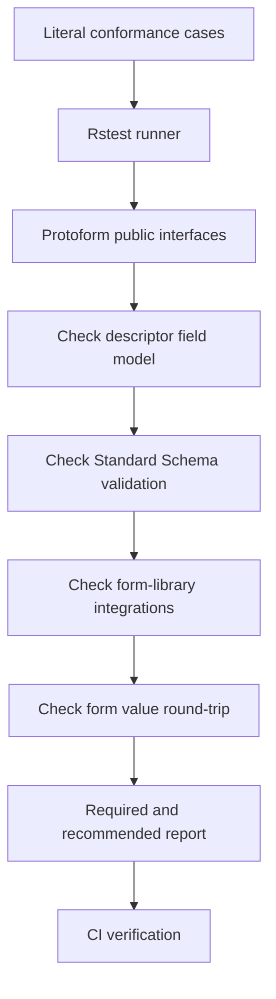

Protoform 提供獨立的一致性測試套件，涵蓋表單介接器所依賴的核心與 protobuf 行為，以及支援的 TanStack Form、Formik 和 Final Form 整合。可直接執行：

```bash
bun run test:conformance
```

此設計採用 [Protocol Buffers conformance suite](https://github.com/protocolbuffers/protobuf/tree/main/conformance) 中實用的職責分離方式：runner 管理案例與預期結果，實作則透過小型公開介面接受測試。由於目前支援的實作是 TypeScript，Protoform 使用 Rstest 在行程內執行此模型。若沒有其他語言介接器需要測試，加入子行程有線協定只會增加成本。

[生產就緒度儀表板](/docs/production-readiness) 將這些通過的案例納入更大且有版本控管的分母。一致性用於判定已實作的合約是否通過；就緒度則明確區分已驗證、延後、不支援及由外部負責的功能。



## 合約層級

| 層級 | 合約 | 範例 |
| --- | --- | --- |
| **必要** | 每個受支援的 Protoform 版本都必須保留的行為 | Standard Schema v1 中繼資料、純量與複合欄位種類、具型別輸出、必填欄位、oneof，以及符合表單結構的路徑 |
| **建議** | 完整 protobuf provider 與受支援整合應具備的豐富行為 | CEL 根層級錯誤、格式規則、所有 map 違規、表單函式庫提交與伺服器錯誤、wrapper 與 well-known type 往返行為 |

預設會執行這兩個層級，且兩者都會阻擋 CI。這些名稱描述的是可攜性下限，而非允許清單：不存在預期失敗、無聲略過，或只能在本機通過的案例。

## 測試套件涵蓋範圍

### 從描述元到欄位模型

此測試套件會解析包含字串、64 位元整數、enum、message、重複欄位、map、oneof、timestamp、duration，以及以 JSON 為基礎的 well-known type 描述元。它會判定 AutoForm 使用的穩定且不依賴 schema 的欄位模型，包括必填狀態與控制項提示。

### 從表單值到 protobuf

完整且有效的 fixture 會通過 `createProtoFormSchema`。此案例會判定 Standard Schema 傳回具型別的 protobuf message，並保留 bytes、64 位元整數、map 及作用中的 oneof 分支。

純量矩陣也會檢查有號及無號 32 位元與 64 位元邊界、float 與 double 特殊值，以及明確與隱含的 presence。無效的整數輸入會在其所屬表單路徑遭拒，避免轉為超出範圍的 protobuf 值。

### 驗證路徑

無效 fixture 涵蓋必填純量、巢狀 message、重複項目、巢狀 map 值、缺少及無效的 oneof、格式限制、CEL 規則，以及單一 map 項目中的多個違規。預期路徑是符合表單結構的常值路徑，例如：

```text
shippingAddress.city
luckyNumbers.0
officeLocations.0.value.city
preferredContact.value
```

轉換失敗及 message 層級的 CEL 失敗必須傳回可見的根層級問題，不得擲出例外或消失。

### 從 protobuf 到表單的往返轉換

往返案例會驗證表單值、接收 protobuf message，再以 `protoToFormValues` 轉回。它會驗證選填欄位、wrapper、JSON 值、map、bytes、field mask、duration、64 位元值及 oneof 的表單安全表示法。

專用矩陣案例會將此合約擴展至所有合法的 map key 型別、重複純量與 enum 類別、每一種純量 wrapper，以及 `Any` payload 的封裝與解封裝。格式錯誤的 base64 與轉譯後重複的 map key 仍會顯示為欄位錯誤。

### Protovalidate 規則矩陣

表格驅動案例涵蓋布林常數；字串值、Unicode 與位元組長度、模式、前後綴、包含關係及成員資格；UUID 與移除空白後的 UUID 格式；enum 常數、別名、已定義值，以及允許與拒絕清單；重複欄位與 map 的基數；唯一性；以及 `Any` type URL 清單。

其他表格涵蓋 float/double 與所有整數類別、網路與識別碼字串、bytes、Duration、FieldMask、Timestamp、忽略語意、自訂預定義規則，以及作為表單指引顯示而不執行驗證的標準範例。欄位與 message 的 CEL 案例會保留規則 ID、動態訊息、巢狀與重複路徑、所有違規，以及無效運算式的安全根層級問題。

電子郵件合約會透過公開 Standard Schema 介面及受支援的表單介接器執行，因此介接器接線無法在未被發現的情況下削弱描述元驗證。

### Resource API 與執行階段矩陣

Resource 案例會驗證 AIP resource 中繼資料、名稱／ID／顯示名稱的分離、標準欄位、所有欄位行為、標準 Create/Get/List/Update/Delete 形式、singleton 形式、最小 update mask、所有標準非 OK 狀態碼、結構化錯誤詳細資料，以及未知詳細資料型別的保留。

執行階段案例另涵蓋遞迴描述元界限、格式錯誤與惡意輸入處理、50／200／500 欄位的呈現模型與轉換預算、bundle 預算、套件相容性設定檔、僅使用鍵盤的步驟復原、無障礙掃描、瀏覽器涵蓋範圍及 hydration 檢查。

### TanStack Form 整合

此測試套件也會執行實際的 TanStack Form 範例。它會驗證 Protoform 的 Standard Schema 問題是否附加至所屬欄位、有效值是否在提交前轉為具型別的 protobuf message，以及結構化伺服器違規是否回傳至正確的 TanStack 欄位。

registry 整合測試套件會分別檢查原生 TanStack hook 與產生的 AutoForm。它涵蓋原生 API 保留、純量與重複欄位、oneof 分支清除、所有可見的 provider 問題、驗證生命週期行為，以及從 TanStack 欄位 meta 衍生的 update mask。

### Formik 與 Final Form 整合

此測試套件會針對產生的 request 描述元與本機 TypeScript API 執行實際的 Formik 和 Final Form 範例。它會驗證用戶端問題、具型別的 protobuf 提交、結構化伺服器錯誤及無障礙欄位狀態。純介接器案例也會驗證巢狀路徑、重複索引、多個問題，以及對 prototype pollution 的抵抗能力。

## 執行及隔離案例

執行完整測試套件：

```bash
bun run test:conformance
```

開發單一合約時，使用 Rstest 的名稱篩選器：

```bash
bun run test:conformance -- -t "nested map value"
```

主要的 `quality:gate` 命令與 CI 都會執行完整測試套件。若變更描述元解析、驗證正規化、Standard Schema 輸出、protobuf 轉換或 oneof 處理，應在發布前於此處新增或更新常值案例。

## 新增涵蓋範圍

1. 當現有矩陣未涵蓋所需功能時，將最小的描述元功能新增至
   `conformance/proto/protoform/conformance/v1/conformance.proto`。
2. 使用 `bun run proto:generate` 重新產生已簽入版本控制的繫結。
3. 在 `conformance/` 下對應的檔案中，新增一組常值輸入與預期結果。
4. 變更實作程式碼前，確認該案例會因預期缺少的行為而失敗。
5. 先執行特定案例，再執行 `bun run test:conformance` 與 `bun run quality:gate`。

預期值應與實作相互獨立。請勿使用受測的相同 helper 計算預期路徑或欄位種類；fixture 才是事實來源。
